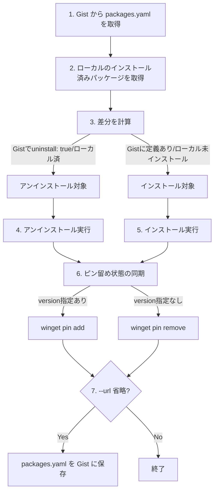
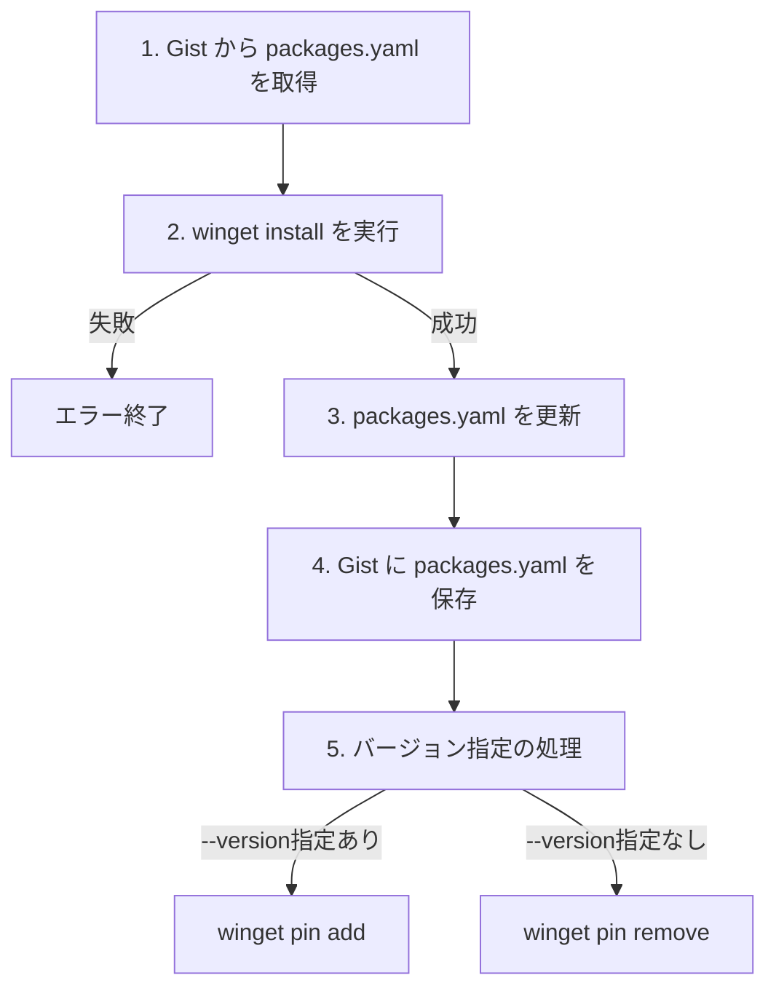
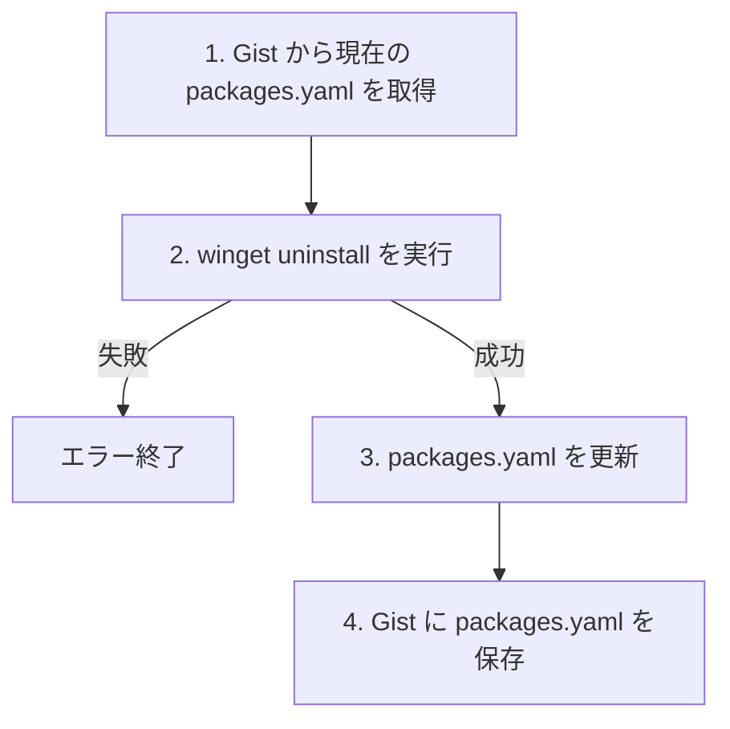
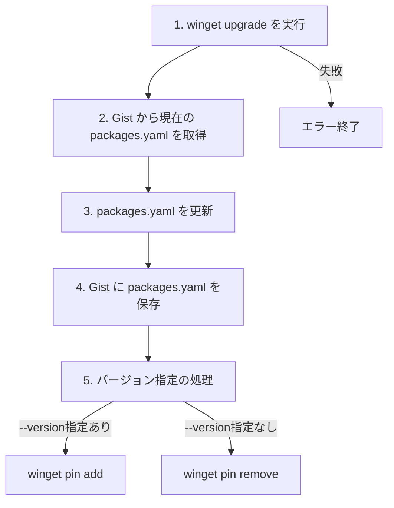
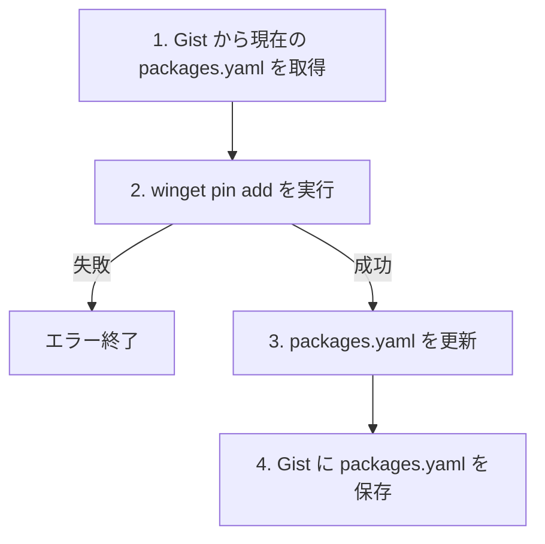
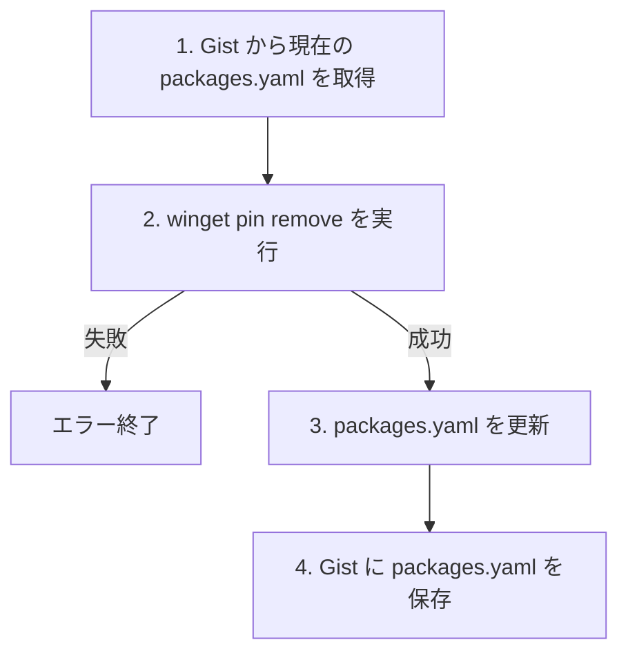

# GistGet コマンド一覧

GistGet は、winget のコマンド体系を完全にサポートしながら、GitHub Gist との同期機能を提供します。

## GistGet 固有コマンド

| コマンド | 概要 |
|---------|------|
| `sync` | Gist から `packages.yaml` を取得し、ローカルのパッケージ状態と同期します。 |
| `export` | ローカルにインストールされているパッケージを YAML 形式で出力します。 |
| `import` | YAML ファイルを Gist にインポートします。 |

## 認証コマンド

| コマンド | 概要 |
|---------|------|
| `auth login` | Device Flow を使用して GitHub にログインします。 |
| `auth logout` | GitHub からログアウトします。 |
| `auth status` | 現在の認証状態とユーザー情報を表示します。 |

## Gist 同期連携コマンド

これらのコマンドは winget を実行すると同時に、`packages.yaml` を更新して Gist に保存します。

| コマンド | 概要 |
|---------|------|
| `install` | パッケージをインストールし、Gist に保存します。`--id` オプションが必須です。 |
| `uninstall` | パッケージをアンインストールし、Gist を更新します。`--id` オプションが必須です。 |
| `upgrade` | パッケージをアップグレードし、Gist に保存します。 |

## ピン留めコマンド

パッケージのバージョンを固定し、自動アップグレードを防ぎます。

| コマンド | 概要 |
|---------|------|
| `pin add` | 指定したバージョンにピン留めし、Gist に保存します。`--version` オプションが必須です。 |
| `pin remove` | ピン留めを解除し、Gist を更新します。 |
| `pin list` | ピン留めされているパッケージを一覧表示します（winget パススルー）。 |
| `pin reset` | すべてのピン留めをリセットします（winget パススルー）。 |

## winget パススルーコマンド

これらのコマンドは winget にそのまま渡されます。引数やオプションは winget と同じです。

| コマンド | 概要 |
|---------|------|
| `list` | インストール済みパッケージを一覧表示します。 |
| `search` | 利用可能なパッケージを検索します。 |
| `show` | パッケージの詳細情報を表示します。 |
| `source` | パッケージソースを管理します。 |
| `settings` | winget の設定を管理します。 |
| `features` | 実験的機能の状態を表示します。 |
| `hash` | インストーラーファイルのハッシュ値を計算します。 |
| `validate` | マニフェストファイルを検証します。 |
| `configure` | 構成ファイルを使用してシステムを設定します。 |
| `download` | インストーラーをダウンロードします。 |
| `repair` | インストール済みパッケージを修復します。 |

---

## コマンド詳細仕様

### sync

Gist に保存された `packages.yaml` とローカルのパッケージ状態を同期します。

#### 構文

```
gistget sync [--url <gist-url>]
```

#### オプション

| オプション | 説明 |
|-----------|------|
| `--url` | 同期元の Gist URL（省略時は認証ユーザーの Gist を検索） |

#### Gist 同期の流れ



#### 備考

- `--url` を指定した場合、読み取り専用モードとなり Gist への書き込みは行われません。


---

### install

パッケージをインストールし、`packages.yaml` を更新して Gist に保存します。

#### 構文

```
gistget install --id <package-id> [options]
```

#### 必須オプション

| オプション | 説明 |
|-----------|------|
| `--id` | パッケージ ID（winget の `--id` と同じ） |

#### インストールオプション（winget 互換）

| オプション | 説明 |
|-----------|------|
| `--version` | インストールするバージョン |
| `--scope` | インストールスコープ（`user` \| `machine`） |
| `--architecture` | アーキテクチャ（`x86` \| `x64` \| `arm` \| `arm64`） |
| `--location` | インストール先パス |
| `--interactive` | 対話型インストール |
| `--silent` | サイレントインストール |
| `--log` | ログファイルパス |
| `--override` | インストーラー引数の上書き |
| `--force` | 強制実行 |
| `--skip-dependencies` | 依存関係をスキップ |
| `--header` | カスタム HTTP ヘッダー |
| `--installer-type` | インストーラータイプ |
| `--custom` | カスタム引数 |

#### Gist 同期の流れ



#### 備考

- `--id` オプションは必須です。`--query` や `--name` による曖昧な指定はサポートされません。
- インストール成功後、指定したオプション（`scope`、`custom` など）は `packages.yaml` に保存されます。

---

### uninstall

パッケージをアンインストールし、`packages.yaml` の該当エントリに `uninstall: true` を設定して Gist に保存します。

#### 構文

```
gistget uninstall --id <package-id>
```

#### 必須オプション

| オプション | 説明 |
|-----------|------|
| `--id` | パッケージ ID |

#### Gist 同期の流れ



#### 備考

- アンインストールしてもエントリは削除されず、`uninstall: true` が設定されます。
- これにより、他のデバイスで `sync` を実行した際に同じパッケージがアンインストールされます。
- エントリを完全に削除するには、Gist を直接編集してください。

---

### upgrade

パッケージをアップグレードし、`packages.yaml` を更新して Gist に保存します。

#### 構文

```
gistget upgrade <package-id> [--id <package-id>] [--version <version>]
```

#### オプション

| オプション | 説明 |
|-----------|------|
| `<package-id>` | パッケージ ID（位置引数）。指定時は Gist 同期が行われます。未指定時は winget にパススルーされます。 |
| `--id` | パッケージ ID（オプション形式）。指定時は Gist 同期が行われます。 |
| `--version` | アップグレード先のバージョン |

#### Gist 同期の流れ



#### 備考

- `--version` を省略した場合、最新バージョンにアップグレードされ、ピン留めは解除されます。
- `--version` を指定した場合、そのバージョンにアップグレードされ、ピン留めされます。
- **ID 未指定時の動作:** パッケージ ID を指定しない場合、コマンドは `winget upgrade` にそのまま渡されます（パススルー）。これにより、`gistget upgrade` でアップグレード可能なパッケージ一覧を表示したり、`gistget upgrade --all` で一括アップグレードを実行したりできます。この場合、Gist との同期（`packages.yaml` の更新）は行われません。

---

### pin

パッケージのバージョンをピン留めし、`packages.yaml` を更新して Gist に保存します。

#### サブコマンド

#### pin add

指定したバージョンにピン留めします。

```
gistget pin add <package-id> --version <version>
```

| オプション | 説明 |
|-----------|------|
| `<package-id>` | パッケージ ID（位置引数） |
| `--version` | ピン留めするバージョン（必須） |

**Gist 同期の流れ:**



#### pin remove

ピン留めを解除します。

```
gistget pin remove <package-id>
```

| オプション | 説明 |
|-----------|------|
| `<package-id>` | パッケージ ID（位置引数） |

**Gist 同期の流れ:**



#### pin list

ピン留めされているパッケージを一覧表示します（winget パススルー）。

```
gistget pin list [arguments]
```

#### pin reset

すべてのピン留めをリセットします（winget パススルー）。

```
gistget pin reset [arguments]
```

#### 備考

- `pin list` と `pin reset` は winget にそのまま渡されるため、Gist との同期は行われません。
- ピン留めは `packages.yaml` の `version` フィールドに保存され、`sync` 実行時に他のデバイスにも適用されます。
