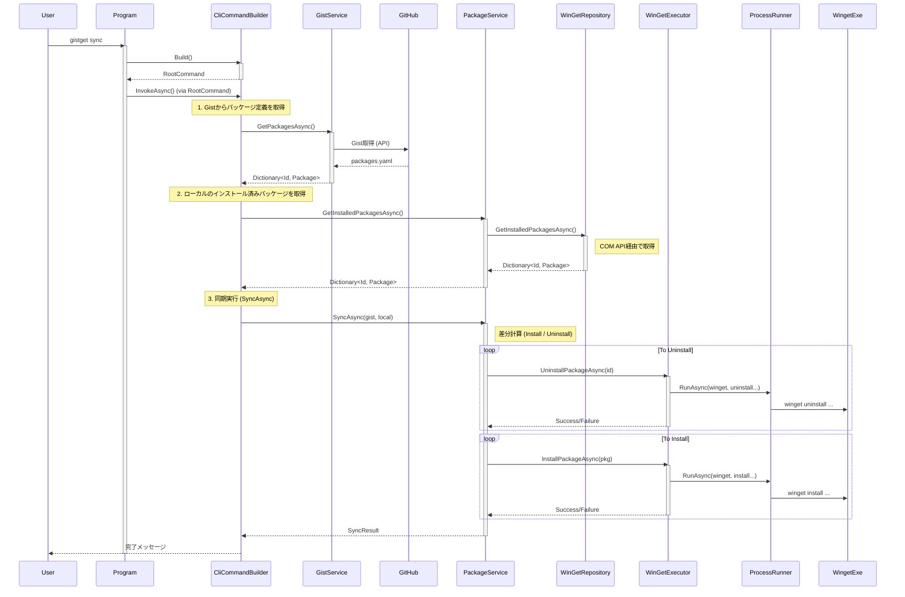
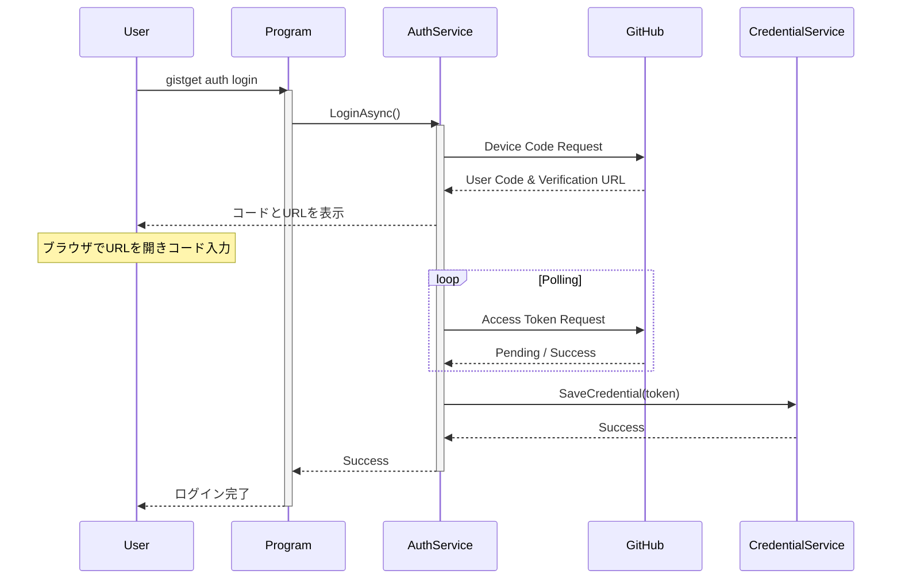

# GistGet システム設計書

## 概要
GistGetは、Windows Package Manager (winget) のパッケージ状態をGitHub Gistを用いて同期するためのCLIツールです。
本ドキュメントでは、システムの主要なクラス構造と処理フローについて記述します。

## クラス図

以下は、GistGetの主要なクラスとその関係を示したクラス図です。

```mermaid
classDiagram
    namespace Presentation {
        class Program {
            +Main(args) Task~int~
        }
        class CliCommandBuilder {
            +Build() RootCommand
        }
    }

    namespace Application {
        class IAuthService {
            <<interface>>
        }
        class AuthService {
            +LoginAsync() Task
        }
        class IGistService {
            <<interface>>
        }
        class GistService {
            +GetPackagesAsync() Task~Dictionary~
        }
        class IPackageService {
            <<interface>>
        }
        class PackageService {
            +SyncAsync() Task~SyncResult~
        }
    }

    namespace Infrastructure {
        class ICredentialService {
            <<interface>>
        }
        class CredentialService {
            +SaveCredential() bool
        }
        class IWinGetRepository {
            <<interface>>
            +GetInstalledPackagesAsync() Task~Dictionary~
        }
        class WinGetRepository {
            +GetInstalledPackagesAsync() Task~Dictionary~
        }
        class IWinGetExecutor {
            <<interface>>
            +InstallPackageAsync() Task~bool~
        }
        class WinGetExecutor {
            +InstallPackageAsync() Task~bool~
        }
        class IProcessRunner {
            <<interface>>
        }
        class ProcessRunner {
            +RunAsync() Task~Result~
        }
    }

    Program ..> CliCommandBuilder
    CliCommandBuilder ..> IPackageService
    CliCommandBuilder ..> IGistService
    CliCommandBuilder ..> IAuthService

    AuthService ..|> IAuthService
    AuthService --> ICredentialService
    
    GistService ..|> IGistService
    GistService --> IAuthService
    
    PackageService ..|> IPackageService
    PackageService --> IWinGetRepository
    PackageService --> IWinGetExecutor

    WinGetRepository ..|> IWinGetRepository
    WinGetExecutor ..|> IWinGetExecutor
    WinGetExecutor --> IProcessRunner
    
    CredentialService ..|> ICredentialService
    ProcessRunner ..|> IProcessRunner
```

### 主要クラスの説明

*   **Program**: アプリケーションのエントリーポイント。DIコンテナのセットアップ（今回は手動DI）と `CliCommandBuilder` の呼び出しのみを行います。
*   **CliCommandBuilder**: Presentation層。`System.CommandLine` を使用してCLIコマンドを構築し、Application層のサービスと紐付けます。
*   **Application Layer**:
    *   **PackageService**: パッケージ同期のビジネスロジック（差分計算など）を担当し、Infrastructure層の `WinGetRepository` / `WinGetExecutor` をオーケストレーションします。
    *   **AuthService**: 認証ロジックを担当します。
    *   **GistService**: Gist操作のロジックを担当します。
*   **Infrastructure Layer**:
    *   **WinGetRepository**: `Microsoft.WindowsPackageManager.ComInterop` (COM) を使用して、インストール済みパッケージ情報を読み取ります。
    *   **WinGetExecutor**: `ProcessRunner` を使用して、`winget` コマンドによる変更操作（インストール/アンインストール）を実行します。
    *   **CredentialService**: Windows Credential Manager へのアクセスを提供します。
    *   **ProcessRunner**: OSプロセス実行の抽象化を提供します。

## シーケンス図

### 1. 同期処理 (Sync Command)

`gistget sync` コマンド実行時の処理フローです。

### 2. 認証処理 (Auth Login)

`gistget auth login` コマンド実行時の処理フローです。

## 重要な設計判断

1.  **ハイブリッドアプローチ (COM + Process)**:
    *   **読み取り (COM API)**: インストール済みパッケージの一覧取得には、`Microsoft.WindowsPackageManager.ComInterop` (COM API) を使用します。これにより、CLI出力のパースに依存せず、正確かつ構造化されたデータを取得できます。特に日本語環境などでのエンコーディング問題を回避できます。
    *   **書き込み・実行 (Process)**: インストール、アンインストール、およびその他のパススルーコマンドには、`System.Diagnostics.Process` を使用して `winget.exe` を直接呼び出します。これにより、wingetの最新機能への追従性を高め、ユーザーへの出力（プログレスバーなど）を自然な形で提供します。PowerShellラッパーは廃止し、直接呼び出しとしました。

2.  **テスト容易性の向上**:
    *   **レイヤー化アーキテクチャ**: Presentation, Application, Infrastructure に責務を分離し、各層を疎結合にしました。
    *   **インターフェース依存**: `PackageService` は `IWinGetRepository` と `IWinGetExecutor` に依存し、これらをモック化することで、実際のwinget環境に依存せずにビジネスロジック（同期計算など）の単体テストが可能となりました。

3.  **Windows Credential Managerの利用**:
    *   セキュリティを考慮し、GitHubのアクセストークンをプレーンテキストでファイルに保存するのではなく、OS標準の資格情報マネージャーに保存する設計としました。

4.  **Device Flow認証**:
    *   CLIツールとしての使い勝手を考慮し、ブラウザを起動して認証するDevice Flowを採用しました。これにより、ユーザーはPAT（Personal Access Token）を手動で発行・管理する必要がなくなります。
