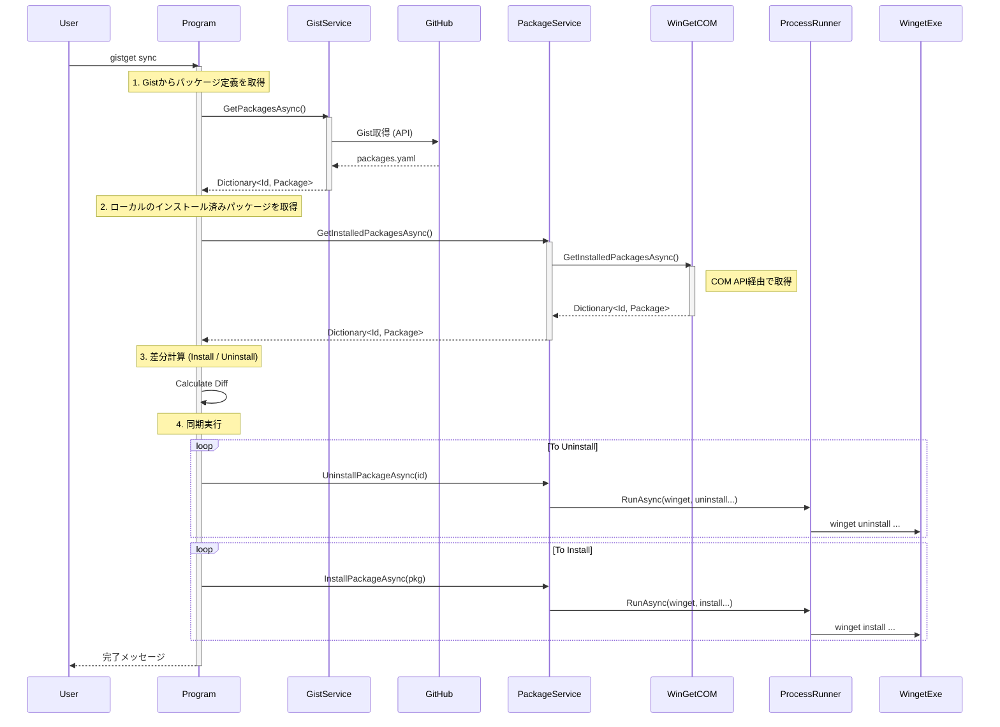
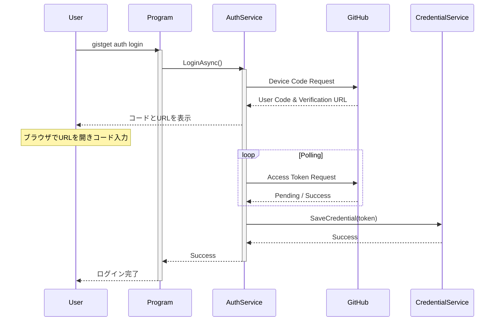

# GistGet システム設計書

## 概要
GistGetは、Windows Package Manager (winget) のパッケージ状態をGitHub Gistを用いて同期するためのCLIツールです。
本ドキュメントでは、システムの主要なクラス構造と処理フローについて記述します。

## クラス図

以下は、GistGetの主要なクラスとその関係を示したクラス図です。

```mermaid
classDiagram
    class Program {
        +Main(args) Task~int~
    }

    class IAuthService {
        <<interface>>
        +LoginAsync() Task~bool~
        +LogoutAsync() Task
        +IsAuthenticatedAsync() Task~bool~
        +GetAccessTokenAsync() Task~string~
    }

    class AuthService {
        -ICredentialService _credentialService
        -string _clientId
        +LoginAsync() Task~bool~
    }

    class ICredentialService {
        <<interface>>
        +GetCredential(target) string
        +SaveCredential(target, username, password) bool
        +DeleteCredential(target) bool
    }

    class CredentialService {
        +GetCredential(target) string
        +SaveCredential(target, username, password) bool
    }

    class IGistService {
        <<interface>>
        +GetPackagesAsync(gistUrl) Task~Dictionary~
        +SavePackagesAsync(packages) Task~string~
    }

    class GistService {
        -IAuthService _authService
        +GetPackagesAsync(gistUrl) Task~Dictionary~
        +SavePackagesAsync(packages) Task~string~
    }

    class IPackageService {
        <<interface>>
        +GetInstalledPackagesAsync() Task~Dictionary~
        +InstallPackageAsync(package) Task~bool~
        +UninstallPackageAsync(packageId) Task~bool~
        +RunPassthroughAsync(command, args) Task
    }

    class PackageService {
        -IWinGetCOM _winGetCom
        -IProcessRunner _processRunner
        +GetInstalledPackagesAsync() Task~Dictionary~
    }

    class IWinGetCOM {
        <<interface>>
        +GetInstalledPackagesAsync() Task~Dictionary~
    }

    class WinGetCOM {
        +GetInstalledPackagesAsync() Task~Dictionary~
    }

    class IProcessRunner {
        <<interface>>
        +RunAsync(fileName, args, redirect) Task~Result~
        +RunPassthroughAsync(fileName, args) Task
    }

    class ProcessRunner {
        +RunAsync(fileName, args, redirect) Task~Result~
        +RunPassthroughAsync(fileName, args) Task
    }

    class GistGetPackage {
        +string Id
        +string Version
        +bool Uninstall
        +string Custom
    }

    class YamlHelper {
        +Serialize(packages) string
        +Deserialize(yaml) Dictionary
    }

    Program ..> IAuthService
    Program ..> IGistService
    Program ..> IPackageService
    Program ..> YamlHelper
    
    AuthService ..|> IAuthService
    AuthService --> ICredentialService
    
    CredentialService ..|> ICredentialService
    
    GistService ..|> IGistService
    GistService --> IAuthService
    GistService ..> GistGetPackage
    
    PackageService ..|> IPackageService
    PackageService --> IWinGetCOM
    PackageService --> IProcessRunner
    PackageService ..> GistGetPackage

    WinGetCOM ..|> IWinGetCOM
    ProcessRunner ..|> IProcessRunner
```

### 主要クラスの説明

*   **Program**: アプリケーションのエントリーポイント。`System.CommandLine` を使用してCLIコマンド（`sync`, `export`, `auth` 等）を定義し、各サービスを組み合わせて処理を実行します。
*   **AuthService**: GitHubのDevice Flowを用いた認証処理を担当します。`HttpClient` を使用してGitHubと直接通信し、取得したトークンを `CredentialService` に渡します。
*   **CredentialService**: Windows Credential Manager (資格情報マネージャー) へのアクセスをカプセル化します。アクセストークンを安全に保存・取得します。
*   **GistService**: GitHub Gist APIとの通信を担当します。`Octokit` ライブラリを使用し、GistからのYAML取得や保存を行います。
*   **PackageService**: ローカルのwinget操作を統括します。読み取り操作は `IWinGetCOM` に、書き込み・実行操作は `IProcessRunner` に委譲します。
*   **WinGetCOM**: `Microsoft.WindowsPackageManager.ComInterop` を使用して、wingetのCOM API経由でインストール済みパッケージ情報を正確に取得します。
*   **ProcessRunner**: `System.Diagnostics.Process` を使用して `winget.exe` を直接実行します。テスト時のモック化のためにインターフェース化されています。
*   **YamlHelper**: `packages.yaml` のシリアライズ・デシリアライズを担当します。`YamlDotNet` を使用します。

## シーケンス図

### 1. 同期処理 (Sync Command)

`gistget sync` コマンド実行時の処理フローです。

### 2. 認証処理 (Auth Login)

`gistget auth login` コマンド実行時の処理フローです。

## 重要な設計判断

1.  **ハイブリッドアプローチ (COM + Process)**:
    *   **読み取り (COM API)**: インストール済みパッケージの一覧取得には、`Microsoft.WindowsPackageManager.ComInterop` (COM API) を使用します。これにより、CLI出力のパースに依存せず、正確かつ構造化されたデータを取得できます。特に日本語環境などでのエンコーディング問題を回避できます。
    *   **書き込み・実行 (Process)**: インストール、アンインストール、およびその他のパススルーコマンドには、`System.Diagnostics.Process` を使用して `winget.exe` を直接呼び出します。これにより、wingetの最新機能への追従性を高め、ユーザーへの出力（プログレスバーなど）を自然な形で提供します。PowerShellラッパーは廃止し、直接呼び出しとしました。

2.  **テスト容易性の向上**:
    *   外部プロセス実行 (`IProcessRunner`) とCOM操作 (`IWinGetCOM`) をインターフェース化し、依存性を注入可能にしました。これにより、実際のwinget環境に依存せずにロジックの単体テストが可能となり、高いコードカバレッジを実現しています。

3.  **Windows Credential Managerの利用**:
    *   セキュリティを考慮し、GitHubのアクセストークンをプレーンテキストでファイルに保存するのではなく、OS標準の資格情報マネージャーに保存する設計としました。

4.  **Device Flow認証**:
    *   CLIツールとしての使い勝手を考慮し、ブラウザを起動して認証するDevice Flowを採用しました。これにより、ユーザーはPAT（Personal Access Token）を手動で発行・管理する必要がなくなります。
