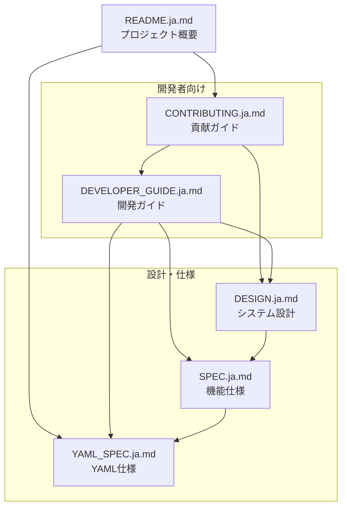

# GistGet ドキュメント

GistGetプロジェクトのドキュメント一覧です。目的に応じて適切なドキュメントを参照してください。

## 📚 ドキュメント一覧

### ユーザー向けドキュメント

#### [README.ja.md](file:///d:/GistGet/README.ja.md)
GistGetの概要、インストール方法、基本的な使い方を説明しています。

**対象読者**: GistGetを使いたいすべてのユーザー

**内容**:
- プロジェクト概要
- 主な機能
- インストール方法
- 基本的な使い方 (認証、同期、エクスポート/インポート)
- 設定ファイルの例

---

### 開発者向けドキュメント

#### [DEVELOPER_GUIDE.ja.md](file:///d:/GistGet/docs/DEVELOPER_GUIDE.ja.md)
GistGetの開発に参加するための包括的なガイドです。

**対象読者**: GistGetの開発に参加する開発者

**内容**:
- 開発環境のセットアップ
- プロジェクト構造の詳細
- ビルドとテストの方法
- TDD開発ワークフロー
- コーディング規約
- テスト戦略
- デバッグ方法
- トラブルシューティング

#### [CONTRIBUTING.ja.md](file:///d:/GistGet/docs/CONTRIBUTING.ja.md)
GistGetプロジェクトへの貢献方法を説明しています。

**対象読者**: GistGetに貢献したい外部開発者

**内容**:
- 行動規範
- 貢献の種類 (バグ報告、機能リクエスト、コード貢献)
- 貢献のワークフロー
- プルリクエストのガイドライン
- コードレビュープロセス
- リリースプロセス
- よくある質問

---

### 設計・仕様ドキュメント

#### [DESIGN.ja.md](file:///d:/GistGet/docs/DESIGN.ja.md)
GistGetのシステム設計を詳細に説明しています。

**対象読者**: アーキテクチャを理解したい開発者

**内容**:
- システム概要
- クラス図
- シーケンス図 (同期処理、認証処理)
- レイヤー化アーキテクチャの説明
- 重要な設計判断 (ハイブリッドアプローチ、テスト容易性など)

#### [SPEC.ja.md](file:///d:/GistGet/docs/SPEC.ja.md)
GistGetの機能仕様を定義しています。

**対象読者**: 機能の詳細を理解したい開発者

**内容**:
- 各コマンドの詳細仕様
- 非パススルー動作の説明
- エラーハンドリング
- 認証フロー

#### [YAML_SPEC.ja.md](file:///d:/GistGet/docs/YAML_SPEC.ja.md)
GistGetで使用するYAML設定ファイルの仕様を定義しています。

**対象読者**: YAML設定ファイルの詳細を理解したいユーザー・開発者

**内容**:
- YAML構文の詳細
- パッケージ定義の方法
- バージョン指定
- カスタムインストールオプション
- アンインストールフラグ

---

## 🗺️ ドキュメントナビゲーション

### 初めてGistGetを使う場合

1. [README.ja.md](file:///d:/GistGet/README.ja.md) - プロジェクト概要と基本的な使い方
2. [YAML_SPEC.ja.md](file:///d:/GistGet/docs/YAML_SPEC.ja.md) - 設定ファイルの詳細

### GistGetの開発に参加したい場合

1. [CONTRIBUTING.ja.md](file:///d:/GistGet/docs/CONTRIBUTING.ja.md) - 貢献方法の概要
2. [DEVELOPER_GUIDE.ja.md](file:///d:/GistGet/docs/DEVELOPER_GUIDE.ja.md) - 開発環境のセットアップと開発方法
3. [DESIGN.ja.md](file:///d:/GistGet/docs/DESIGN.ja.md) - システム設計の理解

### 新機能を実装したい場合

1. [DESIGN.ja.md](file:///d:/GistGet/docs/DESIGN.ja.md) - アーキテクチャの理解
2. [SPEC.ja.md](file:///d:/GistGet/docs/SPEC.ja.md) - 既存機能の仕様確認
3. [DEVELOPER_GUIDE.ja.md](file:///d:/GistGet/docs/DEVELOPER_GUIDE.ja.md) - TDD開発ワークフロー
4. [CONTRIBUTING.ja.md](file:///d:/GistGet/docs/CONTRIBUTING.ja.md) - プルリクエストの作成

### バグを修正したい場合

1. [CONTRIBUTING.ja.md](file:///d:/GistGet/docs/CONTRIBUTING.ja.md) - バグ報告とワークフロー
2. [DEVELOPER_GUIDE.ja.md](file:///d:/GistGet/docs/DEVELOPER_GUIDE.ja.md) - デバッグ方法とテスト
3. [DESIGN.ja.md](file:///d:/GistGet/docs/DESIGN.ja.md) - 関連する設計の理解

---

## 📖 ドキュメント構成図

---

## 🔗 外部リンク

- [GitHub リポジトリ](https://github.com/nuitsjp/GistGet)
- [Issues](https://github.com/nuitsjp/GistGet/issues)
- [Pull Requests](https://github.com/nuitsjp/GistGet/pulls)
- [Discussions](https://github.com/nuitsjp/GistGet/discussions)
- [Releases](https://github.com/nuitsjp/GistGet/releases)

---

## 📝 ドキュメントの更新

ドキュメントに誤りや不足を見つけた場合は、以下の方法で報告または修正してください:

1. [Issue を作成](https://github.com/nuitsjp/GistGet/issues/new) - ドキュメントの問題を報告
2. [Pull Request を作成](https://github.com/nuitsjp/GistGet/pulls) - ドキュメントを直接修正

詳細は[CONTRIBUTING.ja.md](file:///d:/GistGet/docs/CONTRIBUTING.ja.md)を参照してください。

---

## ❓ サポート

質問や問題がある場合は、以下の方法でサポートを受けられます:

- **一般的な質問**: [GitHub Discussions](https://github.com/nuitsjp/GistGet/discussions)
- **バグ報告**: [GitHub Issues](https://github.com/nuitsjp/GistGet/issues)
- **機能リクエスト**: [GitHub Issues](https://github.com/nuitsjp/GistGet/issues)
