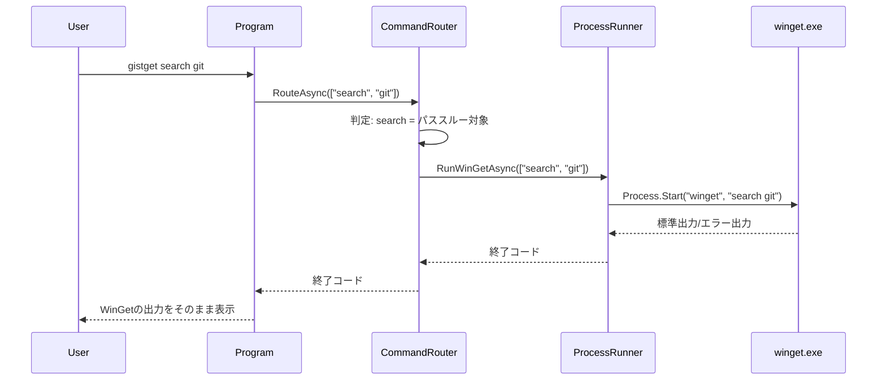
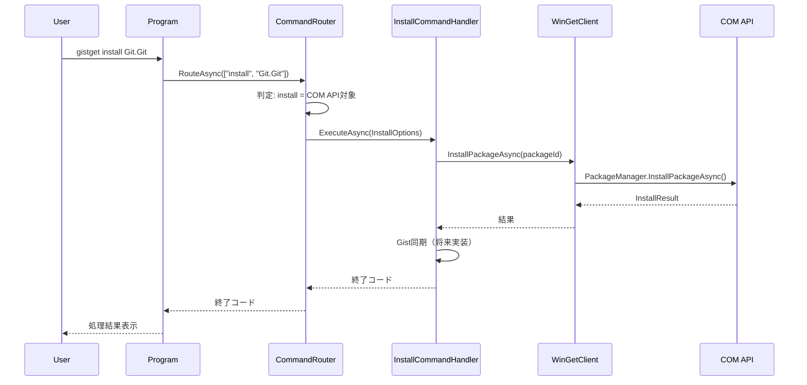

# GistGet アーキテクチャ設計

## 1. 現在の実装状態

### 実装済み機能
- ✅ WinGet CLIへのパススルー実装
- ✅ COM API基盤の構築
- ✅ 基本的なコマンドハンドラー構造
- ⏳ Gist同期機能（未実装）
- ⏳ CI/CDパイプライン（未実装）

### アーキテクチャ概要

```
┌─────────────────────────────────────────┐
│            Program.cs                    │ エントリポイント
├─────────────────────────────────────────┤
│         CommandRouter                    │ コマンド分類・ルーティング  
├──────────────┬──────────────────────────┤
│  COM API     │    パススルー             │
│  (将来拡張)   │    (現在のメイン)         │
├──────────────┼──────────────────────────┤
│ WinGetClient │   ProcessRunner          │
│              │                          │
├──────────────┼──────────────────────────┤
│ COM API      │   winget.exe             │
└──────────────┴──────────────────────────┘
```

## 2. 引数処理戦略

### 二段階の引数処理アプローチ

GistGetは引数処理において、**最小限の解釈**と**完全なパススルー**を使い分けます：

#### 第1段階: 最小限の解釈（ルーティング判定のみ）
```csharp
// 第1引数のコマンドのみを確認してルーティング決定
var command = args.FirstOrDefault()?.ToLower();

switch (command)
{
    case "sync":
    case "export":
    case "import":
        // GistGet独自コマンド → System.CommandLineで完全解析
        return await HandleGistCommand(args);
        
    case "install" when HasGistSyncEnabled():
    case "uninstall" when HasGistSyncEnabled():
        // Gist同期が有効な場合のみCOM API経由
        return await HandleWithComApi(args);
        
    default:
        // その他すべて → 引数を一切解釈せずパススルー
        return await PassthroughToWinGet(args);
}
```

#### 第2段階: コマンド別の処理

| パターン | 対象コマンド | 引数処理 | 理由 |
|---------|------------|---------|------|
| **完全パススルー** | search, list, show, source, settings等 | 引数を**一切解釈せず**そのまま渡す | WinGetの複雑な引数体系と完全互換を保証 |
| **Gist独自コマンド** | sync, export, import | System.CommandLineで**完全解析** | GistGet独自機能のため独自の引数体系 |
| **ハイブリッド** | install, uninstall（Gist同期時） | 最小限の解析後、残りをCOM APIへ | Gist同期のための情報抽出が必要 |

### System.CommandLine使用範囲の限定

```csharp
public class ArgumentStrategy
{
    // GistGet独自コマンドのみSystem.CommandLineを使用
    private static readonly HashSet<string> GistOnlyCommands = new()
    {
        "sync",   // gistget sync [--force]
        "export", // gistget export [--output file]
        "import"  // gistget import [--file file]
    };
    
    public bool ShouldParseArguments(string command)
    {
        // Gist独自コマンドのみ引数解析が必要
        return GistOnlyCommands.Contains(command);
    }
    
    public async Task<int> RouteCommand(string[] args)
    {
        var firstArg = args.FirstOrDefault()?.ToLower();
        
        if (ShouldParseArguments(firstArg))
        {
            // System.CommandLineで引数解析
            var parser = new GistCommandParser();
            return await parser.ParseAndExecute(args);
        }
        else
        {
            // 引数を一切触らずにパススルー
            return await ProcessRunner.RunWinGetAsync(args);
        }
    }
}
```

### パススルー時の注意点

**重要:** WinGetへのパススルー時は引数を**一切加工しない**
- 引数の順序を維持
- 大文字小文字を維持  
- 特殊文字やエスケープを維持
- 未知のオプションもそのまま渡す

```csharp
// ❌ 悪い例: 引数を解釈・加工してしまう
public async Task<int> BadPassthrough(string[] args)
{
    var parsed = ParseArguments(args);  // 不要な解析
    var reformatted = BuildWinGetArgs(parsed);  // 再構築で情報が失われる可能性
    return await RunWinGet(reformatted);
}

// ✅ 良い例: 引数をそのまま渡す
public async Task<int> GoodPassthrough(string[] args)
{
    // 引数配列をそのままwinget.exeに渡す
    return await ProcessRunner.RunWinGetAsync(args);
}
```

## 3. 実行フローのシーケンス図

### A. パススルーパターン（現在のメイン実装）



### B. COM APIパターン（将来の拡張用）



## 4. 現在の実装詳細

### コマンドルーティング戦略

```csharp
public class CommandRouter
{
    // 現在はすべてパススルー
    // 将来的にGist同期が必要なコマンドのみCOM API経由に切り替え
    
    public async Task<int> RouteAsync(string[] args)
    {
        // 現在の実装: すべてwinget.exeへパススルー
        return await ProcessRunner.RunWinGetAsync(args);
        
        // 将来の実装:
        // var command = args.FirstOrDefault();
        // if (IsGistSyncCommand(command))
        // {
        //     return await HandleWithComApi(args);
        // }
        // return await ProcessRunner.RunWinGetAsync(args);
    }
}
```

### 主要コンポーネント

#### Program.cs
- アプリケーションのエントリポイント
- コマンドライン引数をCommandRouterに渡す
- 終了コードを返す

#### CommandRouter
- コマンドの分類とルーティング
- 将来的にCOM APIとパススルーの振り分けを行う
- 現在はすべてパススルー

#### ProcessRunner
- winget.exeの実行を管理
- 標準出力/エラー出力の処理
- プロセスの終了コード取得

#### WinGetClient（部分実装）
- COM APIのラッパー
- PackageManagerの初期化と管理
- 将来のGist同期用基盤

## 5. 技術スタック

### 現在使用中
- **フレームワーク**: .NET 8
- **COM API**: Microsoft.Management.Deployment
- **プロセス管理**: System.Diagnostics.Process
- **非同期処理**: Task-based Async Pattern

### 将来追加予定
- **引数パーサー**: System.CommandLine
- **HTTP通信**: HttpClient（GitHub API用）
- **YAML処理**: YamlDotNet（Gist同期用）
- **暗号化**: Windows DPAPI（トークン保存用）

## 6. 実装の特徴

### シンプルな設計
- 最小限の抽象化
- 直接的なコード実装
- 段階的な機能追加

### 互換性重視
- WinGetの出力を完全に保持
- 既存のワークフローを破壊しない
- エラーメッセージもそのまま伝達

### 拡張性の確保
- COM API基盤は構築済み
- Gist同期機能の追加が容易
- テスト可能な構造

## 7. セキュリティ考慮事項

### 現在の実装
- プロセス実行時の引数エスケープ
- COM APIの安全な初期化
- リソースの適切な解放

### 将来の実装（Gist同期時）
- OAuth Device Flowによる認証
- トークンの暗号化保存
- 最小権限の原則

## 8. 既知の制限事項

### 現在の制限
- Windows専用（COM API依存）
- 管理者権限が必要な操作あり
- Gist同期機能未実装

### 対応予定
- エラーメッセージの改善
- 非管理者モードでの動作改善
- プログレス表示の実装

## 9. CI/CD環境での技術的課題

### A. Windows依存性の課題

```yaml
# COM APIのWindows依存性への対処
strategy:
  matrix:
    os: [windows-latest]  # Windows限定
    dotnet: ['8.0.x']
```

#### 課題と解決策

| コンポーネント | 課題 | 解決策 | 実装難易度 |
|---------------|------|--------|-----------|
| **COM API** | Windows限定 | 条件付きコンパイル | 低 |
| **DPAPI** | Windows限定 | 抽象化レイヤー | 中 |
| **winget.exe** | 実行ファイル依存 | モック実装 | 高 |
| **管理者権限** | CI環境で制限 | テスト分離 | 中 |

### B. ビルド専用CI/CD戦略

```csharp
// CI環境では実際のパッケージ操作を行わない
public static IServiceProvider ConfigureServices(bool isCI = false)
{
    var services = new ServiceCollection();
    
    if (isCI)
    {
        // CI環境：ビルド検証のみ、実際の操作は行わない
        services.AddSingleton<IPackageManager, NullPackageManager>();
        services.AddSingleton<IAuthProvider, NullAuthProvider>();
    }
    else
    {
        // ローカル環境：実際のCOM APIと認証を使用
        services.AddSingleton<IPackageManager, WinGetComManager>();
        services.AddSingleton<IAuthProvider, DeviceFlowAuthProvider>();
    }
    
    return services.BuildServiceProvider();
}

// CI専用の何もしないプロバイダー
public class NullPackageManager : IPackageManager
{
    public Task<int> InstallAsync(string packageId)
    {
        throw new NotSupportedException("CI環境ではパッケージ操作は実行されません");
    }
}

public class NullAuthProvider : IAuthProvider
{
    public Task<string?> GetTokenAsync()
    {
        throw new NotSupportedException("CI環境では認証は実行されません");
    }
}
```

### C. ビルドパイプライン（シンプル版）

```yaml
# ビルド検証のみ実施
name: Build
on: [push, pull_request]

jobs:
  build:
    strategy:
      matrix:
        os: [windows-latest, ubuntu-latest]
    runs-on: ${{ matrix.os }}
    
    steps:
      - uses: actions/checkout@v4
      - uses: actions/setup-dotnet@v4
        with:
          dotnet-version: '8.0.x'
      
      - name: Restore
        run: dotnet restore
      
      - name: Build
        run: dotnet build --configuration Release
      
      - name: Unit Tests Only
        run: dotnet test --filter "Category=Unit"
```

### D. ローカル開発重視のテスト戦略

```bash
# CI相当（ユニットテストのみ）
dotnet test --filter "Category=Unit"

# ローカル統合テスト（認証・COM API含む）
dotnet test --filter "Category=Local"

# 手動検証（実際のパッケージ操作）
dotnet test --filter "Category=Manual"

# 全テスト実行
dotnet test
```

### E. リリースパイプライン（シンプル版）

```yaml
# GitHub Releases への自動デプロイ（ビルドのみ）
name: Release
on:
  push:
    tags: ['v*']

jobs:
  release:
    runs-on: windows-latest
    steps:
      - uses: actions/checkout@v4
      - uses: actions/setup-dotnet@v4
        with:
          dotnet-version: '8.0.x'
      
      - name: Build Release
        run: |
          dotnet publish -c Release -r win-x64 \
            --self-contained -p:PublishSingleFile=true
      
      - name: Create Release
        uses: softprops/action-gh-release@v1
        with:
          files: |
            src/NuitsJp.GistGet/bin/Release/net8.0/win-x64/publish/GistGet.exe
```

### F. 品質保証戦略

| 段階 | 実行環境 | 対象テスト | 自動化レベル |
|------|----------|-----------|-------------|
| **CI/CD** | GitHub Actions | ビルド + ユニットテスト | 完全自動 |
| **ローカル開発** | 開発PC | 統合テスト + COM API | 半自動 |
| **リリース前** | 手動 | 実際のパッケージ操作 | 手動 |

## 10. パフォーマンス最適化
  if: startsWith(github.ref, 'refs/tags/')
  uses: actions/create-release@v1
  with:
    tag_name: ${{ github.ref }}
    release_name: Release ${{ github.ref }}
    draft: false
    prerelease: false
    
- name: Upload Release Asset
  uses: actions/upload-release-asset@v1
  with:
    upload_url: ${{ steps.create_release.outputs.upload_url }}
    asset_path: ./bin/Release/net8.0/win-x64/publish/GistGet.exe
    asset_name: GistGet.exe
    asset_content_type: application/octet-stream
```

## 10. パフォーマンス最適化

### A. 起動時間の改善

```csharp
// ReadyToRun による起動高速化
// プロジェクトファイルに追加
<PropertyGroup>
  <PublishReadyToRun>true</PublishReadyToRun>
  <TieredCompilation>true</TieredCompilation>
</PropertyGroup>
```

### B. メモリ使用量の削減

```csharp
// 大量のパッケージリスト処理時のストリーミング
public async IAsyncEnumerable<Package> GetPackagesAsync()
{
    await foreach (var package in _comApi.GetPackagesAsync())
    {
        yield return package;
    }
}
```

## 11. 認証アーキテクチャ（シンプル戦略）

### A. 事前認証済み前提の戦略

```
┌─────────────────────────────────────────┐
│            AuthProvider                  │ 統一インターフェース
├─────────────────────────────────────────┤
│  既存のGitHubAuthService使用             │ すべての環境で共通
├─────────────────────────────────────────┤
│  • ローカル開発: gistget auth実行済み    │
│  • テスト実行: gistget auth実行済み      │
│  • CI/CD: 認証不要（ビルドのみ）         │
└─────────────────────────────────────────┘
```

### B. 実装アプローチ（シンプル版）

```csharp
// 既存のGitHubAuthServiceをそのまま使用
public class TestWithAuthentication
{
    private readonly IGitHubAuthService _authService;
    
    public TestWithAuthentication()
    {
        // DIコンテナから既存のサービスを取得
        _authService = serviceProvider.GetRequiredService<IGitHubAuthService>();
    }
    
    [Fact]
    [Trait("Category", "Local")]
    public async Task ExportCommand_ShouldWork()
    {
        // 事前認証チェック（失敗時はテストスキップ）
        if (!await _authService.IsAuthenticatedAsync())
        {
            throw new SkipException("認証が必要です。'gistget auth' を先に実行してください。");
        }
        
        // 実際のテスト実行
        var exportCommand = new ExportCommand(_authService);
        var result = await exportCommand.ExecuteAsync(new[] { "export" });
        
        result.Should().Be(0);
    }
}

// ユニットテスト（認証不要）
[Fact]
[Trait("Category", "Unit")]
public void ArgumentParsing_ShouldWork() 
{
    // 外部依存なし、認証不要
    var parser = new ArgumentParser();
    var result = parser.Parse(new[] { "export", "--output", "test.yaml" });
    
    result.Should().NotBeNull();
}
```

### C. テスト実行フロー（事前認証済み前提）

```bash
# 1. 事前認証（一度のみ実行）
gistget auth

# 2. 認証状態確認
gistget auth status
# 出力例: "認証済み: nuitsjp (Atsushi Nakamura)"

# 3. テスト実行
dotnet test --filter "Category=Unit"     # 認証不要
dotnet test --filter "Category=Local"    # 事前認証済み前提
dotnet test                              # 全テスト

# 認証が切れた場合のみ再実行
gistget auth
```

### D. 環境別の想定

| 環境 | 認証方式 | 実行前提 | テスト対象 |
|------|----------|----------|-----------|
| **ローカル開発** | Device Flow | `gistget auth`実行済み | Unit + Local |
| **CI/CD** | なし | 認証不要 | Unitのみ |
| **手動テスト** | Device Flow | `gistget auth`実行済み | 全テスト |

## 13. セキュリティ考慮事項（認証拡張）

### A. 認証方式別のセキュリティ

| 認証方式 | セキュリティレベル | リスク | 対策 |
|----------|------------------|-------|------|
| **Device Flow** | 高 | ブラウザ依存 | HTTPS必須、トークン暗号化 |
| **環境変数** | 中 | ログ漏洩 | CI専用、短期間使用 |
| **モック** | 低 | テスト専用 | 本番環境で無効化 |

### B. トークン管理

```csharp
// トークンの安全な取得
public class SecureTokenManager
{
    public async Task<string> GetSecureTokenAsync()
    {
        // 1. 環境変数チェック（CI/CD）
        var envToken = Environment.GetEnvironmentVariable("GITHUB_TOKEN");
        if (!string.IsNullOrEmpty(envToken))
        {
            LogTokenSource("Environment Variable");
            return envToken;
        }
        
        // 2. 暗号化ファイルチェック（ローカル）
        var fileToken = await LoadEncryptedTokenAsync();
        if (!string.IsNullOrEmpty(fileToken))
        {
            LogTokenSource("Encrypted File");
            return fileToken;
        }
        
        throw new UnauthorizedAccessException("認証が必要です。'gistget auth' を実行してください。");
    }
    
    private void LogTokenSource(string source)
    {
        // セキュリティ: トークン自体はログに出力しない
        _logger.LogInformation("認証トークンを取得しました（ソース: {Source}）", source);
    }
}
```

## 14. 監視とログ（認証関連拡張）

### A. 構造化ログ

```csharp
// Serilog による構造化ログ
Log.Logger = new LoggerConfiguration()
    .MinimumLevel.Debug()
    .WriteTo.Console()
    .WriteTo.File("logs/gistget-.txt", rollingInterval: RollingInterval.Day)
    .CreateLogger();

Log.Information("Installing package {PackageId} version {Version}", 
    packageId, version);
```

### B. テレメトリ（オプトイン）

```csharp
// Application Insights (オプトイン)
if (Settings.EnableTelemetry)
{
    services.AddApplicationInsightsTelemetry();
}
```