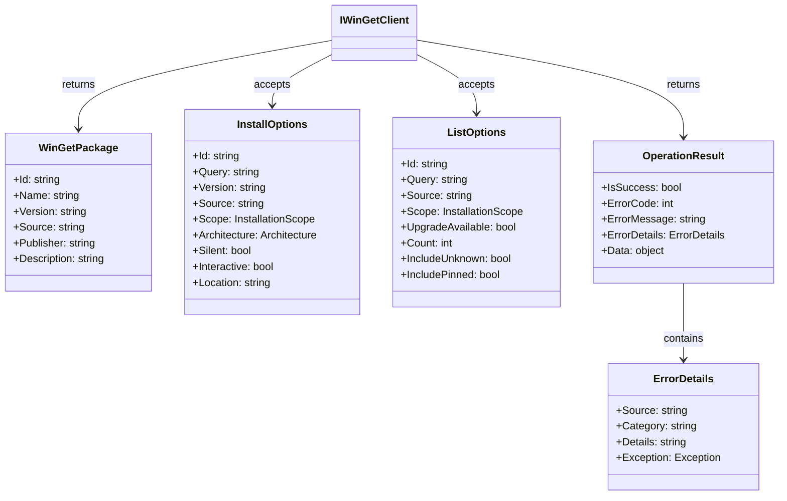
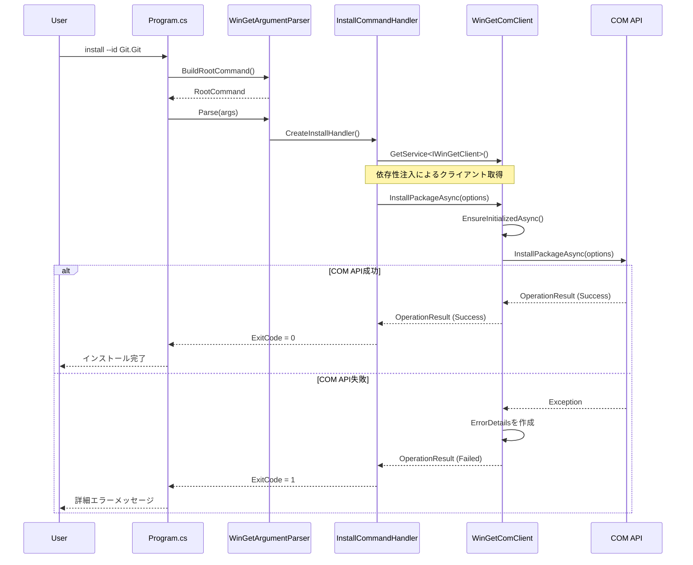
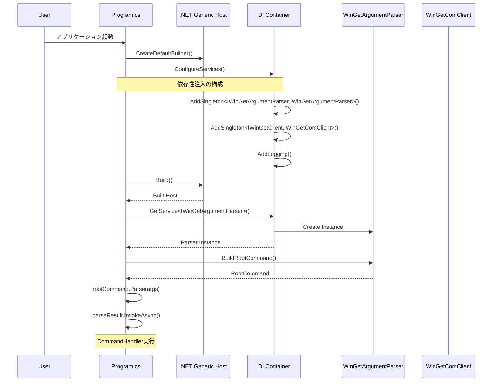
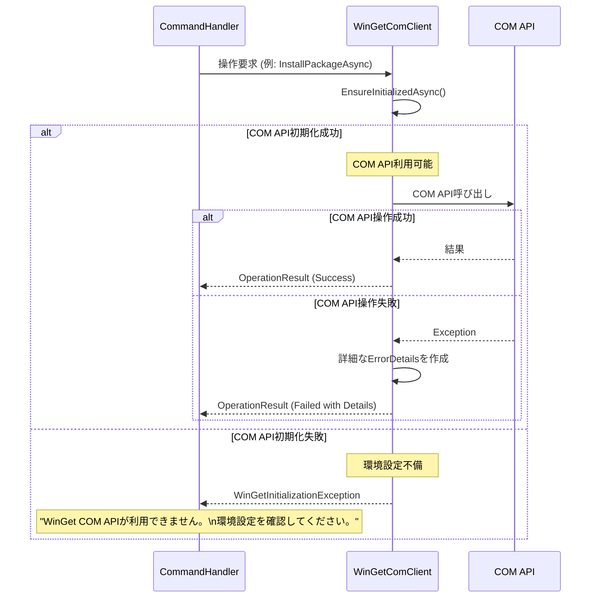
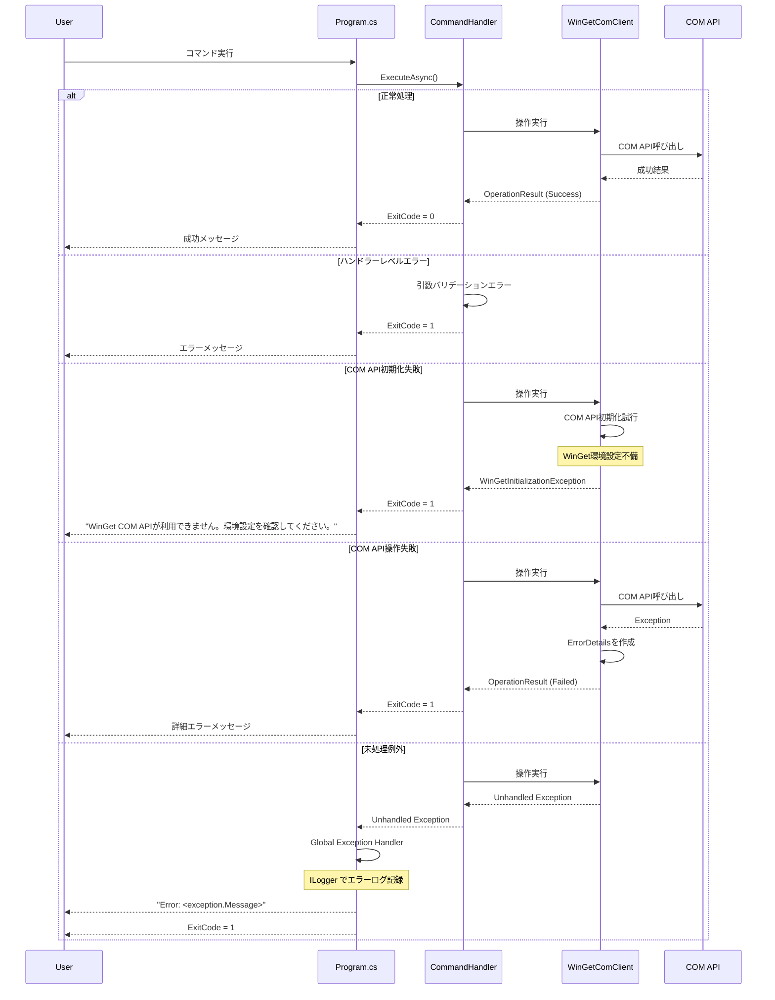
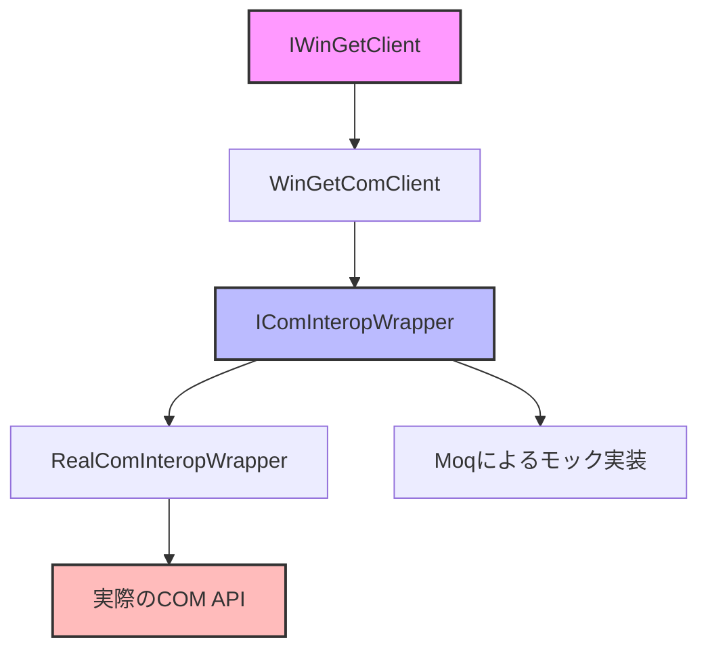

# GistGet .NET アーキテクチャ設計書

## 概要

GistGetは、WinGetの機能を.NET 8で実装し、GitHub Gistとの同期機能を提供するツールです。本書では現在の実装アーキテクチャについて詳述します。

## アーキテクチャ全体像

本アプリケーションは、以下の主要レイヤーで構成されています：

```
┌─────────────────────────────────────────┐
│            CLI Interface                 │ Program.cs
├─────────────────────────────────────────┤
│        Argument Parser Layer            │ WinGetArgumentParser
├─────────────────────────────────────────┤
│         Command Handler Layer           │ BaseCommandHandler + 具象ハンドラ
├─────────────────────────────────────────┤
│        WinGet Client Layer             │ IWinGetClient
├─────────────────────────────────────────┤
│           COM API Layer                 │ WinGetComClient
├─────────────────────────────────────────┤
│        Microsoft WinGet API             │ COM Interop
└─────────────────────────────────────────┘
```

## コア・アーキテクチャ・コンポーネント

### 1. エントリポイント (Program.cs)

**責務**: アプリケーション初期化、依存性注入、エラーハンドリング

- .NET Generic Host を使用した依存性注入コンテナの構築
- System.CommandLine による引数解析とコマンド実行の統合
- グローバルエラーハンドリングとログ設定

### 2. 引数解析レイヤー (WinGetArgumentParser)

**責務**: WinGet CLI完全準拠の引数解析とバリデーション

主要機能：
- 18種類のコマンド（install, list, upgrade等）の完全サポート
- コマンドエイリアス（add→install, ls→list等）
- サブコマンド階層（source add/list/update等）
- 相互排他性・条件付きバリデーション
- グローバルオプション（--help, --version等）

### 3. コマンドハンドラーレイヤー

**責務**: 各WinGetコマンドの実行ロジック

- **BaseCommandHandler**: 共通インフラストラクチャ
- **具象ハンドラー**: InstallCommandHandler, ListCommandHandler等、各コマンド固有の処理

### 4. WinGetクライアントレイヤー

**責務**: WinGet操作の統一インターフェース

- **IWinGetClient**: 公開インターフェース
- **WinGetComClient**: COM API実装

### 5. データモデル

**責務**: WinGet操作で使用するデータ構造とオプション

- **パッケージモデル**: WinGetPackage, SearchResult等
- **オプションモデル**: InstallOptions, ListOptions等
- **結果モデル**: OperationResult, ErrorDetails等

## 主要クラス概要

### Program クラス
- アプリケーション設定とブートストラップ
- 依存性注入の構成
- CommandLineConfigurationによる引数解析実行

### WinGetArgumentParser クラス
```csharp
public class WinGetArgumentParser : IWinGetArgumentParser
{
    // System.CommandLineのRootCommandを構築
    public Command BuildRootCommand()
    
    // 各コマンドの構築メソッド
    private Command BuildInstallCommand()
    private Command BuildListCommand()
    // ... その他18コマンド
}
```

### BaseCommandHandler クラス
```csharp
public abstract class BaseCommandHandler
{
    protected static IServiceProvider? ServiceProvider { get; private set; }
    
    public abstract Task<int> ExecuteAsync(/* パラメータ */);
}
```

### WinGetComClient クラス
```csharp
public class WinGetComClient : IWinGetClient, IDisposable
{
    // COM API実装
    public async Task<OperationResult> InstallPackageAsync(InstallOptions options)
    
    // COM API初期化
    public async Task InitializeAsync()
}
```

## クラス構造図

### コアアーキテクチャ概念図


### データモデル構造図



## 処理シーケンス図

### パッケージインストール処理フロー



### アプリケーション初期化フロー



### COM API 初期化と実行フロー



### エラーハンドリング階層



## 設計パターンと原則

### 1. 依存性注入パターン
- .NET Generic Hostによる統一されたDIコンテナ
- インターフェース分離による疎結合設計

### 2. 例外処理パターン
- COM API専用の明確なエラーハンドリング
- 環境設定問題の明確な診断メッセージ
- 段階的エラー回復とユーザーガイダンス

### 3. コマンドパターン
- 各WinGetコマンドを独立したコマンドハンドラーとして実装
- 共通ベースクラスによる統一されたインターフェース

### 4. アダプターパターン
- Microsoft WindowsPackageManager COM APIをIWinGetClientに適合

## システム統合

### Microsoft.WindowsPackageManager.ComInterop統合
- バージョン: 1.11.430
- COM初期化: PackageManagerFactory.CreatePackageManager()
- 非同期操作: Task-based Async Pattern
- プログレス通知: IProgress&lt;OperationProgress&gt;

### System.CommandLine統合
- 引数解析フレームワーク
- コマンド階層とサブコマンドサポート
- 相互排他性とバリデーションルール

## エラーハンドリング戦略

### 階層的エラーハンドリング
1. **Program.cs**: 最上位例外キャッチとログ出力
2. **CommandHandler**: コマンド実行時の例外処理
3. **WinGetComClient**: COM API実行の例外処理

### 明確なエラー処理
- COM API失敗時の詳細な診断情報提供
- 環境設定問題の明確な特定とガイダンス
- デバッグ支援のための充実したログ情報

## ログとモニタリング

### 統合ログ基盤
- Microsoft.Extensions.Logging使用
- 構造化ログでの詳細な処理情報記録
- COM API実行の透明性とデバッグ支援

### 診断情報
- ClientInfo による実行環境情報取得
- COM API初期化状況の把握
- WinGetバージョン互換性チェック

## セキュリティ考慮事項

### COM APIセキュリティ
- COM オブジェクト初期化の安全性確保
- 適切なCOM リソース管理

### 入力検証
- コマンドライン引数の厳密なバリデーション
- ValidationEngineによるルールベース検証

## パフォーマンス最適化

### COM API戦略
- ネイティブCOM API直接利用による最適化
- 外部プロセス不要による高速化とリソース効率

### 非同期処理
- 全操作のTask-based Async Pattern対応
- CancellationToken による処理中断サポート

### リソース管理
- IDisposable による適切なリソース解放
- COM オブジェクトの確実な解放

## COM API実装のテスト戦略

### テスト技法の概要

COM APIテストにおける主要な課題と解決アプローチ：

| 課題 | 解決技法 | 実装方法 |
|------|----------|----------|
| COM依存性 | ラッパー抽象化 | IComInteropWrapper インターフェース |
| 環境依存 | テストダブル | モック・スタブの活用 |
| 初期化コスト | 遅延初期化 | Lazy&lt;T&gt;パターン |
| リソース管理 | 自動解放 | using/IDisposable パターン |

### 1. 単体テスト戦略

#### COM APIラッパーの抽象化

```csharp
// COM API操作を抽象化するインターフェース
public interface IComInteropWrapper
{
    Task<PackageManager> CreatePackageManagerAsync();
    Task<IEnumerable<CatalogPackage>> GetInstalledPackagesAsync(PackageManager manager);
    Task<InstallResult> InstallPackageAsync(PackageManager manager, string packageId);
}

// テスト可能なWinGetComClient
public class WinGetComClient : IWinGetClient
{
    private readonly IComInteropWrapper _comWrapper;
    
    public WinGetComClient(IComInteropWrapper comWrapper)
    {
        _comWrapper = comWrapper;
    }
}
```

#### モックを使用した単体テスト

```csharp
[Fact]
public async Task InstallPackageAsync_Success_ReturnsSuccessResult()
{
    // Arrange
    var mockWrapper = new Mock<IComInteropWrapper>();
    mockWrapper.Setup(x => x.InstallPackageAsync(It.IsAny<PackageManager>(), "Git.Git"))
              .ReturnsAsync(new InstallResult { Status = InstallStatus.Ok });
    
    var client = new WinGetComClient(mockWrapper.Object);
    
    // Act
    var result = await client.InstallPackageAsync(new InstallOptions { Id = "Git.Git" });
    
    // Assert
    Assert.True(result.IsSuccess);
}
```

### 2. 統合テスト戦略

#### テスト環境の分離

```csharp
public class ComApiIntegrationTestFixture : IAsyncLifetime
{
    private PackageManager? _testPackageManager;
    
    public async Task InitializeAsync()
    {
        // テスト用のCOM環境初期化
        if (IsComApiAvailable())
        {
            _testPackageManager = await CreateTestPackageManager();
        }
    }
    
    public async Task DisposeAsync()
    {
        // COM リソースの確実な解放
        _testPackageManager?.Dispose();
    }
    
    private bool IsComApiAvailable()
    {
        // COM API利用可能性チェック
        try
        {
            var factory = new WindowsPackageManagerFactory();
            return factory != null;
        }
        catch
        {
            return false;
        }
    }
}
```

#### 条件付きテスト実行

```csharp
public class ComApiIntegrationTests : IClassFixture<ComApiIntegrationTestFixture>
{
    [SkippableFact]
    public async Task RealComApi_ListPackages_ReturnsInstalledPackages()
    {
        Skip.IfNot(RuntimeInformation.IsOSPlatform(OSPlatform.Windows), 
                   "Windows環境でのみ実行");
        Skip.IfNot(IsElevated(), "管理者権限が必要");
        Skip.IfNot(IsComApiAvailable(), "COM APIが利用不可");
        
        // 実際のCOM API呼び出しテスト
        var client = new WinGetComClient(new RealComInteropWrapper());
        var packages = await client.ListInstalledPackagesAsync(new ListOptions());
        
        Assert.NotEmpty(packages);
    }
}
```

### 3. テストダブルの階層



#### テストダブルの設計方針

**Moqのみを使用する理由**：
- **単純性**: 一つのモックフレームワークで全てのテストシナリオをカバー
- **保守性**: インメモリ実装の維持コスト削除
- **柔軟性**: Moqのセットアップで任意の動作をシミュレート可能
- **一貫性**: チーム全体で同じテスト手法を使用

| 実装 | 用途 | 使用場面 |
|------|------|----------|
| **RealComInteropWrapper** | 実COM API呼び出し | 統合テスト、E2Eテスト |
| **Moq<IComInteropWrapper>** | 全てのテストダブル | 単体テスト、機能テスト |

#### Moqを使用したテストシナリオ

##### 1. 動作検証（従来のMock的使用）
```csharp
[Fact]
public async Task Install_CallsComApiWithCorrectParameters()
{
    // Arrange
    var mock = new Mock<IComInteropWrapper>();
    var client = new WinGetComClient(mock.Object);
    
    // Act
    await client.InstallPackageAsync(new InstallOptions { Id = "Git.Git" });
    
    // Assert - 呼び出し検証
    mock.Verify(x => x.InstallPackageAsync(
        It.IsAny<PackageManager>(), 
        "Git.Git"), 
        Times.Once);
}
```

##### 2. 状態シミュレーション（従来のStub的使用）
```csharp
[Fact]
public async Task List_ReturnsInstalledPackages()
{
    // Arrange - データを返すようセットアップ
    var mock = new Mock<IComInteropWrapper>();
    var testPackages = new List<CatalogPackage>
    {
        CreateTestPackage("Git.Git", "2.43.0"),
        CreateTestPackage("Microsoft.VisualStudioCode", "1.85.0")
    };
    
    mock.Setup(x => x.GetInstalledPackagesAsync(It.IsAny<PackageManager>()))
        .ReturnsAsync(testPackages);
    
    var client = new WinGetComClient(mock.Object);
    
    // Act
    var packages = await client.ListInstalledPackagesAsync(new ListOptions());
    
    // Assert
    Assert.Equal(2, packages.Count());
}
```

##### 3. 複雑な状態管理（インメモリ動作のシミュレーション）
```csharp
[Fact]
public async Task InstallThenList_ShowsNewlyInstalledPackage()
{
    // Arrange - インメモリ状態をMoqで管理
    var installedPackages = new List<CatalogPackage>();
    var mock = new Mock<IComInteropWrapper>();
    
    // インストール時の動作
    mock.Setup(x => x.InstallPackageAsync(It.IsAny<PackageManager>(), It.IsAny<string>()))
        .ReturnsAsync((PackageManager pm, string id) =>
        {
            // 状態を更新
            installedPackages.Add(CreateTestPackage(id, "1.0.0"));
            return new InstallResult { Status = InstallStatus.Ok };
        });
    
    // リスト取得時の動作
    mock.Setup(x => x.GetInstalledPackagesAsync(It.IsAny<PackageManager>()))
        .ReturnsAsync(() => installedPackages);
    
    var client = new WinGetComClient(mock.Object);
    
    // Act
    await client.InstallPackageAsync(new InstallOptions { Id = "Git.Git" });
    var packages = await client.ListInstalledPackagesAsync(new ListOptions());
    
    // Assert
    Assert.Single(packages);
    Assert.Equal("Git.Git", packages.First().Id);
}
```

##### 4. エラーシナリオ
```csharp
[Theory]
[InlineData(typeof(COMException), "COM API呼び出しエラー")]
[InlineData(typeof(UnauthorizedAccessException), "管理者権限が必要")]
[InlineData(typeof(TimeoutException), "タイムアウト")]
public async Task Install_VariousErrors_HandledCorrectly(
    Type exceptionType, string expectedMessage)
{
    // Arrange
    var mock = new Mock<IComInteropWrapper>();
    mock.Setup(x => x.InstallPackageAsync(It.IsAny<PackageManager>(), It.IsAny<string>()))
        .ThrowsAsync((Exception)Activator.CreateInstance(exceptionType)!);
    
    var client = new WinGetComClient(mock.Object);
    
    // Act & Assert
    var result = await client.InstallPackageAsync(new InstallOptions { Id = "Git.Git" });
    
    Assert.False(result.IsSuccess);
    Assert.Contains(expectedMessage, result.ErrorMessage);
}
```

### 4. エラー条件のテスト

```csharp
public class ComApiErrorHandlingTests
{
    [Fact]
    public async Task InstallPackageAsync_COMException_ReturnsFailureResult()
    {
        // Arrange
        var mockWrapper = new Mock<IComInteropWrapper>();
        mockWrapper.Setup(x => x.InstallPackageAsync(It.IsAny<PackageManager>(), It.IsAny<string>()))
                  .ThrowsAsync(new COMException("COMエラー発生"));
        
        var client = new WinGetComClient(mockWrapper.Object);
        
        // Act
        var result = await client.InstallPackageAsync(new InstallOptions { Id = "Git.Git" });
        
        // Assert
        Assert.False(result.IsSuccess);
        Assert.Contains("COMエラー発生", result.ErrorMessage);
    }
    
    [Fact]
    public async Task InstallPackageAsync_UnauthorizedAccessException_ReturnsFailureResult()
    {
        // Arrange
        var mockWrapper = new Mock<IComInteropWrapper>();
        mockWrapper.Setup(x => x.InstallPackageAsync(It.IsAny<PackageManager>(), It.IsAny<string>()))
                  .ThrowsAsync(new UnauthorizedAccessException("アクセス拒否"));
        
        var client = new WinGetComClient(mockWrapper.Object);
        
        // Act
        var result = await client.InstallPackageAsync(new InstallOptions { Id = "Git.Git" });
        
        // Assert
        Assert.False(result.IsSuccess);
        Assert.Contains("アクセス拒否", result.ErrorMessage);
    }
}
```

### 5. パフォーマンステスト

```csharp
[MemoryDiagnoser]
[SimpleJob(RuntimeMoniker.Net80)]
public class ComApiBenchmarks
{
    private IWinGetClient _client = null!;
    
    [GlobalSetup]
    public void Setup()
    {
        _client = new WinGetComClient(new RealComInteropWrapper());
    }
    
    [Benchmark]
    public async Task ListPackages_Performance()
    {
        await _client.ListInstalledPackagesAsync(new ListOptions());
    }
    
    [Benchmark]
    public async Task SearchPackage_Performance()
    {
        await _client.SearchPackagesAsync(new SearchOptions { Query = "git" });
    }
}
```

### 6. リソースリークテスト

```csharp
public class ComResourceLeakTests
{
    [Fact]
    public async Task ComClient_Disposal_ReleasesAllResources()
    {
        // メモリ使用量の記録
        var initialMemory = GC.GetTotalMemory(true);
        
        // 複数回のCOM操作
        for (int i = 0; i < 100; i++)
        {
            using var client = new WinGetComClient(new RealComInteropWrapper());
            await client.InitializeAsync();
            await client.ListInstalledPackagesAsync(new ListOptions());
        }
        
        // ガベージコレクション実行
        GC.Collect();
        GC.WaitForPendingFinalizers();
        GC.Collect();
        
        var finalMemory = GC.GetTotalMemory(true);
        var memoryLeak = finalMemory - initialMemory;
        
        // 許容範囲内のメモリ増加
        Assert.True(memoryLeak < 1_000_000, // 1MB以下
                   $"メモリリーク検出: {memoryLeak:N0} bytes");
    }
}
```

### 7. テストヘルパーとビルダー

```csharp
// テストヘルパークラス - Moqのセットアップを簡素化
public static class ComInteropMockHelper
{
    public static Mock<IComInteropWrapper> CreateDefaultMock()
    {
        var mock = new Mock<IComInteropWrapper>();
        
        // デフォルトの動作を設定
        mock.Setup(x => x.CreatePackageManagerAsync())
            .ReturnsAsync(Mock.Of<PackageManager>());
        
        mock.Setup(x => x.GetInstalledPackagesAsync(It.IsAny<PackageManager>()))
            .ReturnsAsync(new List<CatalogPackage>());
        
        return mock;
    }
    
    public static Mock<IComInteropWrapper> WithInstalledPackages(
        this Mock<IComInteropWrapper> mock, 
        params (string id, string version)[] packages)
    {
        var catalogPackages = packages
            .Select(p => CreateTestPackage(p.id, p.version))
            .ToList();
        
        mock.Setup(x => x.GetInstalledPackagesAsync(It.IsAny<PackageManager>()))
            .ReturnsAsync(catalogPackages);
        
        return mock;
    }
    
    public static Mock<IComInteropWrapper> WithInstallFailure(
        this Mock<IComInteropWrapper> mock, 
        string packageId, 
        Exception exception)
    {
        mock.Setup(x => x.InstallPackageAsync(It.IsAny<PackageManager>(), packageId))
            .ThrowsAsync(exception);
        
        return mock;
    }
}

// 使用例
[Fact]
public async Task Example_UsingTestHelper()
{
    // Arrange
    var mock = ComInteropMockHelper.CreateDefaultMock()
        .WithInstalledPackages(
            ("Git.Git", "2.43.0"),
            ("Microsoft.VisualStudioCode", "1.85.0"))
        .WithInstallFailure("InvalidPackage", new COMException());
    
    var client = new WinGetComClient(mock.Object);
    
    // Act & Assert
    var packages = await client.ListInstalledPackagesAsync(new ListOptions());
    Assert.Equal(2, packages.Count());
}
```

### 8. テストカバレッジ戦略

| テスト種別 | カバレッジ目標 | 重点領域 |
|-----------|---------------|----------|
| 単体テスト | 90%以上 | ビジネスロジック、バリデーション |
| 統合テスト | 70%以上 | COM API呼び出し、エラーハンドリング |
| E2Eテスト | 主要シナリオ | インストール、アップグレード、削除 |
| パフォーマンス | ベースライン確立 | リスト表示、検索処理 |

### 9. CI/CDパイプラインでのテスト実行

```yaml
# GitHub Actions設定例
test-com-api:
  runs-on: windows-latest
  steps:
    - name: 単体テスト実行
      run: dotnet test --filter "Category=Unit"
      
    - name: 統合テスト実行（管理者権限）
      run: |
        # 管理者権限での実行
        Start-Process powershell -Verb RunAs -ArgumentList @(
          "dotnet test --filter 'Category=Integration'"
        )
      if: github.event_name == 'push' && github.ref == 'refs/heads/main'
      
    - name: パフォーマンステスト
      run: dotnet run -c Release --project tests/Benchmarks
      if: github.event_name == 'schedule'
```

## 拡張性とメンテナンス性

### インターフェース分離
- IWinGetClient による実装詳細の隠蔽
- 将来の拡張に備えた抽象化

### モジュラー設計
- 各レイヤーの独立性確保
- テスト容易性の向上

### 設定可能性
- 依存性注入による柔軟な構成変更
- COM API専用の最適化されたテスト支援

## 今後の拡張予定

### フェーズ3.5: アーキテクチャ簡素化
- CLIフォールバック機構の削除
- COM API専用の最適化
- コードベースの簡素化

### フェーズ4: Gist同期機能統合
- IGistClient インターフェース追加
- OAuth Device Flow認証実装
- GitHub Gist API統合
- PowerShell版との互換性確保

### テスト基盤強化
- 単体テストカバレッジ向上（目標90%以上）
- 統合テスト・E2Eテストの実装
- パフォーマンステストの追加

---

*本書は実装状況に基づいた現時点（2025年1月）でのアーキテクチャ設計書です。*