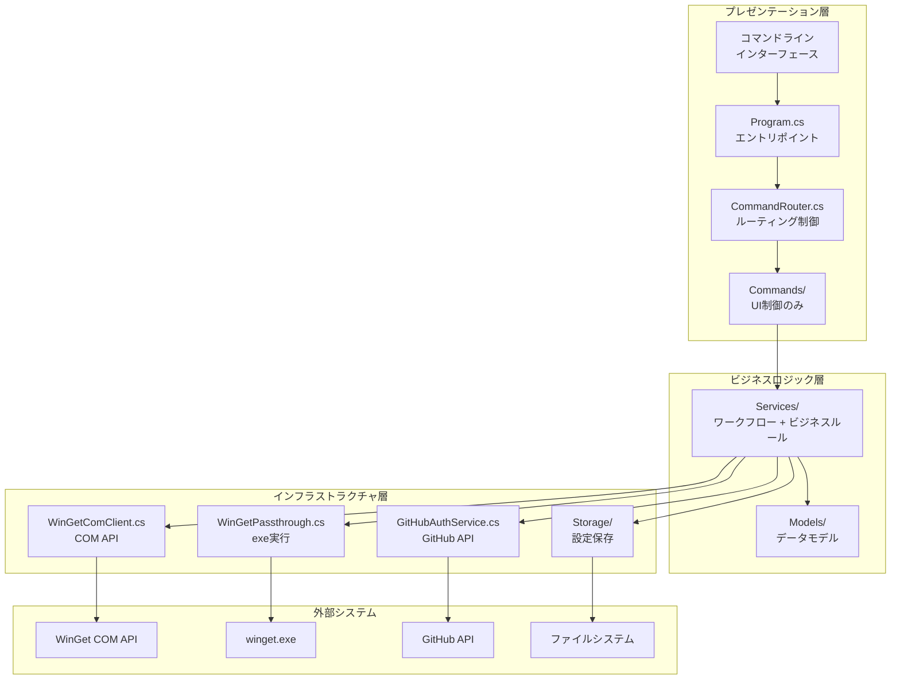

# GistGet アーキテクチャ設計

## アーキテクチャ設計概要

-- ここから編集禁止 --

1. セキュリティ設計: 認証方式と認証情報の保存、設定保管先のGist情報の設定と保管
2. 論理構造設計: レイヤーモデルと、レイヤーの基本的な相互作用の設計
3. テスト設計: 単体・結合テストの方式設計

-- ここまで編集禁止 --

## 1. セキュリティ設計

### 1.1 認証方式

**GitHub OAuth Device Flow**を採用し、ユーザーの代理でGist APIにアクセスする権限を取得しています。


**認証の特徴:**
- OAuth Client ID: `Ov23lihQJhLB6hCnEIvS` (GistGet専用)
- スコープ: `gist`（Gist読み書きのみ）
- 管理者権限不要
- トークン有効期限なし（ユーザーが明示的に取り消すまで有効）

### 1.2 認証情報の保存

- **保存場所**: `%APPDATA%\GistGet\token.json`
- **暗号化**: Windows DPAPI（CurrentUserスコープ）で暗号化保存
- **権限**: CurrentUserスコープ（同じユーザーのみアクセス可能）

### 1.3 Gist設定の保管

- **保存場所**: `%APPDATA%\GistGet\gist.dat`
- **暗号化**: Windows DPAPI（CurrentUserスコープ）
- **内容**: Gist ID、ファイル名、タイムスタンプ

### 1.4 セキュリティ強化ポイント

**現在の実装:**
- トークンはDPAPI暗号化保存済み（CurrentUserスコープ）
- 復号化失敗時の再認証トリガー実装済み
- Gist設定はDPAPI暗号化済み
- ファイルアクセス権限によるユーザー隔離

**将来の改善予定:**
- トークンの定期的な更新機能
- 不正アクセス検知機能
- アクセストークンのスコープ制限強化

## 2. 論理構造設計

### 2.1 レイヤーモデル

**シンプルな3層アーキテクチャ（推奨設計）**:

- **プレゼンテーション層（Commands + Console）**: UI制御とエントリポイント
  - Console層: 高レベルUI抽象化とコマンド固有の表示制御
  - Commands層: ビジネスフロー制御とオプション解析
- **ビジネスロジック層（Services）**: ワークフロー制御とビジネスルール
- **インフラストラクチャ層**: 外部システム連携とデータ永続化



**現在の4層アーキテクチャの問題点**:
- ドメイン層が薄すぎて実質的な価値がない
- Commands層とServices層の責務が曖昧
- 過度な抽象化によるオーバーヘッド

### 2.2 推奨設計での責務分離

#### CommandRouter（プレゼンテーション層）
**責務**: コマンドルーティング制御
- コマンドライン引数の最初の解析（どのコマンドか判定）
- 適切なCommandへのルーティング
- 共通エラーハンドリング（COM例外、ネットワーク例外等）
- 認証・Gist設定チェックの一元管理と自動実行

**推奨実装例**:
```csharp
public class CommandRouter  // 現在のCommandService.cs
{
    public async Task<int> ExecuteAsync(string[] args)
    {
        var command = args.FirstOrDefault()?.ToLowerInvariant();
        
        // 認証・Gist設定が必要なコマンドの一元チェック
        if (RequiresAuthentication(command, args))
        {
            if (!await EnsureAuthenticatedAsync())
                return 1;
                
            if (RequiresGistConfiguration(command, args))
            {
                if (!await EnsureGistConfiguredAsync())
                    return 1;
            }
        }
        
        return command switch
        {
            "login" => await _loginCommand.ExecuteAsync(args),
            "gist" => await HandleGistSubCommandAsync(args),
            "sync" => await _syncCommand.ExecuteAsync(args),
            _ => await _passthroughClient.ExecuteAsync(args) // winget.exeへ
        };
    }
}
```

#### Commands（プレゼンテーション層）
**責務**: ビジネスフロー制御に特化
- コマンドライン引数解析・オプション検証
- ビジネスロジックの呼び出しと結果処理
- 実行結果（exit code）返却

**推奨実装例**:
```csharp
public class GistSetCommand
{
    public async Task<int> ExecuteAsync(string? gistId, string? fileName)
    {
        try 
        {
            // UI制御のみ
            var input = await CollectUserInputAsync(gistId, fileName);
            
            // ビジネスロジックに委譲
            await _gistConfigService.ConfigureGistAsync(input);
            
            // UI表示のみ
            DisplaySuccessMessage(input);
            return 0;
        }
        catch (Exception ex)
        {
            DisplayErrorMessage(ex);
            return 1;
        }
    }
}
```

#### Services（ビジネスロジック層）
**責務**: ワークフロー制御 + ビジネスルール
- 処理の流れ（ワークフロー）制御
- ビジネスルール・バリデーション
- Infrastructure層の組み合わせ利用

**推奨実装例**:
```csharp
public class GistConfigService
{
    public async Task ConfigureGistAsync(GistConfigInput input)
    {
        // ワークフロー + ビジネスルール
        ValidateBusinessRules(input);
        await ValidateAuthentication();
        await ValidateGistAccess(input.GistId);
        await SaveConfiguration(input.ToConfig());
    }
    
    private void ValidateBusinessRules(GistConfigInput input)
    {
        // ビジネスルールをここに集約
        if (!IsValidGistId(input.GistId))
            throw new BusinessRuleException("Invalid Gist ID");
    }
}
```

#### 依存関係の明確化
```
CLI引数 -> CommandRouter (ルーティング判定)
            ↓
         Commands (UI制御)
            ↓  
         Services (ビジネスロジック)
            ↓
         Infrastructure (外部システム)
```

**レイヤー間ルール**:
- CommandRouter → Commands（ルーティング）
- Commands → Services（UI制御がビジネスロジック呼び出し）
- Services → Infrastructure（ビジネスロジックが外部システム利用）
- Services ❌ Commands（逆方向依存の禁止）

#### 現在の実装との差分
**問題**: 
- CommandServiceという名称がルーター機能を表現していない
- Commandが複数Serviceを直接操作（オーケストレーション責務の混在）

**解決**: 
- CommandService → CommandRouterに名称変更
- Serviceがワークフロー制御を担い、Commandは単純なUI制御のみ

### 2.3 Command-Console分離設計

#### 2.3.1 設計原則

**高レベル抽象化によるUI詳細の隠蔽**: CommandからコンソールのI/O詳細を完全に分離し、コマンド固有の高レベルインターフェースを提供します。

**設計理念**:
- Commandはビジネスフローとオプション解析に専念
- ConsoleはUI表現とユーザーインタラクションに専念
- UI変更がCommandに影響しない抽象化レベル

#### 2.3.2 構造設計

**コマンド固有の高レベルインターフェース**:

```csharp
// NuitsJp.GistGet.Presentation.Sync/ISyncConsole.cs
public interface ISyncConsole : IConsoleBase
{
    /// <summary>同期開始を通知</summary>
    void NotifySyncStarting();
    
    /// <summary>同期結果を表示し、ユーザーアクションを取得</summary>
    SyncUserAction ShowSyncResultAndGetAction(SyncResult result);
    
    /// <summary>再起動確認（必要なパッケージリストを含む）</summary>
    bool ConfirmRebootWithPackageList(List<string> packagesRequiringReboot);
    
    /// <summary>再起動実行を通知</summary>
    void NotifyRebootExecuting();
}

// NuitsJp.GistGet.Presentation.Auth/IAuthConsole.cs
public interface IAuthConsole : IConsoleBase
{
    /// <summary>認証フロー全体を実行</summary>
    Task<bool> RunDeviceFlowAuthentication(DeviceCodeInfo deviceCode, CancellationToken cancellationToken);
    
    /// <summary>認証状態を表示</summary>
    void ShowAuthenticationStatus(AuthStatus status);
}

// NuitsJp.GistGet.Presentation.GistConfig/IGistConfigConsole.cs
public interface IGistConfigConsole : IConsoleBase
{
    /// <summary>Gist設定フローを実行</summary>
    GistConfigInput CollectGistConfiguration(bool showInstructions = true);
    
    /// <summary>設定成功を表示</summary>
    void ShowConfigurationSuccess(string gistId, string fileName);
}
```

**共通基盤インターフェース**:

```csharp
// NuitsJp.GistGet.Presentation.Console/IConsoleBase.cs
public interface IConsoleBase
{
    /// <summary>エラーを表示（詳細度は実装に委ねる）</summary>
    void ShowError(Exception exception, string? userFriendlyMessage = null);
    
    /// <summary>警告を表示</summary>
    void ShowWarning(string message);
    
    /// <summary>進捗状況を表示（長時間処理用）</summary>
    IDisposable BeginProgress(string operation);
}
```

**フォルダ構造**:

```
src/NuitsJp.GistGet/Presentation/
├── Console/
│   ├── IConsoleBase.cs (共通基盤)
│   ├── ConsoleBase.cs (共通実装)
│   └── ConsoleStyles.cs (表示スタイル設定)
├── Sync/
│   ├── SyncCommand.cs
│   ├── ISyncConsole.cs
│   ├── SyncConsole.cs (標準実装)
│   └── SharpromptSyncConsole.cs (リッチUI実装)
├── Auth/
│   ├── AuthCommand.cs
│   ├── IAuthConsole.cs
│   ├── AuthConsole.cs
│   └── SharpromptAuthConsole.cs
└── GistConfig/
    ├── GistSetCommand.cs
    ├── GistStatusCommand.cs
    ├── GistShowCommand.cs
    ├── IGistConfigConsole.cs
    ├── GistConfigConsole.cs
    └── SharpromptGistConfigConsole.cs
```

#### 2.3.3 実装パターン

**SyncCommandの簡潔な実装例**:

```csharp
public class SyncCommand
{
    private readonly IGistSyncService _gistSyncService;
    private readonly ISyncConsole _console;
    private readonly ILogger<SyncCommand> _logger;

    public async Task<int> ExecuteAsync(string[] args)
    {
        try
        {
            // オプション解析はCommandが責任を持つ
            var options = ParseOptions(args);
            
            // UIへの通知は高レベルで
            _console.NotifySyncStarting();
            
            // ビジネスロジック実行
            var result = await _gistSyncService.SyncAsync();
            
            // 結果表示とユーザーアクション取得を一体化
            var userAction = _console.ShowSyncResultAndGetAction(result);
            
            // 再起動処理（UIの詳細はConsoleに委譲）
            if (result.RebootRequired && userAction != SyncUserAction.SkipReboot)
            {
                if (_console.ConfirmRebootWithPackageList(result.PackagesRequiringReboot))
                {
                    _console.NotifyRebootExecuting();
                    await _gistSyncService.ExecuteRebootAsync();
                }
            }
            
            return result.ExitCode;
        }
        catch (Exception ex)
        {
            _console.ShowError(ex, "同期処理でエラーが発生しました");
            return 1;
        }
    }
}
```

#### 2.3.4 DI設定

```csharp
// 環境変数やコンフィグで切り替え可能
var useRichUI = Environment.GetEnvironmentVariable("GISTGET_RICH_UI") != "false";

if (useRichUI)
{
    services.AddSingleton<ISyncConsole, SharpromptSyncConsole>();
    services.AddSingleton<IAuthConsole, SharpromptAuthConsole>();
    services.AddSingleton<IGistConfigConsole, SharpromptGistConfigConsole>();
}
else
{
    services.AddSingleton<ISyncConsole, SyncConsole>();
    services.AddSingleton<IAuthConsole, AuthConsole>();
    services.AddSingleton<IGistConfigConsole, GistConfigConsole>();
}
```

#### 2.3.5 設計の利点

1. **責任の分離**: CommandはビジネスフローとオプションBM解析、ConsoleはUI表現に専念
2. **テスタビリティ**: 高レベルインターフェースのモックが簡単
3. **拡張性**: 新しいUI実装（TUI、Web等）の追加が容易
4. **保守性**: UIの変更がCommandに影響しない
5. **ドメイン表現**: メソッド名がビジネス要件を直接表現

### 2.4 名前空間とレイヤーベース抽象化

**現在の問題**: 単一`Abstractions`による過度な抽象化
- 単一プロジェクトで外部公開しないのに全インターフェースを集約
- レイヤー間の依存関係が不明確
- インフラ層の縦割り不足（COM API、winget.exe、GitHub API、Storageが混在）

**推奨設計**: レイヤーベース名前空間設計

#### プレゼンテーション層
```
NuitsJp.GistGet.Presentation/
├── ICommandRouter.cs (現在のICommandService)
├── CommandRouter.cs
├── IErrorMessageService.cs  
├── ErrorMessageService.cs
└── Commands/
    ├── GistSetCommand.cs
    └── [その他のCommand]
```

#### ビジネスロジック層
```
NuitsJp.GistGet.Business/
├── IGistSyncService.cs
├── GistSyncService.cs
├── GistConfigService.cs (新規統合Service)
└── Models/
    ├── GistConfiguration.cs
    └── [その他のModel]
```

#### インフラストラクチャ層（外部システム別縦割り）
```
NuitsJp.GistGet.Infrastructure/
├── WinGet/
│   ├── IWinGetClient.cs
│   ├── WinGetComClient.cs
│   ├── IWinGetPassthrough.cs
│   └── WinGetPassthrough.cs
├── GitHub/
│   ├── IGitHubAuthService.cs
│   ├── GitHubAuthService.cs
│   ├── IGitHubGistClient.cs
│   └── GitHubGistClient.cs
└── Storage/
    ├── IGistConfigurationStorage.cs
    └── GistConfigurationStorage.cs
```

#### 設計原則

1. **レイヤー内同居原則**: 各レイヤー内ではインターフェースと実装を同じ名前空間に配置
   - プロジェクト規模的に分離のオーバーヘッドが不要
   - 関連する定義が近接し、理解しやすい

2. **インフラ層縦割り原則**: 外部システムごとに完全分離
   - `WinGet/`: COM API + exe実行の両方を包含
   - `GitHub/`: 認証 + Gist操作の両方を包含  
   - `Storage/`: 設定ファイル管理

3. **依存関係の明確化**: 各レイヤーは下位レイヤーのインターフェースのみに依存
   ```
   Presentation → Business → Infrastructure (WinGet/GitHub/Storage)
   ```

#### 現在の実装との差分
**問題**: 
- `Abstractions/`に全インターフェースが集約され、レイヤー構造が不明確
- インフラ層で外部システムが混在

**解決**: 
- レイヤー別名前空間にインターフェース移動
- インフラ層を外部システム別に再編成

## 3. テスト設計

### 3.1 テスト方式

**テスト実装の現状**:
- テストプロジェクト: `tests/NuitsJp.GistGet.Tests/`
- テストフレームワーク: xUnit + Moq + Shouldly
- .NET 8 Windows 10環境（win-x64）での実行
- 13個のテストファイル（各主要クラスをカバー）

**テストファイル一覧**:
- `CommandRouterTests.cs` - コマンドルーターのテスト（旧CommandServiceTests.cs）
- `Infrastructure/GitHub/GitHubAuthServiceTests.cs` - DPAPI暗号化テスト（新規追加）
- `GistConfigurationStorageTests.cs` - 設定保存のテスト
- `GistConfigurationTests.cs` - 設定モデルのテスト
- `WinGetComClientTests.cs` - WinGet COM APIのテスト
- `RunnerApplicationTests.cs` - アプリケーションエントリポイントのテスト
- `MockServices.cs` - テスト用モック実装

### 3.2 単体テスト設計（推奨アーキテクチャ対応）

**レイヤーベーステストアーキテクチャ**:

| レイヤー | テスト対象 | 推奨テスト構造 | テスト戦略 |
|---------|-----------|----------------|-----------|
| **Presentation** | UI制御・ルーティング | `Presentation/CommandRouterTests.cs`<br/>`Presentation/Commands/GistSetCommandTests.cs` | UI動作検証、引数解析テスト |
| **Business** | ワークフロー・ビジネスルール | `Business/GistConfigServiceTests.cs`<br/>`Business/GistSyncServiceTests.cs` | ワークフロー統合テスト、下位層モック使用 |
| **Infrastructure** | 外部システム連携 | `Infrastructure/WinGet/WinGetComClientTests.cs`<br/>`Infrastructure/GitHub/GitHubAuthServiceTests.cs`<br/>`Infrastructure/Storage/GistConfigurationStorageTests.cs` | 各外部システム別の隔離テスト |

**t-wada式TDD原則に基づくテスト戦略**:

#### Presentation層テスト
- **責務**: UI制御のみのテスト
- **依存**: Business層サービスをモック
- **検証**: 入力処理、表示処理、終了コード

#### Business層テスト  
- **責務**: ワークフローとビジネスルールのテスト
- **依存**: Infrastructure層をモック
- **検証**: 処理順序、バリデーション、例外処理

#### Infrastructure層テスト
- **責務**: 外部システム連携の個別テスト
- **依存**: 外部システムをモック/スタブ
- **検証**: API呼び出し、データ変換、エラーハンドリング

**DPAPI暗号化テスト（実装済み）**:
- トークンのDPAPI暗号化保存テスト
- 暗号化されたトークンの復号化読み込みテスト
- 復号化失敗時のnull返却テスト
- ファイル不存在時の処理テスト

**名前空間ベースモック戦略**:
```csharp
// Infrastructure層モック（Business層テスト用）
NuitsJp.GistGet.Tests.Mocks.Infrastructure/
├── WinGet/MockWinGetClient.cs
├── GitHub/MockGitHubAuthService.cs  
└── Storage/MockGistConfigurationStorage.cs

// Business層モック（Presentation層テスト用）
NuitsJp.GistGet.Tests.Mocks.Business/
├── MockGistConfigService.cs
└── MockGistSyncService.cs
```

### 3.3 結合テスト設計

**結合テストの段階**:

1. **認証前提テスト**: 
   - `gistget auth`で事前認証が必要
   - 実際のGitHub APIとの通信をテスト

2. **Gist設定前提テスト**:
   - 認証 + Gist設定の両方が必要
   - 実際のGist読み書きをテスト

3. **E2Eテスト**:
   - コマンドライン引数から最終結果まで
   - 実際のwinget.exe実行を含む

- テスト実行戦略

### 3.4 テスト実行環境

**技術的制約**:
- ターゲット環境: `net8.0-windows10.0.22621.0` （Windows 10 Build 22621以降）
- ランタイム: `win-x64` （x64/x86/ARM64対応）
- COM API依存のため、CI/CD環境ではWindows Runnerが必須

**テスト実行戦略**:

| テストタイプ | 実行環境 | 自動化レベル | 制約事項 |
|-------------|----------|-------------|----------|
| **単体テスト** | ローカル/CI | 完全自動化 | モック使用で外部依存なし |
| **統合テスト** | ローカル環境のみ | 半自動化 | COM API・winget.exe依存 |
| **E2Eテスト** | ローカル環境のみ | 手動実行 | 実際のGitHub API接続必要 |

**ローカル開発環境での実行**:
```bash
# テスト実行コマンド
dotnet test tests/NuitsJp.GistGet.Tests/

# カバレッジ取得
dotnet test --collect:"XPlat Code Coverage"
```

**前提条件**:
- Windows 10/11 (Build 22621以降)
- .NET 8 SDK
- Visual Studio 2022またはVS Code
- Microsoft.WindowsPackageManager.ComInterop 1.10.340 （自動インストール）

## 3.5 WinGet COM API制約事項

### 3.5.1 技術的制約の調査結果

**WinGet COM API Uninstall機能対応状況**:

**調査日**: 2025-01-14  
**参照ドキュメント**: [`docs/winget-com-api-spec.md`](./winget-com-api-spec.md) - 公式COM API仕様書  

#### 公式仕様での確認事項

`Microsoft.Management.Deployment.PackageManager`クラス（公式仕様819-839行）:

```csharp
[contract(Microsoft.Management.Deployment.WindowsPackageManagerContract, 1)]
runtimeclass PackageManager
{
    // インストール機能は明示的に定義されている
    Windows.Foundation.IAsyncOperationWithProgress<InstallResult, InstallProgress> 
        InstallPackageAsync(CatalogPackage package, InstallOptions options);
    
    // UninstallPackageAsyncメソッドは存在しない
}
```

#### 技術的結論

1. **Install機能**: COM API完全サポート (`InstallPackageAsync`)
2. **Uninstall機能**: COM APIサポートなし  
   - `UninstallPackageAsync`メソッドが公式仕様に存在しない
   - 2024-2025年時点の最新ドキュメントでも未対応

#### 設計的な示唆

**興味深い点**: `PackageVersionMetadataField`列挙体（467-481行）では以下が定義されている:

```csharp
/// The standard uninstall command; which may be interactive
StandardUninstallCommand,
/// An uninstall command that should be non-interactive  
SilentUninstallCommand,
```

これらのメタデータフィールドの存在から、**将来的にはCOM API経由でのUninstall機能追加が検討されている**可能性がある。

### 3.5.2 現在の実装方針と成功実績

**2025-08-15実装完了**: 公式サンプルベースによるCOM API完全実装達成

#### ハイブリッド実装アプローチ

| 機能 | 実装方式 | 実装状況 |
|------|----------|----------|
| **Install** | COM API優先 → winget.exe フォールバック | ✅ 統合テスト成功 |
| **Uninstall** | 実際パッケージID特定 → winget.exe実行 | ✅ 統合テスト成功 |
| **Search** | COM API実装 | ✅ COM/EXE比較テスト成功 |
| **Upgrade** | 簡易COM実装（将来改善予定） | 部分的サポート |

#### 技術的実装詳細

**初期化パターン**: 
```csharp
// 公式サンプルベースの簡潔実装
_packageManager = new PackageManager();
```

**検索戦略**:
1. PackageMatchField.Id完全一致検索
2. PackageMatchField.Name部分一致フォールバック
3. 結果をPackageDefinitionに統一

#### Gistファイル同期の透過性

**重要**: 実装方式によらずGistファイル同期は透過的に動作:
- Install完了後: `_gistSyncService.AfterInstall(packageId)`  
- Uninstall完了後: `_gistSyncService.AfterUninstall(packageId)`

### 3.5.3 設計正当化

1. **技術的制約の受容**: 公式仕様の限界を受け入れる現実的判断
2. **ユーザー体験の統一**: winget.exeによる一貫した動作保証  
3. **将来拡張への準備**: COM API拡張時の対応準備済み
4. **機能の完全性**: Gist同期機能は全操作で透過的に動作

### 3.5.4 テスト環境の動作実績

#### WinGet COM APIテストの実装成功

**2025-08-15時点の実装状況**:
- **COM API統合テスト全6つが成功**: 初期化・検索・インストール・アンインストール・COM/EXE比較
- **公式サンプルベースの実装**: Microsoft.WindowsPackageManager.ComInterop 1.10.340使用
- **プラットフォーム対応**: net8.0-windows10.0.22621.0、x64/x86/ARM64

**環境変数による制御**:
- `SKIP_WINGET_COM_TESTS`: COM APIが利用できない環境でのテストスキップ機能
  - 設定時: COM API統合テストをスキップし、警告メッセージを出力
  - 未設定時: COM APIテストを実行（推奨）

**CI/CD環境での設定例**:
```yaml
env:
  SKIP_WINGET_COM_TESTS: "true"  # CI環境でCOM APIが利用できない場合のみ
```

**ローカル開発環境**:
- Windows 11/10 (Build 22621以降推奨)
- Windows Package Manager が正しくインストールされている
- Microsoft.WindowsPackageManager.ComInterop パッケージ経由で自動対応

**実装アーキテクチャ**:
- **初期化**: `new PackageManager()` による直接実装（公式サンプルベース）
- **パッケージ検索**: ID完全一致 → 名前部分一致のフォールバック
- **インストール**: COM API実行 → winget.exe フォールバック
- **アンインストール**: 実際のパッケージID特定 → winget.exe実行

## 4. 実装の特徴とアーキテクチャ原則

### 4.1 設計原則

1. **段階的実装**: パススルー → COM API → Gist同期の順で機能追加
2. **後方互換性**: 既存のwingetワークフローを破壊しない
3. **フォールバック戦略**: COM API失敗時の自動フォールバック
4. **セキュアデフォルト**: 認証情報の適切な保護

### 4.2 技術スタック

- **フレームワーク**: .NET 8 (net8.0-windows10.0.22621.0)
- **プラットフォーム**: x64/x86/ARM64 対応
- **COM API**: Microsoft.WindowsPackageManager.ComInterop 1.10.340
- **CsWinRT**: Microsoft.Windows.CsWinRT 2.2.0
- **HTTP通信**: System.Net.Http（GitHub API用）
- **暗号化**: Windows DPAPI
- **ログ**: Microsoft.Extensions.Logging
- **DI**: Microsoft.Extensions.DependencyInjection

### 4.3 エラーハンドリング戦略

- 階層化されたエラー処理
- 回復戦略
  - COM API失敗 → winget.exe実行
  - ネットワーク失敗 → オフライン動作継続
  - 認証失敗 → 再認証プロンプト

## 5. Design Decisions（DR）

### DR-001: 例外と終了コードのポリシー

**Status**: Accepted  
**Date**: 2025-01-14  
**Decision**: 例外処理と終了コードの統一方針を確立する

#### Context
アプリケーション全体で一貫したエラーハンドリング戦略が必要。現在のコードベースにはパターンが存在するが、明文化されていない。

#### Decision

##### 終了コードポリシー
- **成功**: `0` - 処理が正常に完了した場合
- **エラー**: `1` - 任意のエラーが発生した場合（詳細化は将来検討）

##### 例外タイプ分類
1. **入力検証例外**: `ArgumentException`, `ArgumentNullException`
   - 用途: パラメータ検証、NULL チェック
   - 処理: コンストラクタ、メソッド開始時の即座チェック

2. **ビジネスルール例外**: `InvalidOperationException`
   - 用途: 設定未完了、アクセス権限、状態不正
   - 処理: ビジネスロジック層での検証

3. **外部システム例外**: `COMException`, `HttpRequestException`, `IOException`
   - 用途: COM API、GitHub API、ファイルシステム連携エラー
   - 処理: Infrastructure層での専用ハンドリング

4. **データ形式例外**: `JsonException`, `YamlException`, `CryptographicException`
   - 用途: データシリアライズ、暗号化処理エラー
   - 処理: 変換処理での専用catch

##### エラーハンドリング原則
1. **階層化catch処理**: 具体的例外から一般例外へ
2. **ログ出力**: 全例外を構造化ログで記録（`_logger.LogError`）
3. **ユーザー表示**: エラー種別に応じた適切な日本語メッセージ（`Console.WriteLine`）
4. **フォールバック戦略**: COM API失敗時のwinget.exe実行など

##### 実装パターン例
```csharp
public async Task<int> ExecuteAsync(string[] args)
{
    try
    {
        // メイン処理
        return 0;
    }
    catch (ArgumentException argEx)
    {
        _logger.LogError(argEx, "入力検証エラー: {Message}", argEx.Message);
        Console.WriteLine($"入力エラー: {argEx.Message}");
        return 1;
    }
    catch (InvalidOperationException invEx)
    {
        _logger.LogError(invEx, "操作エラー: {Message}", invEx.Message);
        Console.WriteLine($"操作エラー: {invEx.Message}");
        return 1;
    }
    catch (COMException comEx)
    {
        _errorMessageService.HandleComException(comEx);
        return 1;
    }
    catch (HttpRequestException httpEx)
    {
        _errorMessageService.HandleNetworkException(httpEx);
        return 1;
    }
    catch (Exception ex)
    {
        _errorMessageService.HandleUnexpectedException(ex);
        return 1;
    }
}
```

#### Consequences
- **Positive**: 一貫したエラー処理、保守性向上、ユーザー体験統一
- **Negative**: 追加の実装コスト、エラー分類の学習コスト
- **Risks**: 既存コードの不整合、新機能での遵守漏れ

#### Implementation Notes
- `ErrorMessageService.cs`で例外タイプ別メッセージ処理を実装済み
- `CommandRouter.cs`で主要例外タイプの catch 実装済み
- テスト実装時は例外パターンの確認を含める

### DR-002: CommandRouterでの一元的認証・設定チェック

**Status**: Accepted  
**Date**: 2025-08-15  
**Decision**: CommandRouterで認証・Gist設定チェックを一元化し、自動的に未設定の場合はフローを実行する

#### Context
各コマンドで個別に認証・Gist設定チェックを行うと、同一ロジックが分散し、保守性が低下する。ユーザー体験として、認証やGist設定を意識することなく、自然にコマンドを実行できるようにしたい。

#### Decision

##### 一元的チェック実装
```csharp
public async Task<int> ExecuteAsync(string[] args)
{
    var command = args[0].ToLowerInvariant();
    
    // 認証・Gist設定が必要なコマンドを判定
    if (RequiresAuthentication(command, args))
    {
        if (!await EnsureAuthenticatedAsync())
            return 1;
            
        if (RequiresGistConfiguration(command, args))
        {
            if (!await EnsureGistConfiguredAsync())
                return 1;
        }
    }
    
    return await RouteCommandAsync(command, args);
}
```

##### コマンド判定ロジック
- **認証が必要**: sync, install, uninstall, upgrade, gist (status以外)
- **Gist設定が必要**: sync, install, uninstall, upgrade, gist show

##### 自動実行フロー
1. **EnsureAuthenticatedAsync**: 未認証時に`LoginCommand`を自動実行
2. **EnsureGistConfiguredAsync**: 未設定時に`GistSetCommand`を自動実行

##### auth → login コマンド変更
- `auth`コマンドを`login`コマンドに完全変更

#### Consequences
- **Positive**: DRY原則の徹底、ユーザー体験の向上、保守性の向上
- **Negative**: CommandRouterの複雑度増加、新しい依存性の追加
- **Risks**: ログインフローの無限ループ、設定フローの中断時の処理

#### Implementation Notes
- CommandRouterに`IGitHubAuthService`、`IGistManager`、`LoginCommand`を依存性注入
- 各コマンドから認証・設定チェックロジックを削除
- テストでは認証・設定済み状態をモックで設定
- LoginCommandがAuthCommandを完全に置き換え