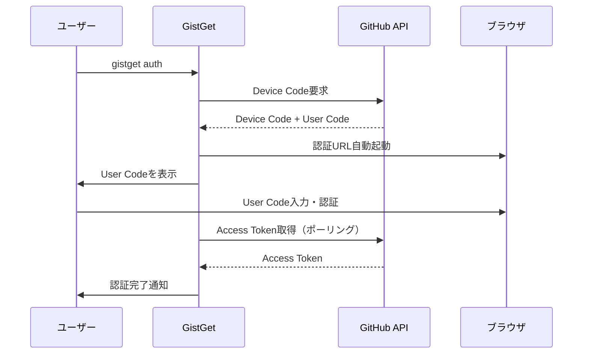
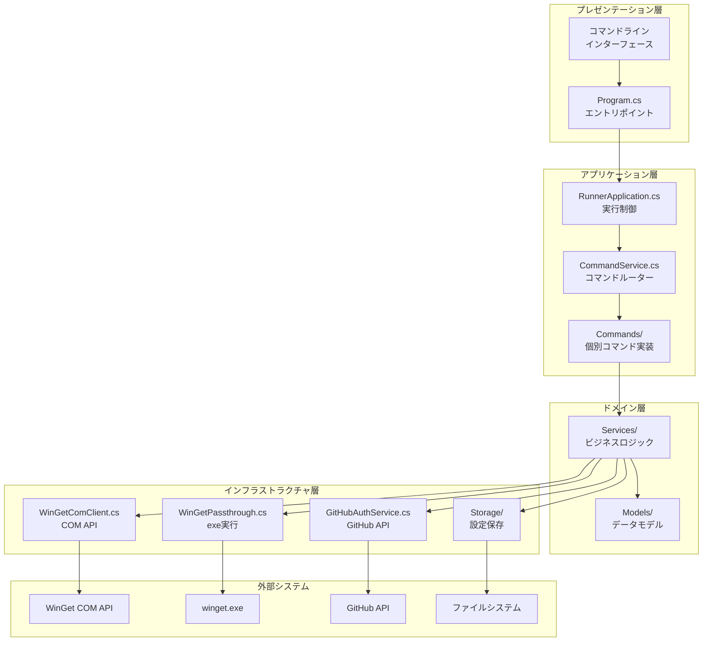

# GistGet アーキテクチャ設計

## アーキテクチャ設計概要

-- ここから編集禁止 --

1. セキュリティ設計: 認証方式と認証情報の保存、設定保管先のGist情報の設定と保管
2. 論理構造設計: レイヤーモデルと、レイヤーの基本的な相互作用の設計
3. テスト設計: 単体・結合テストの方式設計

-- ここまで編集禁止 --

## 1. セキュリティ設計

### 1.1 認証方式

**GitHub OAuth Device Flow**を採用し、ユーザーの代理でGist APIにアクセスする権限を取得しています。

**認証の特徴:**
- OAuth Client ID: `Ov23lihQJhLB6hCnEIvS` (GistGet専用)
- スコープ: `gist`（Gist読み書きのみ）
- 管理者権限不要
- トークン有効期限なし（ユーザーが明示的に取り消すまで有効）

### 1.2 認証情報の保存

- **保存場所**: `%APPDATA%\GistGet\token.json`
- **暗号化**: 現在は平文保存（将来的にDPAPI対応予定）
- **権限**: CurrentUserスコープ（同じユーザーのみアクセス可能）

### 1.3 Gist設定の保管

- **保存場所**: `%APPDATA%\GistGet\gist.dat`
- **暗号化**: Windows DPAPI（CurrentUserスコープ）
- **内容**: Gist ID、ファイル名、タイムスタンプ

### 1.4 セキュリティ強化ポイント

**現在の実装:**
- トークンは平文保存（改善余地あり）
- Gist設定はDPAPI暗号化済み
- ファイルアクセス権限によるユーザー隔離

**将来の改善予定:**
- トークンのDPAPI暗号化
- トークンの定期的な更新機能
- 不正アクセス検知機能

## 2. 論理構造設計

### 2.1 レイヤーモデル

### 2.2 レイヤー間の基本的な相互作用

- 依存性注入による疎結合
- コマンドルーティング戦略

### 2.3 抽象化レイヤー

- インターフェース定義
  - コマンド実行の抽象化
  - WinGet操作の抽象化
  - GitHub認証の抽象化
  - Gist同期の抽象化
  - エラー処理の抽象化
- 実装戦略の切り替え
  - COM API優先、失敗時にwinget.exe実行にフォールバック
  - テスト時はモック実装に差し替え可能
  - 将来的な機能拡張に対応

## 3. テスト設計

### 3.1 テスト方式

- テスト用ディレクトリは存在するが、テストファイルは未作成
- テストフレームワークはxUnitを使用予定（.NET 8標準）

### 3.2 単体テスト設計

| レイヤー | テスト対象 | テスト戦略 |
|---------|-----------|-----------|
| **Services** | ビジネスロジック | モックを使用した隔離テスト |
| **Commands** | コマンド実装 | 入出力検証、エラーハンドリング |
| **Models** | データモデル | プロパティ、バリデーション |
| **Storage** | データ永続化 | 一時ファイルでの実際の暗号化テスト |

- 依存性注入によるテスト容易性

### 3.3 結合テスト設計

**結合テストの段階**:

1. **認証前提テスト**: 
   - `gistget auth`で事前認証が必要
   - 実際のGitHub APIとの通信をテスト

2. **Gist設定前提テスト**:
   - 認証 + Gist設定の両方が必要
   - 実際のGist読み書きをテスト

3. **E2Eテスト**:
   - コマンドライン引数から最終結果まで
   - 実際のwinget.exe実行を含む

- テスト実行戦略

### 3.4 テスト実行環境

- Windows COM API依存のため、GitHub ActionsではWindows環境が必須
- winget.exe依存のため、フル機能テストはローカル環境のみ
- 単体テストのみCI/CDで自動実行

- ローカル開発環境
  - 事前認証: `gistget auth`
  - Gist設定: `gistget gist set`
  - テスト実行: `dotnet test`

- テストデータ管理
  - テスト用Gistは開発者個人のGitHubアカウント
  - 機密データは環境変数で管理
  - テスト後のクリーンアップ処理実装

## 4. 実装の特徴とアーキテクチャ原則

### 4.1 設計原則

1. **段階的実装**: パススルー → COM API → Gist同期の順で機能追加
2. **後方互換性**: 既存のwingetワークフローを破壊しない
3. **フォールバック戦略**: COM API失敗時の自動フォールバック
4. **セキュアデフォルト**: 認証情報の適切な保護

### 4.2 技術スタック

- **フレームワーク**: .NET 8
- **COM API**: Microsoft.Management.Deployment
- **HTTP通信**: System.Net.Http（GitHub API用）
- **暗号化**: Windows DPAPI
- **ログ**: Microsoft.Extensions.Logging
- **DI**: Microsoft.Extensions.DependencyInjection

### 4.3 エラーハンドリング戦略

- 階層化されたエラー処理
- 回復戦略
  - COM API失敗 → winget.exe実行
  - ネットワーク失敗 → オフライン動作継続
  - 認証失敗 → 再認証プロンプト