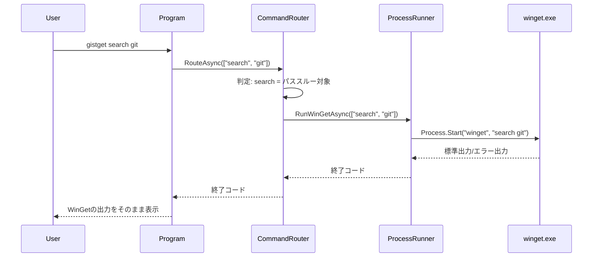
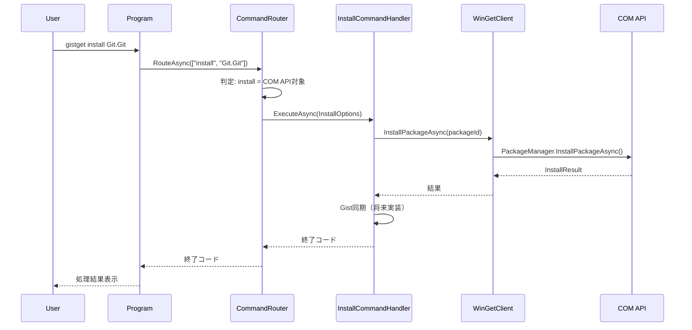

# GistGet アーキテクチャ設計

## 1. 現在の実装状態

### 実装済み機能
- ✅ WinGet CLIへのパススルー実装
- ✅ COM API基盤の構築
- ✅ 基本的なコマンドハンドラー構造
- ⏳ Gist同期機能（未実装）
- ⏳ CI/CDパイプライン（未実装）

### アーキテクチャ概要

```
┌─────────────────────────────────────────┐
│            Program.cs                    │ エントリポイント
├─────────────────────────────────────────┤
│         CommandRouter                    │ コマンド分類・ルーティング  
├──────────────┬──────────────────────────┤
│  COM API     │    パススルー             │
│  (将来拡張)   │    (現在のメイン)         │
├──────────────┼──────────────────────────┤
│ WinGetClient │   ProcessRunner          │
│              │                          │
├──────────────┼──────────────────────────┤
│ COM API      │   winget.exe             │
└──────────────┴──────────────────────────┘
```

## 2. 引数処理戦略

### 二段階の引数処理アプローチ

GistGetは引数処理において、**最小限の解釈**と**完全なパススルー**を使い分けます：

#### 第1段階: 最小限の解釈（ルーティング判定のみ）
```csharp
// 第1引数のコマンドのみを確認してルーティング決定
var command = args.FirstOrDefault()?.ToLower();

switch (command)
{
    case "sync":
    case "export":
    case "import":
        // GistGet独自コマンド → System.CommandLineで完全解析
        return await HandleGistCommand(args);
        
    case "install" when HasGistSyncEnabled():
    case "uninstall" when HasGistSyncEnabled():
        // Gist同期が有効な場合のみCOM API経由
        return await HandleWithComApi(args);
        
    default:
        // その他すべて → 引数を一切解釈せずパススルー
        return await PassthroughToWinGet(args);
}
```

#### 第2段階: コマンド別の処理

| パターン | 対象コマンド | 引数処理 | 理由 |
|---------|------------|---------|------|
| **完全パススルー** | search, list, show, source, settings等 | 引数を**一切解釈せず**そのまま渡す | WinGetの複雑な引数体系と完全互換を保証 |
| **Gist独自コマンド** | sync, export, import | System.CommandLineで**完全解析** | GistGet独自機能のため独自の引数体系 |
| **ハイブリッド** | install, uninstall（Gist同期時） | 最小限の解析後、残りをCOM APIへ | Gist同期のための情報抽出が必要 |

### System.CommandLine使用範囲の限定

```csharp
public class ArgumentStrategy
{
    // GistGet独自コマンドのみSystem.CommandLineを使用
    private static readonly HashSet<string> GistOnlyCommands = new()
    {
        "sync",   // gistget sync [--force]
        "export", // gistget export [--output file]
        "import"  // gistget import [--file file]
    };
    
    public bool ShouldParseArguments(string command)
    {
        // Gist独自コマンドのみ引数解析が必要
        return GistOnlyCommands.Contains(command);
    }
    
    public async Task<int> RouteCommand(string[] args)
    {
        var firstArg = args.FirstOrDefault()?.ToLower();
        
        if (ShouldParseArguments(firstArg))
        {
            // System.CommandLineで引数解析
            var parser = new GistCommandParser();
            return await parser.ParseAndExecute(args);
        }
        else
        {
            // 引数を一切触らずにパススルー
            return await ProcessRunner.RunWinGetAsync(args);
        }
    }
}
```

### パススルー時の注意点

**重要:** WinGetへのパススルー時は引数を**一切加工しない**
- 引数の順序を維持
- 大文字小文字を維持  
- 特殊文字やエスケープを維持
- 未知のオプションもそのまま渡す

```csharp
// ❌ 悪い例: 引数を解釈・加工してしまう
public async Task<int> BadPassthrough(string[] args)
{
    var parsed = ParseArguments(args);  // 不要な解析
    var reformatted = BuildWinGetArgs(parsed);  // 再構築で情報が失われる可能性
    return await RunWinGet(reformatted);
}

// ✅ 良い例: 引数をそのまま渡す
public async Task<int> GoodPassthrough(string[] args)
{
    // 引数配列をそのままwinget.exeに渡す
    return await ProcessRunner.RunWinGetAsync(args);
}
```

## 3. 実行フローのシーケンス図

### A. パススルーパターン（現在のメイン実装）



### B. COM APIパターン（将来の拡張用）



## 4. 現在の実装詳細

### コマンドルーティング戦略

```csharp
public class CommandRouter
{
    // 現在はすべてパススルー
    // 将来的にGist同期が必要なコマンドのみCOM API経由に切り替え
    
    public async Task<int> RouteAsync(string[] args)
    {
        // 現在の実装: すべてwinget.exeへパススルー
        return await ProcessRunner.RunWinGetAsync(args);
        
        // 将来の実装:
        // var command = args.FirstOrDefault();
        // if (IsGistSyncCommand(command))
        // {
        //     return await HandleWithComApi(args);
        // }
        // return await ProcessRunner.RunWinGetAsync(args);
    }
}
```

### 主要コンポーネント

#### Program.cs
- アプリケーションのエントリポイント
- コマンドライン引数をCommandRouterに渡す
- 終了コードを返す

#### CommandRouter
- コマンドの分類とルーティング
- 将来的にCOM APIとパススルーの振り分けを行う
- 現在はすべてパススルー

#### ProcessRunner
- winget.exeの実行を管理
- 標準出力/エラー出力の処理
- プロセスの終了コード取得

#### WinGetClient（部分実装）
- COM APIのラッパー
- PackageManagerの初期化と管理
- 将来のGist同期用基盤

## 5. 技術スタック

### 現在使用中
- **フレームワーク**: .NET 8
- **COM API**: Microsoft.Management.Deployment
- **プロセス管理**: System.Diagnostics.Process
- **非同期処理**: Task-based Async Pattern

### 将来追加予定
- **引数パーサー**: System.CommandLine
- **HTTP通信**: HttpClient（GitHub API用）
- **YAML処理**: YamlDotNet（Gist同期用）
- **暗号化**: Windows DPAPI（トークン保存用）

## 6. 実装の特徴

### シンプルな設計
- 最小限の抽象化
- 直接的なコード実装
- 段階的な機能追加

### 互換性重視
- WinGetの出力を完全に保持
- 既存のワークフローを破壊しない
- エラーメッセージもそのまま伝達

### 拡張性の確保
- COM API基盤は構築済み
- Gist同期機能の追加が容易
- テスト可能な構造

## 7. セキュリティ考慮事項

### 現在の実装
- プロセス実行時の引数エスケープ
- COM APIの安全な初期化
- リソースの適切な解放

### 将来の実装（Gist同期時）
- OAuth Device Flowによる認証
- トークンの暗号化保存
- 最小権限の原則

## 8. 既知の制限事項

### 現在の制限
- Windows専用（COM API依存）
- 管理者権限が必要な操作あり
- Gist同期機能未実装

### 対応予定
- エラーメッセージの改善
- 非管理者モードでの動作改善
- プログレス表示の実装

## 9. CI/CD環境での技術的課題

### A. Windows依存性の課題

```yaml
# COM APIのWindows依存性への対処
strategy:
  matrix:
    os: [windows-latest]  # Windows限定
    dotnet: ['8.0.x']
```

#### 課題と解決策

| コンポーネント | 課題 | 解決策 | 実装難易度 |
|---------------|------|--------|-----------|
| **COM API** | Windows限定 | 条件付きコンパイル | 低 |
| **DPAPI** | Windows限定 | 抽象化レイヤー | 中 |
| **winget.exe** | 実行ファイル依存 | モック実装 | 高 |
| **管理者権限** | CI環境で制限 | テスト分離 | 中 |

### B. テスタビリティの改善

```csharp
// 依存性注入によるテスト可能な設計
public interface IPackageManager
{
    Task<int> InstallAsync(string packageId);
    Task<int> UninstallAsync(string packageId);
}

// 本番実装
public class WinGetComManager : IPackageManager
{
    private readonly PackageManager _comApi;
    // COM API実装
}

// テスト用モック
public class MockPackageManager : IPackageManager
{
    public Dictionary<string, bool> InstalledPackages { get; }
    // メモリ内実装
}

// CI環境での自動切り替え
public static IServiceProvider ConfigureServices(bool isCI)
{
    var services = new ServiceCollection();
    
    if (isCI)
    {
        services.AddSingleton<IPackageManager, MockPackageManager>();
        services.AddSingleton<IAuthProvider, EnvironmentAuthProvider>();
    }
    else
    {
        services.AddSingleton<IPackageManager, WinGetComManager>();
        services.AddSingleton<IAuthProvider, DeviceFlowAuthProvider>();
    }
    
    return services.BuildServiceProvider();
}
```

### C. ビルドパイプライン最適化

```yaml
# マルチステージビルド
stages:
  - stage: Build
    jobs:
      - job: Compile
        steps:
          - task: DotNetCoreCLI@2
            inputs:
              command: 'build'
              arguments: '--configuration Release'
              
  - stage: Test
    dependsOn: Build
    jobs:
      - job: UnitTests
        steps:
          - script: dotnet test --filter "Category=Unit"
            
      - job: IntegrationTests
        condition: eq(variables['Build.SourceBranch'], 'refs/heads/main')
        steps:
          - script: dotnet test --filter "Category=Integration"
          
  - stage: Package
    condition: startsWith(variables['Build.SourceBranch'], 'refs/tags/')
    jobs:
      - job: CreateExecutable
        steps:
          - script: |
              dotnet publish -c Release -r win-x64 \
                --self-contained \
                -p:PublishSingleFile=true \
                -p:IncludeNativeLibrariesForSelfExtract=true
```

### D. 環境別設定管理

```json
// appsettings.json
{
  "Environment": "Production",
  "GitHub": {
    "ApiUrl": "https://api.github.com",
    "ClientId": "YOUR_CLIENT_ID"
  }
}

// appsettings.CI.json
{
  "Environment": "CI",
  "GitHub": {
    "ApiUrl": "https://api.github.com",
    "UseEnvironmentToken": true
  },
  "Testing": {
    "UseMocks": true,
    "SkipAdminTests": true
  }
}

// appsettings.Development.json
{
  "Environment": "Development",
  "GitHub": {
    "ApiUrl": "https://api.github.com",
    "ClientId": "DEV_CLIENT_ID"
  },
  "Logging": {
    "LogLevel": {
      "Default": "Debug"
    }
  }
}
```

### E. 継続的デプロイメント

```yaml
# GitHub Releases への自動デプロイ
- name: Create Release
  if: startsWith(github.ref, 'refs/tags/')
  uses: actions/create-release@v1
  with:
    tag_name: ${{ github.ref }}
    release_name: Release ${{ github.ref }}
    draft: false
    prerelease: false
    
- name: Upload Release Asset
  uses: actions/upload-release-asset@v1
  with:
    upload_url: ${{ steps.create_release.outputs.upload_url }}
    asset_path: ./bin/Release/net8.0/win-x64/publish/GistGet.exe
    asset_name: GistGet.exe
    asset_content_type: application/octet-stream
```

## 10. パフォーマンス最適化

### A. 起動時間の改善

```csharp
// ReadyToRun による起動高速化
// プロジェクトファイルに追加
<PropertyGroup>
  <PublishReadyToRun>true</PublishReadyToRun>
  <TieredCompilation>true</TieredCompilation>
</PropertyGroup>
```

### B. メモリ使用量の削減

```csharp
// 大量のパッケージリスト処理時のストリーミング
public async IAsyncEnumerable<Package> GetPackagesAsync()
{
    await foreach (var package in _comApi.GetPackagesAsync())
    {
        yield return package;
    }
}
```

## 11. 監視とログ

### A. 構造化ログ

```csharp
// Serilog による構造化ログ
Log.Logger = new LoggerConfiguration()
    .MinimumLevel.Debug()
    .WriteTo.Console()
    .WriteTo.File("logs/gistget-.txt", rollingInterval: RollingInterval.Day)
    .CreateLogger();

Log.Information("Installing package {PackageId} version {Version}", 
    packageId, version);
```

### B. テレメトリ（オプトイン）

```csharp
// Application Insights (オプトイン)
if (Settings.EnableTelemetry)
{
    services.AddApplicationInsightsTelemetry();
}
```