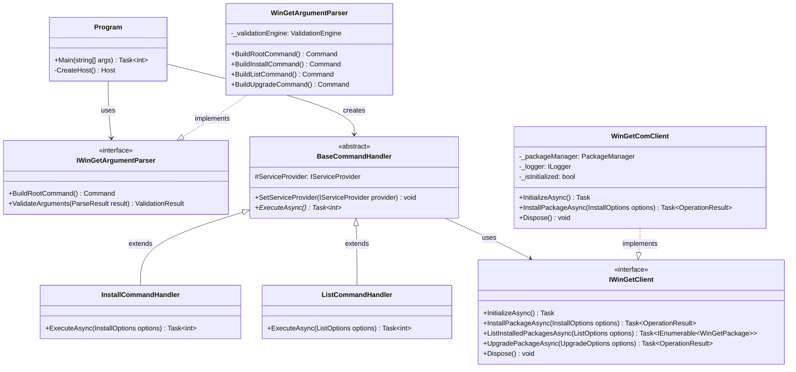
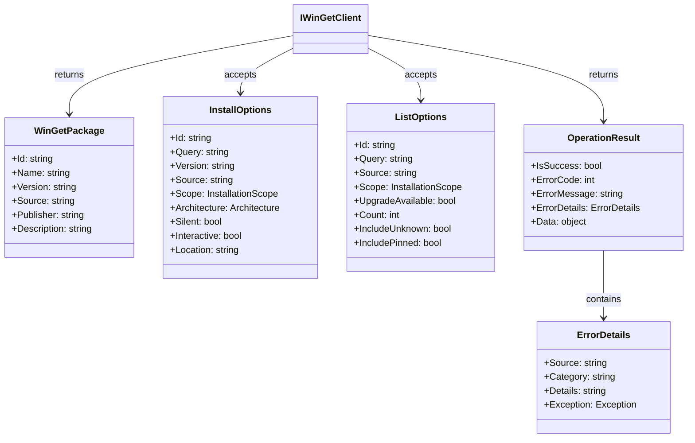
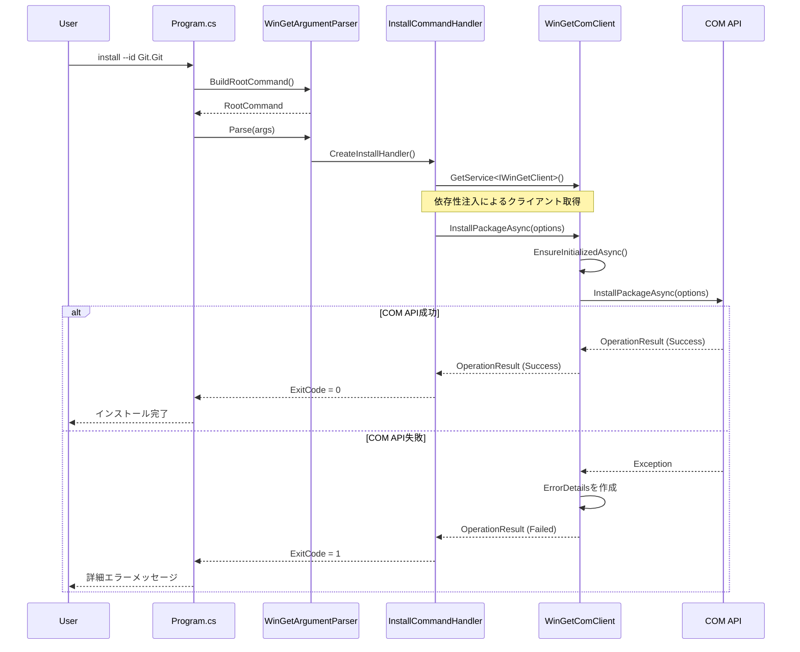
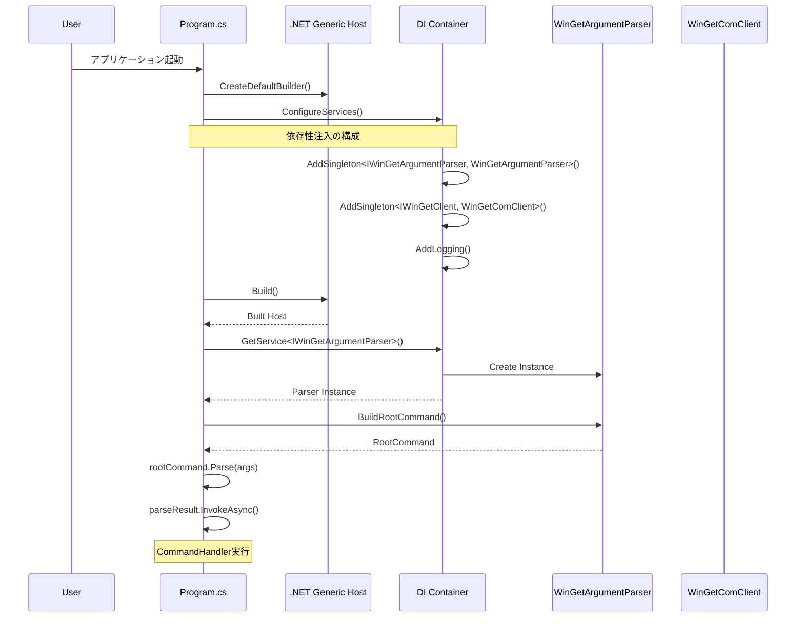
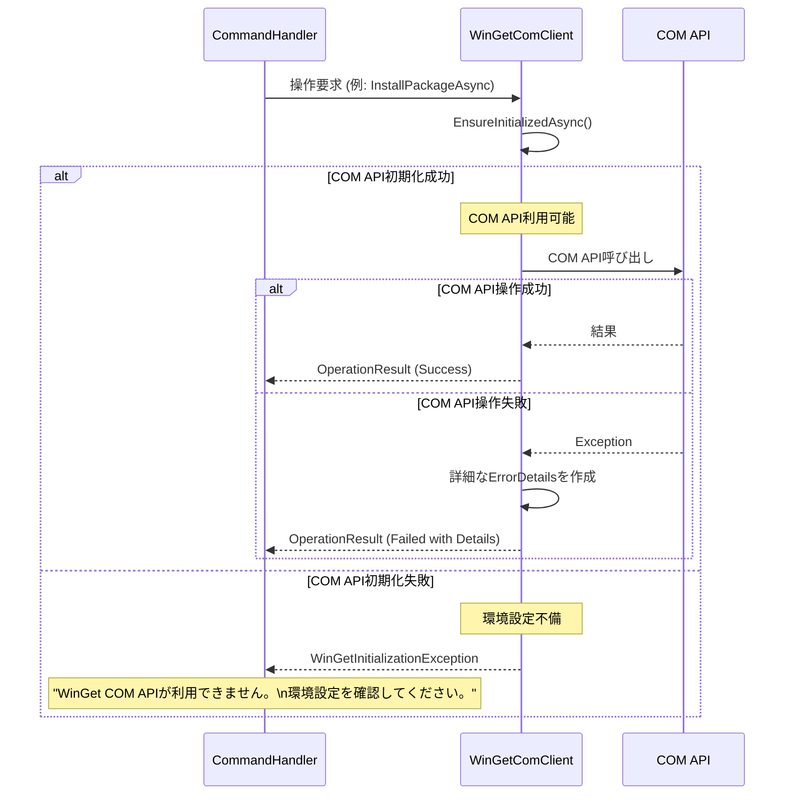
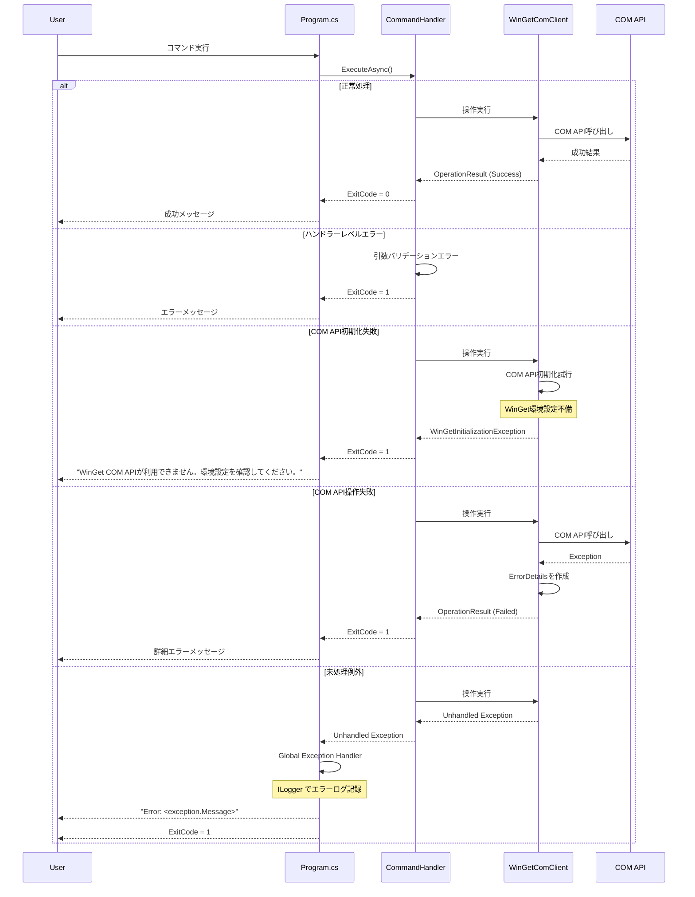

# GistGet .NET アーキテクチャ設計書

## 概要

GistGetは、WinGetの機能を.NET 8で実装し、GitHub Gistとの同期機能を提供するツールです。本書では現在の実装アーキテクチャについて詳述します。

## アーキテクチャ全体像

本アプリケーションは、以下の主要レイヤーで構成されています：

```
┌─────────────────────────────────────────┐
│            CLI Interface                 │ Program.cs
├─────────────────────────────────────────┤
│        Argument Parser Layer            │ WinGetArgumentParser
├─────────────────────────────────────────┤
│         Command Handler Layer           │ BaseCommandHandler + 具象ハンドラ
├─────────────────────────────────────────┤
│        WinGet Client Abstraction        │ IWinGetClient
├─────────────────────────────────────────┤
│           COM API Layer                 │ WinGetComClient
├─────────────────────────────────────────┤
│        Microsoft WinGet API             │ COM Interop
└─────────────────────────────────────────┘
```

## コア・アーキテクチャ・コンポーネント

### 1. エントリポイント (Program.cs)

**責務**: アプリケーション初期化、依存性注入、エラーハンドリング

- .NET Generic Host を使用した依存性注入コンテナの構築
- System.CommandLine による引数解析とコマンド実行の統合
- グローバルエラーハンドリングとログ設定

### 2. 引数解析レイヤー (WinGetArgumentParser)

**責務**: WinGet CLI完全準拠の引数解析とバリデーション

主要機能：
- 18種類のコマンド（install, list, upgrade等）の完全サポート
- コマンドエイリアス（add→install, ls→list等）
- サブコマンド階層（source add/list/update等）
- 相互排他性・条件付きバリデーション
- グローバルオプション（--help, --version等）

### 3. コマンドハンドラーレイヤー

**責務**: 各WinGetコマンドの実行ロジック

- **BaseCommandHandler**: 共通インフラストラクチャ
- **具象ハンドラー**: InstallCommandHandler, ListCommandHandler等、各コマンド固有の処理

### 4. WinGetクライアント抽象化レイヤー

**責務**: WinGet操作の統一インターフェースとCOM API実装

- **IWinGetClient**: 公開インターフェース
- **WinGetComClient**: COM API専用実装

### 5. データモデル

**責務**: WinGet操作で使用するデータ構造とオプション

- **パッケージモデル**: WinGetPackage, SearchResult等
- **オプションモデル**: InstallOptions, ListOptions等
- **結果モデル**: OperationResult, ErrorDetails等

## 主要クラス概要

### Program クラス
- アプリケーション設定とブートストラップ
- 依存性注入の構成
- CommandLineConfigurationによる引数解析実行

### WinGetArgumentParser クラス
```csharp
public class WinGetArgumentParser : IWinGetArgumentParser
{
    // System.CommandLineのRootCommandを構築
    public Command BuildRootCommand()
    
    // 各コマンドの構築メソッド
    private Command BuildInstallCommand()
    private Command BuildListCommand()
    // ... その他18コマンド
}
```

### BaseCommandHandler クラス
```csharp
public abstract class BaseCommandHandler
{
    protected static IServiceProvider? ServiceProvider { get; private set; }
    
    public abstract Task<int> ExecuteAsync(/* パラメータ */);
}
```

### WinGetComClient クラス
```csharp
public class WinGetComClient : IWinGetClient, IDisposable
{
    // COM API専用実装
    public async Task<OperationResult> InstallPackageAsync(InstallOptions options)
    
    // COM API初期化
    public async Task InitializeAsync()
}
```

## クラス構造図

### コアアーキテクチャ概念図



### データモデル構造図



## 処理シーケンス図

### パッケージインストール処理フロー



### アプリケーション初期化フロー



### COM API 初期化と実行フロー



### エラーハンドリング階層



## 設計パターンと原則

### 1. 依存性注入パターン
- .NET Generic Hostによる統一されたDIコンテナ
- インターフェース分離による疎結合設計

### 2. 例外処理パターン
- COM API専用の明確なエラーハンドリング
- 環境設定問題の明確な診断メッセージ
- 段階的エラー回復とユーザーガイダンス

### 3. コマンドパターン
- 各WinGetコマンドを独立したコマンドハンドラーとして実装
- 共通ベースクラスによる統一されたインターフェース

### 4. アダプターパターン
- Microsoft WindowsPackageManager COM APIをIWinGetClientに適合
- COM API専用の最適化されたインターフェース実装

## システム統合

### Microsoft.WindowsPackageManager.ComInterop統合
- バージョン: 1.11.430
- COM初期化: PackageManagerFactory.CreatePackageManager()
- 非同期操作: Task-based Async Pattern
- プログレス通知: IProgress&lt;OperationProgress&gt;

### System.CommandLine統合
- 引数解析フレームワーク
- コマンド階層とサブコマンドサポート
- 相互排他性とバリデーションルール

### COM API専用最適化
- ネイティブCOM API直接利用によるオーバーヘッド削減
- プロセス間通信の削除による高速化

## エラーハンドリング戦略

### 階層的エラーハンドリング
1. **Program.cs**: 最上位例外キャッチとログ出力
2. **CommandHandler**: コマンド実行時の例外処理
3. **WinGetComClient**: COM API/CLI実行の例外処理

### 明確なエラー処理
- COM API失敗時の詳細な診断情報提供
- 環境設定問題の明確な特定とガイダンス
- デバッグ支援のための充実したログ情報

## ログとモニタリング

### 統合ログ基盤
- Microsoft.Extensions.Logging使用
- 構造化ログでの詳細な処理情報記録
- COM API実行の透明性とデバッグ支援

### 診断情報
- ClientInfo による実行環境情報取得
- COM API初期化状況の把握
- WinGetバージョン互換性チェック

## セキュリティ考慮事項

### COM APIセキュリティ
- COM オブジェクト初期化の安全性確保
- 適切なCOM リソース管理

### 入力検証
- コマンドライン引数の厳密なバリデーション
- ValidationEngineによるルールベース検証

## パフォーマンス最適化

### COM API専用戦略
- ネイティブCOM API直接利用による最適化
- 外部プロセス不要による高速化とリソース効率

### 非同期処理
- 全操作のTask-based Async Pattern対応
- CancellationToken による処理中断サポート

### リソース管理
- IDisposable による適切なリソース解放
- COM オブジェクトの確実な解放

## 拡張性とメンテナンス性

### インターフェース分離
- IWinGetClient による実装詳細の隠蔽
- 新たなWinGet実装方式の容易な追加

### モジュラー設計
- 各レイヤーの独立性確保
- テスト容易性の向上

### 設定可能性
- 依存性注入による柔軟な構成変更
- COM API専用の最適化されたテスト支援

## 今後の拡張予定

### フェーズ4: Gist同期機能統合
- IGistClient インターフェース追加
- OAuth Device Flow認証実装
- GitHub Gist API統合
- PowerShell版との互換性確保

### テスト基盤強化
- 単体テストカバレッジ向上（目標90%以上）
- 統合テスト・E2Eテストの実装
- パフォーマンステストの追加

---

*本書は実装状況に基づいた現時点（2025年8月）でのアーキテクチャ設計書です。*