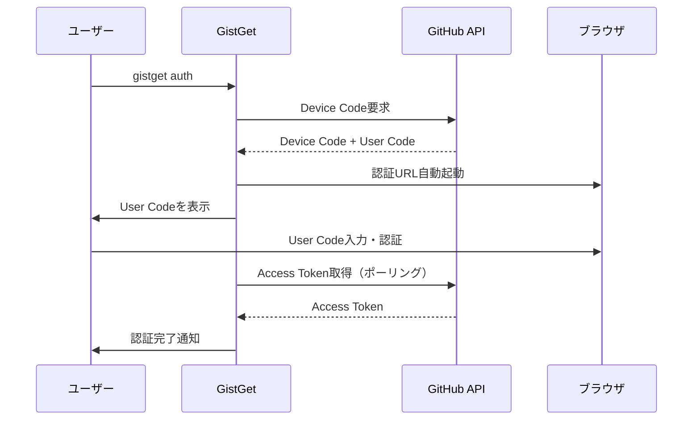
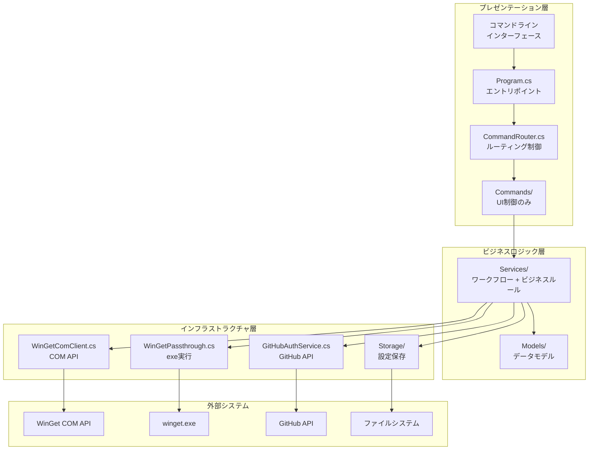

# GistGet アーキテクチャ設計

## アーキテクチャ設計概要

-- ここから編集禁止 --

1. セキュリティ設計: 認証方式と認証情報の保存、設定保管先のGist情報の設定と保管
2. 論理構造設計: レイヤーモデルと、レイヤーの基本的な相互作用の設計
3. テスト設計: 単体・結合テストの方式設計

-- ここまで編集禁止 --

## 1. セキュリティ設計

### 1.1 認証方式

**GitHub OAuth Device Flow**を採用し、ユーザーの代理でGist APIにアクセスする権限を取得しています。



**認証の特徴:**
- OAuth Client ID: `Ov23lihQJhLB6hCnEIvS` (GistGet専用)
- スコープ: `gist`（Gist読み書きのみ）
- 管理者権限不要
- トークン有効期限なし（ユーザーが明示的に取り消すまで有効）

### 1.2 認証情報の保存

- **保存場所**: `%APPDATA%\GistGet\token.json`
- **暗号化**: 現在は平文保存（将来的にDPAPI対応予定）
- **権限**: CurrentUserスコープ（同じユーザーのみアクセス可能）

### 1.3 Gist設定の保管

- **保存場所**: `%APPDATA%\GistGet\gist.dat`
- **暗号化**: Windows DPAPI（CurrentUserスコープ）
- **内容**: Gist ID、ファイル名、タイムスタンプ

### 1.4 セキュリティ強化ポイント

**現在の実装:**
- トークンは平文保存（改善余地あり）
- Gist設定はDPAPI暗号化済み
- ファイルアクセス権限によるユーザー隔離

**将来の改善予定:**
- トークンのDPAPI暗号化
- トークンの定期的な更新機能
- 不正アクセス検知機能

## 2. 論理構造設計

### 2.1 レイヤーモデル

**シンプルな3層アーキテクチャ（推奨設計）**:

- **プレゼンテーション層（Commands）**: UI制御とエントリポイント
- **ビジネスロジック層（Services）**: ワークフロー制御とビジネスルール
- **インフラストラクチャ層**: 外部システム連携とデータ永続化



**現在の4層アーキテクチャの問題点**:
- ドメイン層が薄すぎて実質的な価値がない
- Commands層とServices層の責務が曖昧
- 過度な抽象化によるオーバーヘッド

### 2.2 推奨設計での責務分離

#### CommandRouter（プレゼンテーション層）
**責務**: コマンドルーティング制御
- コマンドライン引数の最初の解析（どのコマンドか判定）
- 適切なCommandへのルーティング
- 共通エラーハンドリング（COM例外、ネットワーク例外等）

**推奨実装例**:
```csharp
public class CommandRouter  // 現在のCommandService.cs
{
    public async Task<int> ExecuteAsync(string[] args)
    {
        var command = args.FirstOrDefault()?.ToLowerInvariant();
        
        return command switch
        {
            "auth" => await _authCommand.ExecuteAsync(args),
            "gist" => await HandleGistSubCommandAsync(args),
            "sync" => await _syncCommand.ExecuteAsync(args),
            _ => await _passthroughClient.ExecuteAsync(args) // winget.exeへ
        };
    }
}
```

#### Commands（プレゼンテーション層）
**責務**: UI制御に特化
- コマンドライン引数解析・対話的入力処理
- コンソール出力・エラーメッセージ表示
- 実行結果（exit code）返却

**推奨実装例**:
```csharp
public class GistSetCommand
{
    public async Task<int> ExecuteAsync(string? gistId, string? fileName)
    {
        try 
        {
            // UI制御のみ
            var input = await CollectUserInputAsync(gistId, fileName);
            
            // ビジネスロジックに委譲
            await _gistConfigService.ConfigureGistAsync(input);
            
            // UI表示のみ
            DisplaySuccessMessage(input);
            return 0;
        }
        catch (Exception ex)
        {
            DisplayErrorMessage(ex);
            return 1;
        }
    }
}
```

#### Services（ビジネスロジック層）
**責務**: ワークフロー制御 + ビジネスルール
- 処理の流れ（ワークフロー）制御
- ビジネスルール・バリデーション
- Infrastructure層の組み合わせ利用

**推奨実装例**:
```csharp
public class GistConfigService
{
    public async Task ConfigureGistAsync(GistConfigInput input)
    {
        // ワークフロー + ビジネスルール
        ValidateBusinessRules(input);
        await ValidateAuthentication();
        await ValidateGistAccess(input.GistId);
        await SaveConfiguration(input.ToConfig());
    }
    
    private void ValidateBusinessRules(GistConfigInput input)
    {
        // ビジネスルールをここに集約
        if (!IsValidGistId(input.GistId))
            throw new BusinessRuleException("Invalid Gist ID");
    }
}
```

#### 依存関係の明確化
```
CLI引数 -> CommandRouter (ルーティング判定)
            ↓
         Commands (UI制御)
            ↓  
         Services (ビジネスロジック)
            ↓
         Infrastructure (外部システム)
```

**レイヤー間ルール**:
- CommandRouter → Commands（ルーティング）
- Commands → Services（UI制御がビジネスロジック呼び出し）
- Services → Infrastructure（ビジネスロジックが外部システム利用）
- Services ❌ Commands（逆方向依存の禁止）

#### 現在の実装との差分
**問題**: 
- CommandServiceという名称がルーター機能を表現していない
- Commandが複数Serviceを直接操作（オーケストレーション責務の混在）

**解決**: 
- CommandService → CommandRouterに名称変更
- Serviceがワークフロー制御を担い、Commandは単純なUI制御のみ

### 2.3 名前空間とレイヤーベース抽象化

**現在の問題**: 単一`Abstractions`による過度な抽象化
- 単一プロジェクトで外部公開しないのに全インターフェースを集約
- レイヤー間の依存関係が不明確
- インフラ層の縦割り不足（COM API、winget.exe、GitHub API、Storageが混在）

**推奨設計**: レイヤーベース名前空間設計

#### プレゼンテーション層
```
NuitsJp.GistGet.Presentation/
├── ICommandRouter.cs (現在のICommandService)
├── CommandRouter.cs
├── IErrorMessageService.cs  
├── ErrorMessageService.cs
└── Commands/
    ├── GistSetCommand.cs
    └── [その他のCommand]
```

#### ビジネスロジック層
```
NuitsJp.GistGet.Business/
├── IGistSyncService.cs
├── GistSyncService.cs
├── GistConfigService.cs (新規統合Service)
└── Models/
    ├── GistConfiguration.cs
    └── [その他のModel]
```

#### インフラストラクチャ層（外部システム別縦割り）
```
NuitsJp.GistGet.Infrastructure/
├── WinGet/
│   ├── IWinGetClient.cs
│   ├── WinGetComClient.cs
│   ├── IWinGetPassthrough.cs
│   └── WinGetPassthrough.cs
├── GitHub/
│   ├── IGitHubAuthService.cs
│   ├── GitHubAuthService.cs
│   ├── IGitHubGistClient.cs
│   └── GitHubGistClient.cs
└── Storage/
    ├── IGistConfigurationStorage.cs
    └── GistConfigurationStorage.cs
```

#### 設計原則

1. **レイヤー内同居原則**: 各レイヤー内ではインターフェースと実装を同じ名前空間に配置
   - プロジェクト規模的に分離のオーバーヘッドが不要
   - 関連する定義が近接し、理解しやすい

2. **インフラ層縦割り原則**: 外部システムごとに完全分離
   - `WinGet/`: COM API + exe実行の両方を包含
   - `GitHub/`: 認証 + Gist操作の両方を包含  
   - `Storage/`: 設定ファイル管理

3. **依存関係の明確化**: 各レイヤーは下位レイヤーのインターフェースのみに依存
   ```
   Presentation → Business → Infrastructure (WinGet/GitHub/Storage)
   ```

#### 現在の実装との差分
**問題**: 
- `Abstractions/`に全インターフェースが集約され、レイヤー構造が不明確
- インフラ層で外部システムが混在

**解決**: 
- レイヤー別名前空間にインターフェース移動
- インフラ層を外部システム別に再編成

## 3. テスト設計

### 3.1 テスト方式

**テスト実装の現状**:
- テストプロジェクト: `tests/NuitsJp.GistGet.Tests/`
- テストフレームワーク: xUnit + Moq + Shouldly
- .NET 8 Windows 10環境（win-x64）での実行
- 13個のテストファイル（各主要クラスをカバー）

**テストファイル一覧**:
- `CommandServiceTests.cs` - コマンドルーターのテスト
- `GistConfigurationStorageTests.cs` - 設定保存のテスト
- `GistConfigurationTests.cs` - 設定モデルのテスト
- `WinGetComClientTests.cs` - WinGet COM APIのテスト
- `RunnerApplicationTests.cs` - アプリケーションエントリポイントのテスト
- `MockServices.cs` - テスト用モック実装

### 3.2 単体テスト設計（推奨アーキテクチャ対応）

**レイヤーベーステストアーキテクチャ**:

| レイヤー | テスト対象 | 推奨テスト構造 | テスト戦略 |
|---------|-----------|----------------|-----------|
| **Presentation** | UI制御・ルーティング | `Presentation/CommandRouterTests.cs`<br/>`Presentation/Commands/GistSetCommandTests.cs` | UI動作検証、引数解析テスト |
| **Business** | ワークフロー・ビジネスルール | `Business/GistConfigServiceTests.cs`<br/>`Business/GistSyncServiceTests.cs` | ワークフロー統合テスト、下位層モック使用 |
| **Infrastructure** | 外部システム連携 | `Infrastructure/WinGet/WinGetComClientTests.cs`<br/>`Infrastructure/GitHub/GitHubAuthServiceTests.cs`<br/>`Infrastructure/Storage/GistConfigurationStorageTests.cs` | 各外部システム別の隔離テスト |

**t-wada式TDD原則に基づくテスト戦略**:

#### Presentation層テスト
- **責務**: UI制御のみのテスト
- **依存**: Business層サービスをモック
- **検証**: 入力処理、表示処理、終了コード

#### Business層テスト  
- **責務**: ワークフローとビジネスルールのテスト
- **依存**: Infrastructure層をモック
- **検証**: 処理順序、バリデーション、例外処理

#### Infrastructure層テスト
- **責務**: 外部システム連携の個別テスト
- **依存**: 外部システムをモック/スタブ
- **検証**: API呼び出し、データ変換、エラーハンドリング

**名前空間ベースモック戦略**:
```csharp
// Infrastructure層モック（Business層テスト用）
NuitsJp.GistGet.Tests.Mocks.Infrastructure/
├── WinGet/MockWinGetClient.cs
├── GitHub/MockGitHubAuthService.cs  
└── Storage/MockGistConfigurationStorage.cs

// Business層モック（Presentation層テスト用）
NuitsJp.GistGet.Tests.Mocks.Business/
├── MockGistConfigService.cs
└── MockGistSyncService.cs
```

### 3.3 結合テスト設計

**結合テストの段階**:

1. **認証前提テスト**: 
   - `gistget auth`で事前認証が必要
   - 実際のGitHub APIとの通信をテスト

2. **Gist設定前提テスト**:
   - 認証 + Gist設定の両方が必要
   - 実際のGist読み書きをテスト

3. **E2Eテスト**:
   - コマンドライン引数から最終結果まで
   - 実際のwinget.exe実行を含む

- テスト実行戦略

### 3.4 テスト実行環境

**技術的制約**:
- ターゲット環境: `net8.0-windows10.0.26100` （Windows 10限定）
- ランタイム: `win-x64` （64bit Windows専用）
- COM API依存のため、CI/CD環境ではWindows Runnerが必須

**テスト実行戦略**:

| テストタイプ | 実行環境 | 自動化レベル | 制約事項 |
|-------------|----------|-------------|----------|
| **単体テスト** | ローカル/CI | 完全自動化 | モック使用で外部依存なし |
| **統合テスト** | ローカル環境のみ | 半自動化 | COM API・winget.exe依存 |
| **E2Eテスト** | ローカル環境のみ | 手動実行 | 実際のGitHub API接続必要 |

**ローカル開発環境での実行**:
```bash
# テスト実行コマンド
dotnet test tests/NuitsJp.GistGet.Tests/

# カバレッジ取得
dotnet test --collect:"XPlat Code Coverage"
```

**前提条件**:
- Windows 10/11 (Build 26100以降)
- .NET 8 SDK
- Visual Studio 2022またはVS Code
- WinGet COM APIの利用可能な環境

## 4. 実装の特徴とアーキテクチャ原則

### 4.1 設計原則

1. **段階的実装**: パススルー → COM API → Gist同期の順で機能追加
2. **後方互換性**: 既存のwingetワークフローを破壊しない
3. **フォールバック戦略**: COM API失敗時の自動フォールバック
4. **セキュアデフォルト**: 認証情報の適切な保護

### 4.2 技術スタック

- **フレームワーク**: .NET 8
- **COM API**: Microsoft.Management.Deployment
- **HTTP通信**: System.Net.Http（GitHub API用）
- **暗号化**: Windows DPAPI
- **ログ**: Microsoft.Extensions.Logging
- **DI**: Microsoft.Extensions.DependencyInjection

### 4.3 エラーハンドリング戦略

- 階層化されたエラー処理
- 回復戦略
  - COM API失敗 → winget.exe実行
  - ネットワーク失敗 → オフライン動作継続
  - 認証失敗 → 再認証プロンプト