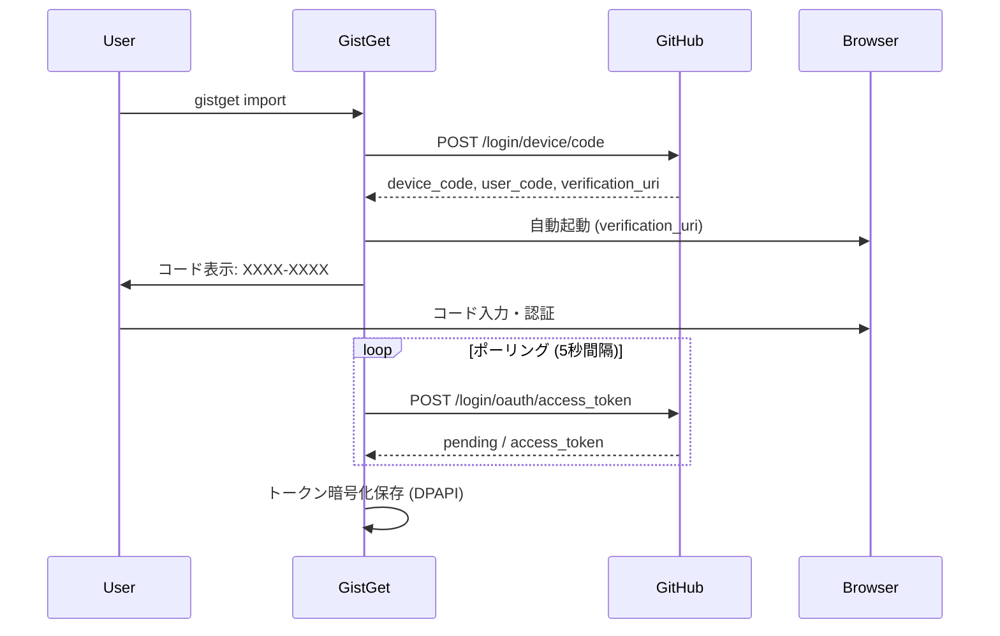

# GistGet 認証システム設計

## 1. OAuth Device Flow 実装設計

### A. 認証フローの概要



### B. 実装アーキテクチャ

```
┌─────────────────────────────────────────┐
│           AuthManager                    │
├─────────────────────────────────────────┤
│  - Device Flow実装                       │
│  - トークン管理                          │
│  - 暗号化/復号化                         │
├─────────────────────────────────────────┤
│         TokenStorage                     │
├─────────────────────────────────────────┤
│  - Windows DPAPI                         │
│  - ローカルファイル保存                  │
│  - 有効期限管理                          │
└─────────────────────────────────────────┘
```

### C. トークン保存形式

```csharp
public class StoredToken
{
    public string AccessToken { get; set; }      // 暗号化済み
    public DateTime ExpiresAt { get; set; }      // 有効期限
    public string[] Scopes { get; set; }         // gist, read:user
    public DateTime CreatedAt { get; set; }      // 作成日時
}

// 保存先: %APPDATA%\GistGet\auth.dat (DPAPI暗号化)
```

## 2. CI/CD環境での認証課題

### A. 主要な課題（更新版）

| 課題 | 影響範囲 | 重要度 | 解決の複雑さ |
|------|---------|--------|--------------|
| **Linux CI環境でのWindows機能** | ビルド・テスト | 高 | 中 |
| **インタラクティブ認証の不可** | テスト自動化 | 高 | 高 |
| **Windows DPAPI依存** | Linux CI環境 | 高 | 低（CI環境では不要） |
| **トークンの安全な管理** | セキュリティ | 高 | 高 |

### B. 環境別の認証戦略（更新版）

```yaml
# 環境別認証方式
environments:
  local_windows:
    method: OAuth Device Flow
    storage: Windows DPAPI
    interactive: true
    platform: Windows 11
    
  ci_linux:
    method: Personal Access Token
    storage: GitHub Secrets
    interactive: false
    platform: Ubuntu (GitHub Actions)
    
  test:
    method: Mock/Stub
    storage: In-Memory
    interactive: false
    platform: Any
```

### C. CI/CD用の認証実装（Linux対応）

```csharp
public interface IAuthProvider
{
    Task<string> GetTokenAsync();
}

// Windows専用: ローカル開発用
#if WINDOWS
public class DeviceFlowAuthProvider : IAuthProvider
{
    public async Task<string> GetTokenAsync()
    {
        // OAuth Device Flow実装（Windows専用）
        return await PerformDeviceFlowAsync();
    }
}
#endif

// クロスプラットフォーム: CI/CD用
public class EnvironmentAuthProvider : IAuthProvider
{
    public async Task<string> GetTokenAsync()
    {
        return Environment.GetEnvironmentVariable("GITHUB_TOKEN")
            ?? throw new InvalidOperationException("GITHUB_TOKEN not set");
    }
}

// クロスプラットフォーム: テスト用
public class MockAuthProvider : IAuthProvider
{
    public async Task<string> GetTokenAsync()
    {
        return await Task.FromResult("mock-token-12345");
    }
}
```

## 3. GitHub API Gistスコープ

### A. 必要なスコープ

```yaml
# Gist操作に必要なスコープ
scopes:
  - gist  # Gist の作成、読み取り、更新、削除のすべて
```

**注意**: `gist`スコープ1つですべてのGist操作が可能です。`create:gist`のような細分化されたスコープは存在しません。

### B. スコープの権限詳細

| 操作 | 必要なスコープ | 説明 |
|------|--------------|------|
| **List gists** | `gist` | ユーザーのGist一覧取得 |
| **Get a gist** | `gist` または 公開Gistならスコープ不要 | 特定のGist取得 |
| **Create a gist** | `gist` | 新規Gist作成 |
| **Update a gist** | `gist` | 既存Gist更新 |
| **Delete a gist** | `gist` | Gist削除 |

### C. トークン作成例

```bash
# GitHub Personal Access Token作成時
# Settings > Developer settings > Personal access tokens > Tokens (classic)
# 必要なスコープ: ☑ gist
```

## 4. Linux CI環境での実行戦略

### A. プラットフォーム別ビルド設定

```xml
<!-- GistGet.csproj -->
<Project Sdk="Microsoft.NET.Sdk">
  <PropertyGroup>
    <IsWindows Condition="'$([System.Runtime.InteropServices.RuntimeInformation]::IsOSPlatform($([System.Runtime.InteropServices.OSPlatform]::Windows)))' == 'true'">true</IsWindows>
    <DefineConstants Condition="'$(IsWindows)' == 'true'">WINDOWS</DefineConstants>
  </PropertyGroup>

  <!-- Windows専用の依存関係 -->
  <ItemGroup Condition="'$(IsWindows)' == 'true'">
    <PackageReference Include="Microsoft.Management.Deployment" Version="1.0.0" />
  </ItemGroup>
</Project>
```

### B. GitHub Actions設定（マルチOS対応）

```yaml
# .github/workflows/build.yml
name: Build and Test
on: [push, pull_request]

jobs:
  # Linux環境でのビルドとGist機能テスト
  build-linux:
    runs-on: ubuntu-latest
    env:
      GITHUB_TOKEN: ${{ secrets.GIST_ACCESS_TOKEN }}
    steps:
      - uses: actions/checkout@v4
      - uses: actions/setup-dotnet@v4
        with:
          dotnet-version: '8.0.x'
      
      - name: Build
        run: dotnet build --configuration Release
      
      - name: Test Gist Features
        run: dotnet test --filter "Category=GistSync" --configuration Release

  # Windows環境でのフル機能テスト（ローカル実行推奨）
  build-windows:
    runs-on: windows-latest
    if: github.event_name == 'release' # リリース時のみ
    steps:
      - uses: actions/checkout@v4
      - uses: actions/setup-dotnet@v4
        with:
          dotnet-version: '8.0.x'
      
      - name: Build Full
        run: dotnet build --configuration Release
      
      - name: Test (No Admin)
        run: dotnet test --filter "Category!=RequiresAdmin"
      
      - name: Package
        run: dotnet publish -c Release -r win-x64 --self-contained -p:PublishSingleFile=true
```

## 5. 実装優先順位（更新版）

### Phase 1: 基本認証（MVP）- Linux CI対応
- [x] 環境変数からのトークン取得
- [ ] 基本的なGist API呼び出し（Linux CIでテスト可能）
- [ ] エラーハンドリング

### Phase 2: Device Flow（Windows専用）
- [ ] OAuth Device Flow実装（条件付きコンパイル）
- [ ] トークンのDPAPI暗号化保存（Windows専用）
- [ ] 自動更新機能

### Phase 3: CI/CD統合
- [ ] GitHub Actions設定（Linux主体）
- [ ] クロスプラットフォーム自動テスト
- [ ] Windows向けリリースパイプライン

## 6. トラブルシューティング

### よくある問題と解決策

| 問題 | 原因 | 解決策 |
|------|------|--------|
| 認証失敗 | トークン期限切れ | `gistget auth refresh`実行 |
| CI/CDでの失敗 | 環境変数未設定 | GitHub Secretsを確認 |
| レート制限 | API呼び出し過多 | キャッシュ実装、間隔調整 |
| DPAPI エラー | ユーザー変更 | トークン再取得 |
