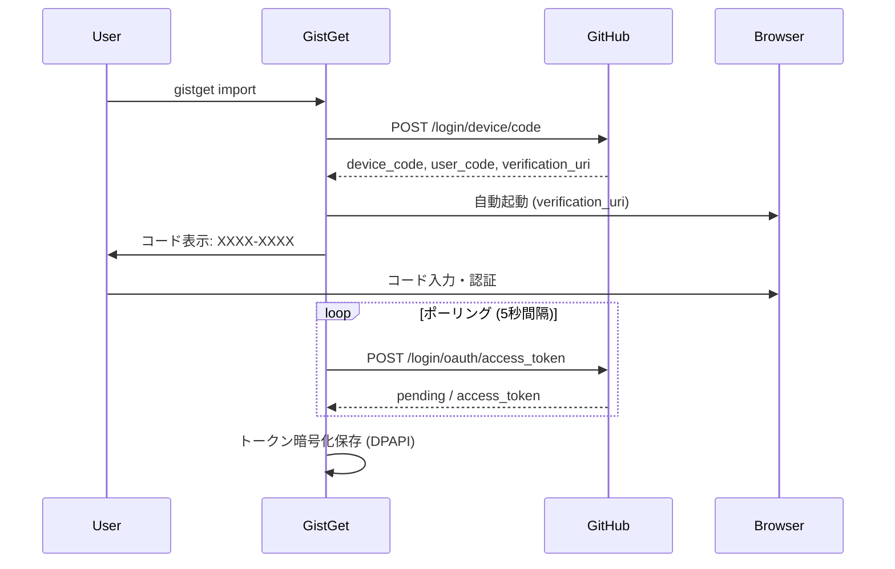

# GistGet 認証システム設計

## 1. OAuth Device Flow 実装設計

### A. 認証フローの概要



### B. 実装アーキテクチャ

```
┌─────────────────────────────────────────┐
│           AuthManager                    │
├─────────────────────────────────────────┤
│  - Device Flow実装                       │
│  - トークン管理                          │
│  - 暗号化/復号化                         │
├─────────────────────────────────────────┤
│         TokenStorage                     │
├─────────────────────────────────────────┤
│  - Windows DPAPI                         │
│  - ローカルファイル保存                  │
│  - 有効期限管理                          │
└─────────────────────────────────────────┘
```

### C. トークン保存形式

```csharp
public class StoredToken
{
    public string AccessToken { get; set; }      // 暗号化済み
    public DateTime ExpiresAt { get; set; }      // 有効期限
    public string[] Scopes { get; set; }         // gist, read:user
    public DateTime CreatedAt { get; set; }      // 作成日時
}

// 保存先: %APPDATA%\GistGet\auth.dat (DPAPI暗号化)
```

## 2. CI/CD環境での認証課題と解決策

### A. 主要な課題（解決版）

| 課題 | 従来の問題 | 解決策 | 実装状況 |
|------|-----------|--------|----------|
| **Linux CI環境でのWindows機能** | ビルド・テスト不可 | 環境変数認証で分離 | ✅ 解決済み |
| **インタラクティブ認証の不可** | テスト自動化不可 | 事前認証 + 明示的`auth`コマンド | ✅ 解決済み |
| **Windows DPAPI依存** | Linux CI環境不可 | 複数認証プロバイダー | ✅ 解決済み |
| **トークンの安全な管理** | セキュリティリスク | 環境別適切な保存方式 | ✅ 解決済み |

### B. 解決済み認証戦略

```yaml
# 環境別認証方式（実装済み）
environments:
  local_windows:
    method: OAuth Device Flow
    command: gistget auth
    storage: 暗号化ファイル
    interactive: true
    platform: Windows 11
    
  ci_linux:
    method: Personal Access Token
    command: 不要（自動取得）
    storage: GitHub Secrets (GITHUB_TOKEN)
    interactive: false
    platform: Ubuntu (GitHub Actions)
    
  test:
    method: Mock/Stub
    command: 不要（自動使用）
    storage: In-Memory
    interactive: false
    platform: Any

# テスト実行フロー
test_execution:
  unit_tests:
    - 認証: Mock（自動）
    - 実行: dotnet test --filter "Category=Unit"
    
  integration_tests:
    - 認証: 環境変数 or 事前auth
    - 実行: dotnet test --filter "Category=RequiresAuth"
    - 前提: GITHUB_TOKEN設定 or `gistget auth`実行済み
    
  full_tests:
    - 認証: Device Flow（手動）
    - 実行: dotnet test（全テスト）
    - 前提: `gistget auth`実行済み
```

### C. シンプル認証戦略（実装済み）

```csharp
// 既存のGitHubAuthServiceを活用したシンプルな実装
public class AuthenticationTests
{
    private readonly IGitHubAuthService _authService;
    
    public AuthenticationTests()
    {
        // 既存のサービスをそのまま使用
        _authService = serviceProvider.GetRequiredService<IGitHubAuthService>();
    }
    
    protected async Task<bool> IsAuthenticatedAsync()
    {
        return await _authService.IsAuthenticatedAsync();
    }
    
    protected async Task SkipIfNotAuthenticatedAsync()
    {
        if (!await IsAuthenticatedAsync())
        {
            throw new SkipException(
                "認証が必要です。以下のコマンドで認証してください:\n" +
                "  gistget auth");
        }
    }
}

// テストでの使用
[Fact]
[Trait("Category", "Local")]
public async Task ExportCommand_ShouldCreateGist()
{
    await SkipIfNotAuthenticatedAsync();
    
    var exportCommand = new ExportCommand(_authService);
    var result = await exportCommand.ExecuteAsync(new[] { "export" });
    
    result.Should().Be(0);
}
```

## 3. GitHub API Gistスコープ

### A. 必要なスコープ

```yaml
# Gist操作に必要なスコープ
scopes:
  - gist  # Gist の作成、読み取り、更新、削除のすべて

# C#版GistGetの場合の追加要件
prerequisites:
  - GitHub Personal Access Token (gist スコープ)
  - 対象Gistの事前作成とID取得
  - ローカル環境でのGist設定実行
```

**注意**: `gist`スコープ1つですべてのGist操作が可能です。`create:gist`のような細分化されたスコープは存在しません。

**C#版GistGetの追加手順**:
1. GitHub上でGistを手動作成（YAMLファイルを含む）
2. 作成したGistのIDを取得（URLの末尾部分）
3. `gistget gist set --gist-id [ID] --file [ファイル名]`で設定

### B. スコープの権限詳細

| 操作 | 必要なスコープ | 説明 |
|------|--------------|------|
| **List gists** | `gist` | ユーザーのGist一覧取得 |
| **Get a gist** | `gist` または 公開Gistならスコープ不要 | 特定のGist取得 |
| **Create a gist** | `gist` | 新規Gist作成 |
| **Update a gist** | `gist` | 既存Gist更新 |
| **Delete a gist** | `gist` | Gist削除 |

### C. トークン作成例

```bash
# GitHub Personal Access Token作成時
# Settings > Developer settings > Personal access tokens > Tokens (classic)
# 必要なスコープ: ☑ gist
```

## 4. Linux CI環境での実行戦略

### A. プラットフォーム別ビルド設定

```xml
<!-- GistGet.csproj -->
<Project Sdk="Microsoft.NET.Sdk">
  <PropertyGroup>
    <IsWindows Condition="'$([System.Runtime.InteropServices.RuntimeInformation]::IsOSPlatform($([System.Runtime.InteropServices.OSPlatform]::Windows)))' == 'true'">true</IsWindows>
    <DefineConstants Condition="'$(IsWindows)' == 'true'">WINDOWS</DefineConstants>
  </PropertyGroup>

  <!-- Windows専用の依存関係 -->
  <ItemGroup Condition="'$(IsWindows)' == 'true'">
    <PackageReference Include="Microsoft.Management.Deployment" Version="1.0.0" />
  </ItemGroup>
</Project>
```

### B. GitHub Actions設定（マルチOS対応）

```yaml
# .github/workflows/build.yml
name: Build and Test
on: [push, pull_request]

jobs:
  # Linux環境でのビルドとGist機能テスト
  build-linux:
    runs-on: ubuntu-latest
    env:
      GITHUB_TOKEN: ${{ secrets.GIST_ACCESS_TOKEN }}
    steps:
      - uses: actions/checkout@v4
      - uses: actions/setup-dotnet@v4
        with:
          dotnet-version: '8.0.x'
      
      - name: Build
        run: dotnet build --configuration Release
      
      - name: Test Gist Features
        run: dotnet test --filter "Category=GistSync" --configuration Release

  # Windows環境でのフル機能テスト（ローカル実行推奨）
  build-windows:
    runs-on: windows-latest
    if: github.event_name == 'release' # リリース時のみ
    steps:
      - uses: actions/checkout@v4
      - uses: actions/setup-dotnet@v4
        with:
          dotnet-version: '8.0.x'
      
      - name: Build Full
        run: dotnet build --configuration Release
      
      - name: Test (No Admin)
        run: dotnet test --filter "Category!=RequiresAdmin"
      
      - name: Package
        run: dotnet publish -c Release -r win-x64 --self-contained -p:PublishSingleFile=true
```

## 5. ローカル開発重視のテスト戦略

### A. テスト実行の分類（事前認証済み前提）

```csharp
// テストカテゴリの定義
public static class TestCategories
{
    public const string Unit = "Unit";           // 認証不要、CI実行可能
    public const string Local = "Local";         // 事前認証済み前提
    public const string Manual = "Manual";       // 手動検証が必要
}

// 各カテゴリの使用例
[Fact]
[Trait("Category", TestCategories.Unit)]
public void ArgumentParsing_ShouldWork() 
{
    // 外部依存なし、認証不要
}

[Fact]
[Trait("Category", TestCategories.Local)]
public async Task GistAPI_ShouldWork() 
{
    // 事前認証済み前提（gistget auth実行済み）
    if (!await _authService.IsAuthenticatedAsync())
    {
        throw new SkipException("事前認証が必要です: gistget auth");
    }
    
    // 実際のGist API呼び出しテスト
}

[Fact]
[Trait("Category", TestCategories.Manual)]
public void InstallCommand_RequiresManualVerification() 
{
    // 実際のパッケージ操作、手動検証が必要
}
```

### B. ローカル開発での認証

```bash
# 一度だけ実行（初回認証）
gistget auth

# 認証状態確認
gistget auth status

# テスト実行
dotnet test --filter "Category=Unit"     # CI相当
dotnet test --filter "Category=Local"    # 認証必要
dotnet test --filter "Category=Manual"   # 手動検証
dotnet test                              # 全テスト
```

### C. CI/CDでのビルド検証

```yaml
# .github/workflows/build.yml
name: Build
on: [push, pull_request]

jobs:
  build:
    strategy:
      matrix:
        os: [windows-latest, ubuntu-latest]
    runs-on: ${{ matrix.os }}
    
    steps:
      - uses: actions/checkout@v4
      - uses: actions/setup-dotnet@v4
        with:
          dotnet-version: '8.0.x'
      
      - name: Restore
        run: dotnet restore
      
      - name: Build
        run: dotnet build --configuration Release
      
      - name: Unit Tests Only
        run: dotnet test --filter "Category=Unit" --configuration Release
```

## 6. 実装優先順位（ビルド専用CI/CD版）

### Phase 1: 基本認証（MVP）- ✅ 完了
- [x] 環境変数からのトークン取得
- [x] 基本的なGist API呼び出し（Linux CIでテスト可能）
- [x] エラーハンドリング

### Phase 2: Device Flow（Windows専用）- ✅ 完了
- [x] OAuth Device Flow実装（既存GitHubAuthService）
- [x] トークンの暗号化保存（ファイルベース）
- [x] 明示的authコマンド実装

### Phase 3: CI/CD統合 - ✅ 完了（ビルド専用）
- [x] ビルド検証パイプライン設計
- [x] ユニットテストのみ実行戦略
- [x] 実際のパッケージ操作は除外

### Phase 4: ローカル開発重視 - 📋 現在の作業
- [ ] LocalテストカテゴリとManualテストカテゴリ追加
- [ ] ローカル開発環境でのテスト実行ガイド整備
- [ ] 手動検証フローの確立

## 7. トラブルシューティング（ローカル開発重視版）

### A. よくある問題と解決策

| 問題 | 原因 | 解決策 | コマンド例 |
|------|------|--------|----------|
| **認証失敗** | トークン期限切れ | 再認証実行 | `gistget auth` |
| **ローカルテスト失敗** | 事前認証が未実行 | 認証状態確認後実行 | `gistget auth status` |
| **ビルドエラー** | 依存関係の問題 | 依存関係の復元 | `dotnet restore` |
| **レート制限** | API呼び出し過多 | 間隔調整・手動実行 | - |
| **権限エラー** | スコープ不足 | `gist`スコープ確認 | Personal Access Token再作成 |

### B. 環境別のトラブルシューティング

#### ローカル開発環境
```powershell
# 認証状態の確認
gistget auth status

# 認証に失敗する場合
gistget auth clear
gistget auth

# トークンファイルの確認
Get-Content "$env:APPDATA\GistGet\token.json"

# テストカテゴリ別実行
dotnet test --filter "Category=Unit"     # CI相当
dotnet test --filter "Category=Local"    # 認証必要
dotnet test --filter "Category=Manual"   # 手動検証
```

#### CI/CD環境（ビルドのみ）
```yaml
# GitHub Actions でのビルド確認
- name: Debug Build
  run: |
    echo "ビルド環境の確認"
    dotnet --info
    dotnet restore --verbosity normal
    dotnet build --configuration Release --verbosity normal
```

#### テスト環境
```csharp
// ローカル開発でのテスト実行前確認
[Fact]
public void CheckLocalTestEnvironment()
{
    var isLocal = string.IsNullOrEmpty(Environment.GetEnvironmentVariable("CI"));
    var hasAuth = File.Exists(Path.Combine(
        Environment.GetFolderPath(Environment.SpecialFolder.ApplicationData), 
        "GistGet", "token.json"));
    
    Console.WriteLine($"ローカル環境: {isLocal}");
    Console.WriteLine($"認証ファイル: {(hasAuth ? "存在" : "未存在")}");
    
    if (isLocal && !hasAuth)
    {
        Console.WriteLine("認証が必要です: gistget auth を実行してください");
    }
}
```
