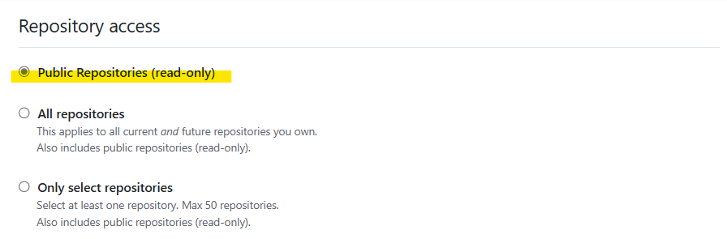

# Set-GitHubToken

Set an authentication token when updating Gist.

```pwsh
Set-GitHubToken github_pat_11AD3NELA0SGEHcrynCMSo...
```

The token is [safely stored using "Set-GitHubAuthentication"](https://github.com/nuitsjp/GistGet/blob/37cc27b3cf0a23e63eb91497cadcdb5ccac9f66a/src/Public/Set-GitHubToken.ps1#L40) from GitHub's official PowerShell Module "PowerShellForGitHub".

You can issue the token from the link below:

- [https://github.com/settings/personal-access-tokens/new](https://github.com/settings/personal-access-tokens/new)

## Permissions

Assign only the minimum necessary permissions to the token.

If you're only using PowerShellForGitHub for GistGet, assign the following permissions:

- Public Repositories(read-only)
- Account permissions - Gists Read and write

The specific settings are as follows:




After assigning the necessary permissions, issue the token and set it as follows.

## Parameters

|Parameter|Description|
|--|--|
|Token|Specify the GitHub Personal Access Token string.|