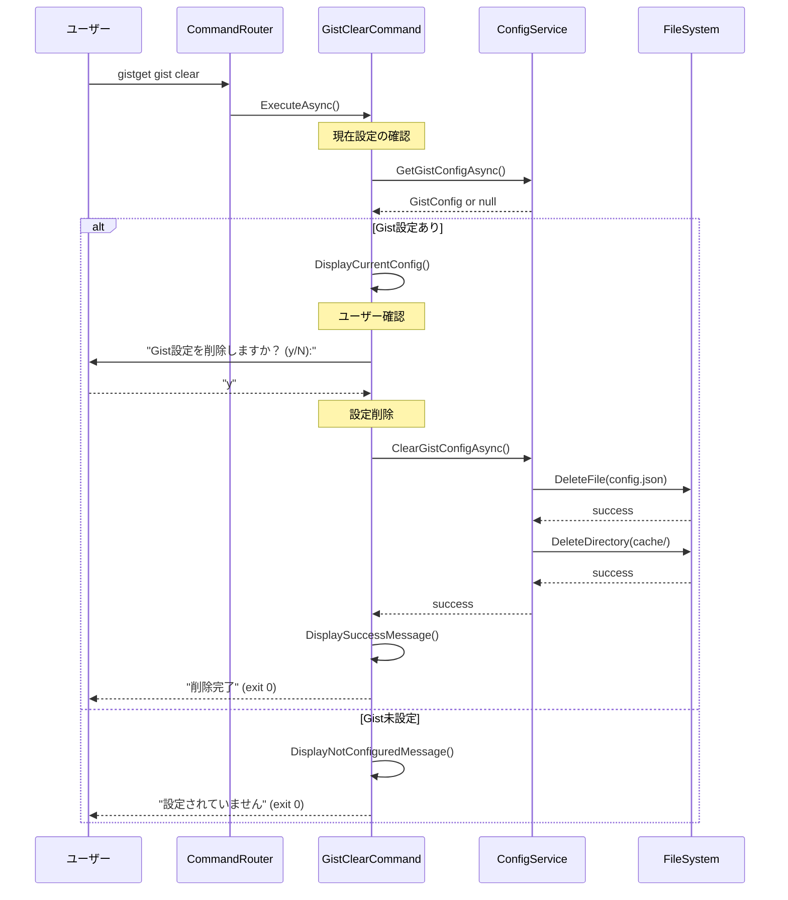

# gist clearコマンド仕様書

## 概要
ローカルに保存されたGist設定をクリア（削除）するコマンドです。Gist IDやファイル名の設定を完全に削除し、初期状態に戻します。

## 基本動作方針

### コアコンセプト
- **設定の完全削除**: ローカルのGist設定を安全に削除
- **安全性優先**: 削除前の確認プロンプト（--forceオプション以外）
- **ローカル限定**: GitHub上のGist内容は変更しない
- **設定ファイル管理**: 暗号化された設定ファイルの適切な削除
- **独立動作**: 他のコマンドに依存しない独立実装

### 動作フロー

1. **現在設定の確認**
   - 既存のGist設定の存在確認
   - 現在の設定内容の表示

2. **削除確認**
   - ユーザーへの確認プロンプト（--forceオプション以外）
   - 削除される設定内容の詳細表示

3. **設定削除**
   - 暗号化された設定ファイルの安全な削除
   - 関連するキャッシュファイルの削除

4. **削除確認**
   - 削除完了の確認
   - 次のステップの案内

## 詳細仕様

### コマンドライン引数
```bash
gistget gist clear [options]
```

**オプション**:
- `--force`: 確認プロンプトをスキップして強制削除
- `--keep-cache`: キャッシュファイルは削除しない
- `--dry-run`: 実際の削除を実行せず、削除対象のみ表示

### 削除対象の確認プロンプト

#### 標準的な確認プロンプト
```
現在のGist設定
==============
Gist ID: abc123def456
ファイル名: packages.yaml
設定日時: 2024-01-10 15:20:00

以下の設定を削除します:
  • Gist設定ファイル: C:\Users\user\AppData\Roaming\GistGet\config.json
  • キャッシュファイル: C:\Users\user\AppData\Roaming\GistGet\cache\
  
警告: この操作は元に戻せません。

Gist設定を削除しますか？ (y/N): 
```

#### ドライランモード（--dry-run）
```
削除対象の確認
==============
以下のファイルが削除されます:

設定ファイル:
  ✓ C:\Users\user\AppData\Roaming\GistGet\config.json (1.2KB)
  
キャッシュファイル:
  ✓ C:\Users\user\AppData\Roaming\GistGet\cache\gist_abc123.json (0.8KB)
  ✓ C:\Users\user\AppData\Roaming\GistGet\cache\packages.cache (2.1KB)

注意: --dry-runモードのため、実際の削除は行われません。
```

### 削除完了メッセージ

#### 正常削除時
```
Gist設定の削除が完了しました
============================

削除されたファイル:
  ✓ 設定ファイル: config.json
  ✓ キャッシュファイル: 2個のファイル

次のステップ:
1. 新しいGist設定を行う場合: gistget gist set
2. 認証設定も削除する場合: gistget login --logout
3. 設定状態を確認する場合: gistget gist status
```

#### 部分削除時（エラーあり）
```
Gist設定の削除が部分的に完了しました
================================

削除結果:
  ✓ 設定ファイル: config.json - 削除成功
  ✗ キャッシュファイル: cache.json - 削除失敗（ファイルが使用中）

残りのファイルを手動で削除する場合:
  C:\Users\user\AppData\Roaming\GistGet\cache\cache.json
```

### エラーハンドリング

#### 設定状態エラー
- **Gist未設定**: 既に設定されていない旨を表示して正常終了
- **設定ファイル未発見**: 設定ファイルが存在しない場合の処理

#### ファイル操作エラー
- **ファイルアクセス拒否**: 管理者権限での実行を促す
- **ファイル使用中**: プロセス終了の案内
- **ディスク書き込みエラー**: ディスク容量や権限の確認を促す

#### ユーザー操作エラー
- **ユーザーキャンセル**: 削除をキャンセルした旨を表示
- **無効な入力**: 正しい入力形式の案内

#### 終了コード
- `0`: 正常終了（削除成功または既に未設定）
- `1`: ファイル操作エラー
- `2`: ユーザーキャンセル
- `3`: システムエラー

## シーケンス図



## 実装クラス

### GistClearCommand (Presentation層)
```csharp
public class GistClearCommand
{
    public async Task<int> ExecuteAsync(GistClearOptions options)
    {
        // UI制御：確認プロンプト、進捗表示、結果表示
        // Business層への委譲：ConfigService.ClearGistConfigAsync()
    }
    
    private async Task<bool> ConfirmDeletionAsync(GistConfig config, bool force)
    {
        // 削除確認プロンプトの表示
        // --forceオプション時はtrueを返す
    }
    
    private void DisplayDeletionTargets(GistConfig config, GistClearOptions options)
    {
        // 削除対象ファイルの表示
    }
}
```

### ConfigService (Business層)
```csharp
public class ConfigService : IConfigService
{
    public async Task<bool> ClearGistConfigAsync(GistClearOptions options)
    {
        // Gist設定の削除処理
        // 1. 現在設定の確認
        // 2. 設定ファイル削除
        // 3. キャッシュファイル削除
        // 4. 削除結果の確認
    }
    
    private async Task<List<string>> GetDeletionTargetsAsync(bool includeCache)
    {
        // 削除対象ファイルのリスト取得
    }
    
    private async Task<DeletionResult> DeleteConfigFilesAsync(List<string> targets)
    {
        // ファイル削除の実行
    }
}
```

### GistClearOptions (Business層モデル)
```csharp
public class GistClearOptions
{
    public bool Force { get; set; }
    public bool KeepCache { get; set; }
    public bool DryRun { get; set; }
}
```

### DeletionResult (Business層モデル)
```csharp
public class DeletionResult
{
    public List<string> SuccessfulDeletions { get; set; }
    public List<string> FailedDeletions { get; set; }
    public List<string> ErrorMessages { get; set; }
    public bool IsComplete { get; set; }
}
```

## 依存関係

### 必要なサービス
- `IConfigService`: Gist設定管理
- `IFileSystem`: ファイル操作
- `ILogger<T>`: ログ出力

### 設定要件
- ローカルファイルシステムへの書き込み権限

## テスト戦略

### 単体テスト (Business層)
- 設定削除ロジックのテスト
- 確認プロンプト処理のテスト
- エラーハンドリングのテスト
- ドライランモードのテスト

### 統合テスト (Infrastructure層)
- 実際のファイルシステムでの削除テスト
- 暗号化ファイルの削除テスト
- 権限エラー時の動作テスト

### E2Eテスト
- コマンドライン引数から削除完了まで
- ユーザーキャンセル時の動作確認
- エラーケースでの適切な終了コード確認

## 実装注意点

### セキュリティ
- 設定ファイルの安全な削除（データ復旧困難な方法）
- 削除前の適切な確認プロンプト
- 機密情報の完全な除去

### ユーザビリティ
- 分かりやすい削除確認プロンプト
- 削除対象の詳細表示
- 削除後の次のステップ案内
- エラー時の具体的な解決策提示

### 堅牢性
- ファイルアクセスエラーの適切な処理
- 部分削除時の状態管理
- 削除失敗時の回復方法提示

### データ整合性
- 設定ファイルとキャッシュの整合性確保
- 削除後の状態確認
- 残存ファイルの適切な報告

### PowerShell版との互換性
- PowerShell版と同じファイル削除対象
- 同じ確認プロンプト形式
- 一貫したエラーメッセージ

## 重要：セットアップフローとの連携

### 設定リセットフロー
```bash
# 1. 現在の設定確認
gistget gist status

# 2. 設定削除
gistget gist clear

# 3. 新しい設定
gistget gist set

# 4. 設定確認
gistget gist status
```

### トラブルシューティング用途
```bash
# 設定ファイル破損時のリセット
gistget gist clear --force

# 認証情報も含めた完全リセット
gistget login --logout
gistget gist clear --force
```

### 開発・テスト用途
```bash
# ドライランでの削除対象確認
gistget gist clear --dry-run

# キャッシュは残してメイン設定のみクリア
gistget gist clear --keep-cache
```

**gist clearコマンドはGistGet設定のリセット機能として重要な役割を果たし、トラブルシューティングや設定変更において安全で確実な初期化を提供します。**

この仕様に基づき、PowerShellモジュール版と同等の機能を持つ.NET版gist clearコマンドを実装します。