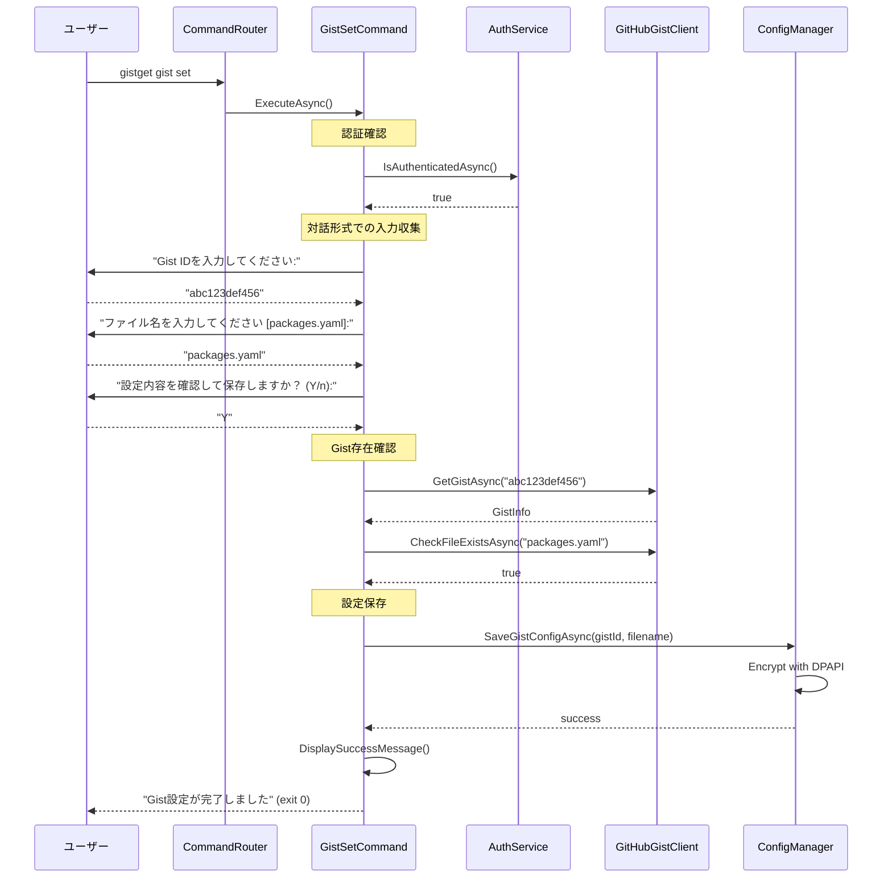

# gist setコマンド仕様書

## 概要
GitHub Gist情報（Gist IDとファイル名）を設定するコマンドです。GistGetが同期対象とするGistを指定し、ローカル環境に安全に保存します。

## 基本動作方針

### コアコンセプト
- **Gist設定の管理**: 同期対象のGist IDとファイル名の設定
- **対話形式サポート**: 引数なしでの実行時は対話形式で案内
- **安全な保存**: Windows DPAPI暗号化でローカル保存
- **設定検証**: 設定後にGistアクセス可能性を確認
- **独立動作**: 他のコマンドに依存しない独立実装

### 動作フロー

1. **認証確認**
   - GitHub認証状態の確認
   - 未認証の場合は事前にloginコマンドの実行を促す

2. **設定方法の決定**
   - 引数指定時: コマンドライン引数から直接設定
   - 引数なし時: 対話形式で設定情報を収集

3. **Gist情報の入力**
   - Gist ID の入力・検証
   - ファイル名の入力・検証
   - 設定内容の確認

4. **Gist存在確認**
   - GitHub APIを使用してGistの存在確認
   - ファイル存在の確認
   - アクセス権限の確認

5. **設定保存**
   - Windows DPAPI暗号化での安全な保存
   - 設定ファイルの作成/更新

6. **設定完了**
   - 設定成功の確認
   - 次のステップの案内

## 詳細仕様

### コマンドライン引数
```bash
gistget gist set [options]
```

**オプション**:
- `--gist-id <gist-id>`: Gist IDを直接指定
- `--file <filename>`: ファイル名を直接指定（デフォルト: packages.yaml）
- `--force`: 既存設定を上書き
- `--verify`: 設定後にGistアクセス可能性を検証

### 対話形式の設定フロー

#### 1. Gist ID入力
```
GitHub GistのID（URL末尾の文字列）を入力してください:
例: https://gist.github.com/username/abc123def456 の場合は「abc123def456」
Gist ID: 
```

#### 2. ファイル名入力
```
Gist内のファイル名を入力してください（デフォルト: packages.yaml）:
ファイル名 [packages.yaml]: 
```

#### 3. 設定確認
```
以下の設定で保存します:
  Gist ID: abc123def456
  ファイル名: packages.yaml
  
この設定で保存しますか？ (Y/n): 
```

### 設定ファイルの形式

#### 保存場所
- Windows: `%APPDATA%\GistGet\config.json`
- 暗号化: Windows DPAPI使用

#### 設定内容
```json
{
  "gist": {
    "id": "abc123def456",
    "filename": "packages.yaml"
  },
  "lastModified": "2024-01-15T10:30:00Z"
}
```

### エラーハンドリング

#### 認証エラー
- **GitHub未認証**: `login`コマンドの実行を促すメッセージを表示
- **認証トークン無効**: 再認証の案内

#### 入力エラー
- **Gist ID不正**: 正しい形式の例を表示
- **ファイル名不正**: 使用可能な文字の案内
- **入力なし**: デフォルト値または再入力の案内

#### Gist検証エラー
- **Gist未発見**: Gist IDの確認とアクセス権限の確認を促す
- **ファイル未発見**: Gist内のファイル一覧を表示
- **アクセス権限なし**: Gistが公開設定または適切な権限があるかを確認
- **ネットワークエラー**: 接続確認の案内

#### ファイル操作エラー
- **設定ファイル作成失敗**: ディスクアクセス権限の確認
- **暗号化失敗**: Windows DPAPIの問題と代替手段の案内

#### 終了コード
- `0`: 正常終了（設定保存成功）
- `1`: 入力エラー
- `2`: Gist検証エラー
- `3`: 認証エラー
- `4`: ファイル操作エラー

## シーケンス図



## 実装クラス

### GistSetCommand (Presentation層)
```csharp
public class GistSetCommand
{
    public async Task<int> ExecuteAsync(GistSetOptions options)
    {
        // UI制御：対話形式入力、確認プロンプト、結果表示
        // Business層への委譲：ConfigService.SetGistConfigAsync()
    }
    
    private async Task<GistConfig> CollectGistConfigAsync(GistSetOptions options)
    {
        // 対話形式またはオプションからGist設定を収集
    }
    
    private async Task<bool> VerifyGistAccessAsync(string gistId, string filename)
    {
        // Gistアクセス可能性の検証
    }
}
```

### ConfigService (Business層)
```csharp
public class ConfigService : IConfigService
{
    public async Task<bool> SetGistConfigAsync(string gistId, string filename, bool force = false)
    {
        // Gist設定の保存処理
        // 1. 既存設定の確認
        // 2. 設定の暗号化
        // 3. ファイル保存
    }
    
    public async Task<GistConfig> GetGistConfigAsync()
    {
        // 現在のGist設定を取得
    }
    
    public async Task<bool> IsGistConfiguredAsync()
    {
        // Gist設定済みかどうかの確認
    }
}
```

### ConfigManager (Infrastructure層)
```csharp
public class ConfigManager : IConfigManager
{
    public async Task SaveConfigAsync(AppConfig config)
    {
        // Windows DPAPI暗号化でconfig.jsonを保存
    }
    
    public async Task<AppConfig> LoadConfigAsync()
    {
        // 暗号化されたconfig.jsonを復号化して読み込み
    }
}
```

### GistSetOptions (Business層モデル)
```csharp
public class GistSetOptions
{
    public string GistId { get; set; }
    public string Filename { get; set; } = "packages.yaml";
    public bool Force { get; set; }
    public bool Verify { get; set; } = true;
}
```

### GistConfig (Business層モデル)
```csharp
public class GistConfig
{
    public string Id { get; set; }
    public string Filename { get; set; }
    public DateTime LastModified { get; set; }
}
```

## 依存関係

### 必要なサービス
- `IAuthService`: GitHub認証状態確認
- `IGitHubGistClient`: Gist存在確認
- `IConfigManager`: 設定ファイル管理
- `ILogger<T>`: ログ出力

### 設定要件
- GitHub認証トークン（事前にloginコマンドで設定済み）
- ローカル設定ディレクトリ書き込み権限

## テスト戦略

### 単体テスト (Business層)
- 対話形式入力処理のテスト
- Gist設定検証ロジックのテスト
- 設定保存処理のテスト
- エラーハンドリングのテスト

### 統合テスト (Infrastructure層)
- 実際のGistを使用した存在確認テスト
- DPAPI暗号化/復号化のテスト
- 設定ファイル読み書きのテスト

### E2Eテスト
- コマンドライン引数から設定完了まで
- 対話形式での完全なフローテスト
- エラーケースでの適切な動作確認

## 実装注意点

### セキュリティ
- Windows DPAPI暗号化での安全な設定保存
- 設定ファイルの適切なアクセス権限設定
- 認証トークンとの分離管理

### ユーザビリティ
- 分かりやすい対話形式のプロンプト
- 適切なデフォルト値の提供
- エラー時の具体的な解決策提示
- Gist設定方法の詳細ガイド

### 堅牢性
- 設定ファイル破損時の回復機能
- ネットワーク障害時の適切なエラー処理
- 不正な入力値のサニタイズ

### 拡張性
- 将来的な設定項目追加への対応
- 複数Gist管理の実装余地
- 設定インポート/エクスポート機能の余地

### PowerShell版との互換性
- PowerShell版の設定ファイルとの相互運用性
- 同じ設定形式での保存
- 設定移行パスの提供

## 重要：初期セットアップとの連携

### セットアップフロー
```bash
# 1. GitHub認証
gistget login

# 2. Gist設定
gistget gist set

# 3. 設定確認
gistget gist status

# 4. 初回同期
gistget sync
```

### 自動設定フロー
他のコマンド実行時にGist未設定が検出された場合、自動的に`gist set`コマンドが実行されるケースがあります：

```bash
gistget sync  # Gist未設定時 → 自動的にgist setフローを実行
```

**gist setコマンドはGistGetの初期セットアップにおいて重要な役割を果たし、すべてのGist連携機能の前提条件となります。**

この仕様に基づき、PowerShellモジュール版と同等の機能を持つ.NET版gist setコマンドを実装します。