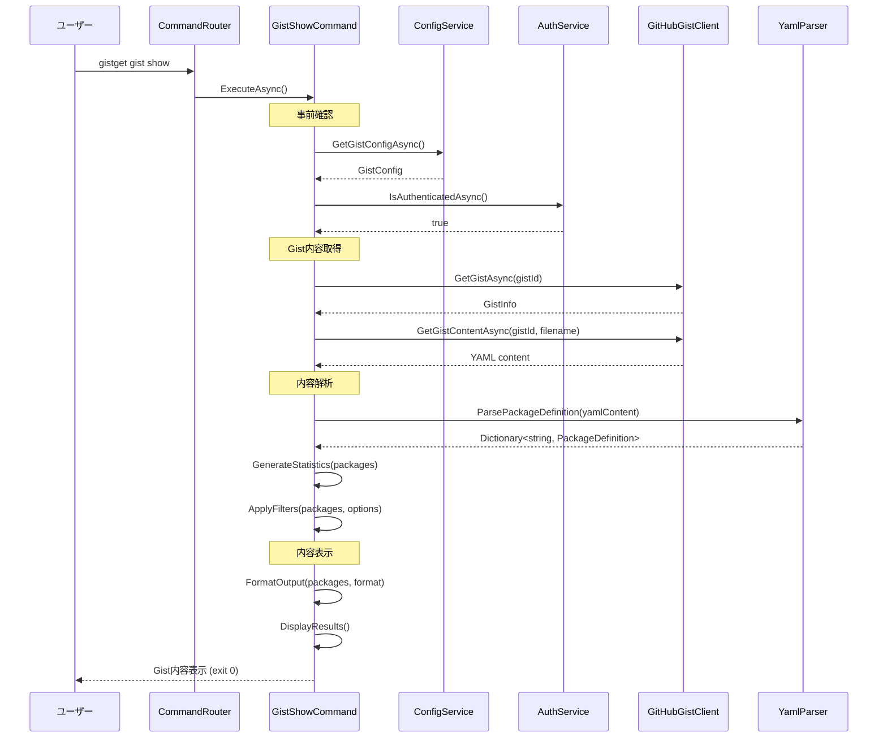

# gist showコマンド仕様書

## 概要
設定されたGistの内容を表示するコマンドです。Gist内のパッケージ定義をYAML形式または人間が読みやすい形式で表示し、現在の同期対象パッケージを確認できます。

## 基本動作方針

### コアコンセプト
- **Gist内容の可視化**: 現在設定されたGistのパッケージ定義を表示
- **多様な出力形式**: YAML、JSON、人間可読形式での表示に対応
- **読み取り専用**: Gistの内容を変更しない安全な操作
- **統計情報**: パッケージ数、最終更新日時などの情報も表示
- **エラー耐性**: Gist未設定や接続エラーでも適切なメッセージを表示

### 動作フロー

1. **事前確認**
   - Gist設定の存在確認
   - GitHub認証の確認

2. **Gist内容取得**
   - GitHubAPIを使用してGist内容を取得
   - 設定ファイル（YAML）の読み取り

3. **内容解析**
   - YAML形式のパッケージ定義を解析
   - パッケージ数、バージョン情報の統計生成

4. **内容表示**
   - 指定された形式での内容表示
   - 統計情報の表示

5. **エラー処理**
   - 接続エラーや解析エラーの適切な処理

## 詳細仕様

### コマンドライン引数
```bash
gistget gist show [options]
```

**オプション**:
- `--format <format>`: 出力形式指定（table, yaml, json, raw）
- `--stats`: 統計情報のみ表示
- `--no-stats`: 統計情報を非表示
- `--filter <pattern>`: パッケージ名でフィルタリング

### 出力形式

#### 標準形式（テーブル表示）
```
Gist内容
========
Gist ID: abc123def456
ファイル名: packages.yaml
最終更新: 2024-01-15 10:30:00

パッケージ一覧:
┌─────────────────────────────────┬─────────┬────────────┐
│ Package ID                      │ Version │ Custom     │
├─────────────────────────────────┼─────────┼────────────┤
│ Git.Git                        │ 2.43.0  │            │
│ Microsoft.VisualStudioCode     │ (最新)   │            │
│ Microsoft.PowerToys            │ 0.76.0  │ --scope user │
│ Docker.DockerDesktop           │ (最新)   │            │
└─────────────────────────────────┴─────────┴────────────┘

統計情報:
  総パッケージ数: 4
  バージョン固定: 2
  カスタム設定: 1
```

#### YAML形式（--format yaml）
```yaml
# Gist ID: abc123def456
# 最終更新: 2024-01-15T10:30:00Z

Git.Git:
  version: 2.43.0
Microsoft.VisualStudioCode:
Microsoft.PowerToys:
  version: 0.76.0
  scope: user
Docker.DockerDesktop:
```

#### JSON形式（--format json）
```json
{
  "gist": {
    "id": "abc123def456",
    "filename": "packages.yaml",
    "lastModified": "2024-01-15T10:30:00Z",
    "url": "https://gist.github.com/username/abc123def456"
  },
  "packages": [
    {
      "id": "Git.Git",
      "version": "2.43.0"
    },
    {
      "id": "Microsoft.VisualStudioCode"
    },
    {
      "id": "Microsoft.PowerToys",
      "version": "0.76.0",
      "custom": "--scope user"
    },
    {
      "id": "Docker.DockerDesktop"
    }
  ],
  "stats": {
    "totalCount": 4,
    "versionPinned": 2,
    "customSettings": 1
  }
}
```

#### Raw形式（--format raw）
```yaml
Git.Git:
  version: 2.43.0
Microsoft.VisualStudioCode:
Microsoft.PowerToys:
  version: 0.76.0
  scope: user
Docker.DockerDesktop:
```

#### 統計のみ（--stats）
```
Gist統計情報
============
Gist ID: abc123def456
ファイル名: packages.yaml
最終更新: 2024-01-15 10:30:00
URL: https://gist.github.com/username/abc123def456

パッケージ統計:
  総数: 4個
  バージョン固定: 2個
  カスタム設定: 1個
  
サイズ情報:
  ファイルサイズ: 1.2KB
  文字数: 1,234文字
  行数: 45行
```

### フィルタリング機能

#### パッケージ名でのフィルタリング
```bash
# Microsoftで始まるパッケージのみ表示
gistget gist show --filter "Microsoft*"

# Git関連パッケージを表示
gistget gist show --filter "*git*"
```

### エラーハンドリング

#### 設定エラー
- **Gist未設定**: `gist set`コマンドの実行を案内
- **GitHub未認証**: `login`コマンドの実行を案内

#### Gistアクセスエラー
- **Gist未発見**: Gist IDの確認を促す
- **ファイル未発見**: Gist内のファイル一覧を表示
- **アクセス権限なし**: Gistの公開設定確認を促す
- **ネットワークエラー**: 接続確認とリトライの案内

#### 内容解析エラー
- **YAML解析エラー**: 構文エラーの場所と修正方法を提示
- **無効なパッケージ定義**: 問題のあるエントリを特定
- **空のGist**: Gistが空の場合の案内

#### 終了コード
- `0`: 正常終了（内容表示成功）
- `1`: 設定エラー
- `2`: Gistアクセスエラー
- `3`: 内容解析エラー

## シーケンス図



## 実装クラス

### GistShowCommand (Presentation層)
```csharp
public class GistShowCommand
{
    public async Task<int> ExecuteAsync(GistShowOptions options)
    {
        // UI制御：フォーマット制御、フィルタリング、内容表示
        // Business層への委譲：GistDisplayService.ShowGistContentAsync()
    }
    
    private void DisplayGistContent(GistContent content, GistShowOptions options)
    {
        // 指定されたフォーマットでの内容表示
    }
}
```

### GistDisplayService (Business層)
```csharp
public class GistDisplayService : IGistDisplayService
{
    public async Task<GistContent> ShowGistContentAsync(GistShowOptions options)
    {
        // Gist内容取得と解析
        // 1. Gist設定確認
        // 2. Gist内容取得
        // 3. YAML解析
        // 4. 統計生成
        // 5. フィルタリング適用
    }
    
    private GistStatistics GenerateStatistics(PackageCollection packages)
    {
        // パッケージ統計情報の生成
    }
    
    private Dictionary<string, PackageDefinition> ApplyFilters(Dictionary<string, PackageDefinition> packages, string filter)
    {
        // フィルタリングの適用（辞書形式のキーでのフィルタリング）
    }
}
```

### GistShowOptions (Business層モデル)
```csharp
public class GistShowOptions
{
    public string Format { get; set; } = "table";
    public bool StatsOnly { get; set; }
    public bool NoStats { get; set; }
    public string Filter { get; set; }
}
```

### GistContent (Business層モデル)
```csharp
public class GistContent
{
    public GistInfo GistInfo { get; set; }
    public Dictionary<string, PackageDefinition> Packages { get; set; }
    public GistStatistics Statistics { get; set; }
    public string RawContent { get; set; }
}
```

### GistStatistics (Business層モデル)
```csharp
public class GistStatistics
{
    public int TotalCount { get; set; }
    public int VersionPinned { get; set; }
    public int CustomSettings { get; set; }
    public long FileSize { get; set; }
    public int LineCount { get; set; }
    public DateTime LastModified { get; set; }
}
```

## 依存関係

### 必要なサービス
- `IConfigService`: Gist設定管理
- `IAuthService`: GitHub認証確認
- `IGitHubGistClient`: Gist内容取得
- `IYamlParser`: YAML解析
- `ILogger<T>`: ログ出力

### 設定要件
- GitHub認証トークン
- Gist設定（GistId, FileName）

## テスト戦略

### 単体テスト (Business層)
- YAML解析処理のテスト
- 統計生成ロジックのテスト
- フィルタリング機能のテスト
- 各種出力フォーマットのテスト
- エラーハンドリングのテスト

### 統合テスト (Infrastructure層)
- 実際のGistを使用した内容取得テスト
- 様々なYAMLフォーマットでの解析テスト
- 認証状態での動作テスト

### E2Eテスト
- 各種オプションでのコマンド実行テスト
- 大量パッケージでのパフォーマンステスト
- エラーケースでの適切な動作確認

## 実装注意点

### パフォーマンス
- 大量パッケージでの高速表示
- ネットワーク呼び出しの最小化
- メモリ効率的なYAML解析

### ユーザビリティ
- 分かりやすいテーブル表示
- 適切な列幅の自動調整
- 色分けによる視認性向上
- 長いパッケージ名の適切な省略

### データ整合性
- YAML解析エラーの適切な処理
- 部分的に壊れたデータでの継続表示
- 不正なパッケージ定義の警告表示

### 拡張性
- 新しい出力フォーマットの追加余地
- カスタムフィルタリング条件の拡張
- 統計情報項目の追加対応

### PowerShell版との互換性
- PowerShell版と同等の表示フォーマット
- 同じYAML解析結果
- 一貫した統計情報計算

## 重要：他コマンドとの連携

### 設定確認フロー
```bash
# 設定状態の確認
gistget gist status

# Gist内容の確認
gistget gist show

# ローカル環境との差分確認
gistget sync --dry-run
```

### デバッグ・トラブルシューティング
```bash
# YAML構文確認
gistget gist show --format yaml

# Raw内容確認
gistget gist show --format raw

# 統計のみで概要確認
gistget gist show --stats
```

**gist showコマンドはGist内容の可視化によってユーザーが現在の同期対象を把握し、問題の特定や設定確認を効率的に行えるようにします。**

この仕様に基づき、PowerShellモジュール版と同等の機能を持つ.NET版gist showコマンドを実装します。