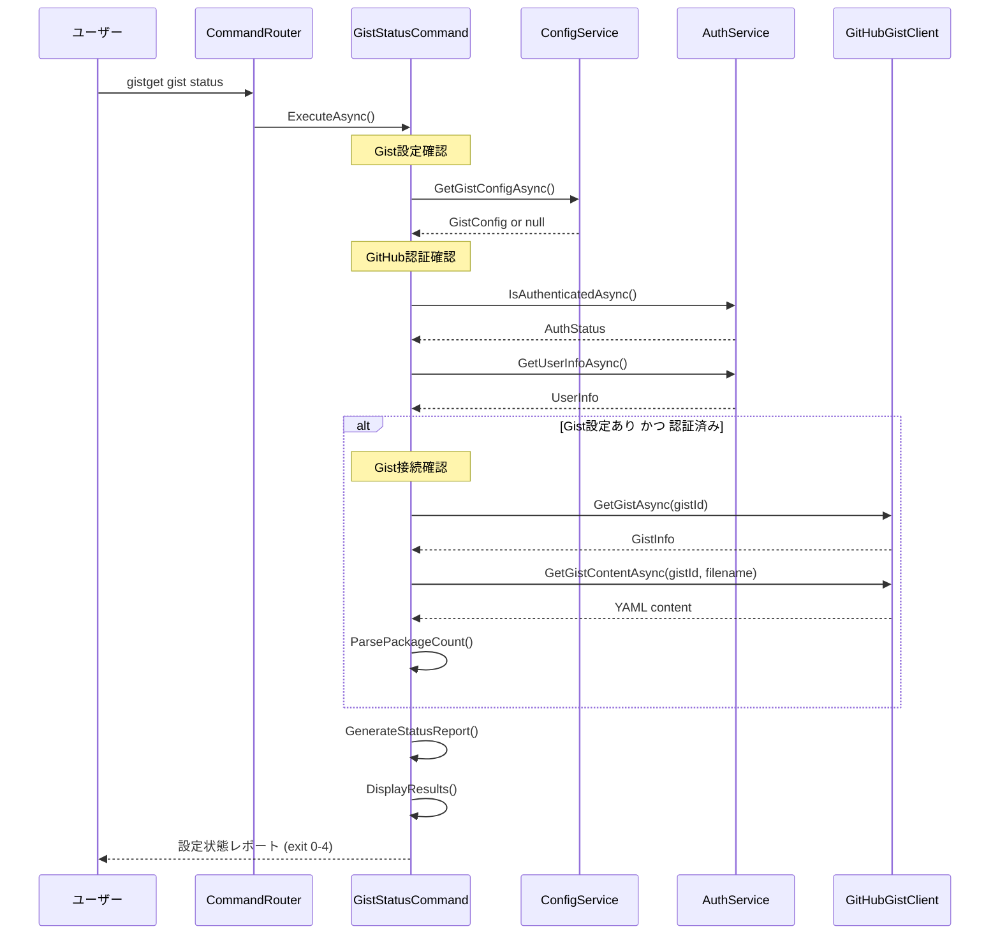

# gist statusコマンド仕様書

## 概要
現在のGist設定状態とアクセス可能性を確認するコマンドです。Gist設定の有無、GitHub認証状態、Gistへの接続可能性を総合的に表示します。

## 基本動作方針

### コアコンセプト
- **設定状態の可視化**: Gist設定の有無と内容を表示
- **接続確認**: GitHub認証とGistアクセス可能性の確認
- **問題診断**: 設定や接続の問題点を特定して解決策を提示
- **読み取り専用**: システム状態を変更しない安全な操作
- **独立動作**: 他のコマンドに依存しない独立実装

### 動作フロー

1. **Gist設定確認**
   - ローカル設定ファイルの存在確認
   - 設定内容の読み取りと表示

2. **GitHub認証確認**
   - 認証トークンの存在確認
   - トークンの有効性確認

3. **Gistアクセス確認**
   - 設定されたGistへの接続テスト
   - ファイル存在確認
   - アクセス権限確認

4. **パッケージ情報表示**
   - Gist内のパッケージ数
   - 最終更新日時

5. **総合ステータス表示**
   - 全体的な設定状態
   - 問題点と推奨アクション

## 詳細仕様

### コマンドライン引数
```bash
gistget gist status [options]
```

**オプション**:
- `--detailed`: 詳細情報を表示
- `--json`: JSON形式で出力
- `--check-connectivity`: Gist接続テストを実行

### 出力形式

#### 標準出力形式
```
Gist設定状態
============

✓ Gist設定: 済み
  Gist ID: abc123def456
  ファイル名: packages.yaml

✓ GitHub認証: 有効
  ユーザー: username
  スコープ: gist

✓ Gist接続: 成功
  最終更新: 2024-01-15 10:30:00
  パッケージ数: 15個

総合ステータス: ✓ すべて正常
```

#### エラー状態の表示例
```
Gist設定状態
============

✗ Gist設定: 未設定
  推奨アクション: gistget gist set を実行

✓ GitHub認証: 有効
  ユーザー: username

- Gist接続: スキップ（Gist未設定のため）

総合ステータス: ✗ 設定が必要
```

#### JSON出力形式（--jsonオプション）
```json
{
  "gist": {
    "configured": true,
    "id": "abc123def456",
    "filename": "packages.yaml",
    "accessible": true,
    "lastModified": "2024-01-15T10:30:00Z",
    "packageCount": 15
  },
  "auth": {
    "authenticated": true,
    "username": "username",
    "scopes": ["gist"],
    "tokenValid": true
  },
  "status": {
    "overall": "healthy",
    "issues": [],
    "recommendations": []
  }
}
```

### 詳細情報表示（--detailedオプション）

#### Gist設定詳細
```
Gist設定詳細:
  設定ファイル: C:\Users\user\AppData\Roaming\GistGet\config.json
  暗号化状態: DPAPI暗号化済み
  設定日時: 2024-01-10 15:20:00
  最終確認: 2024-01-15 10:30:00
```

#### GitHub認証詳細
```
GitHub認証詳細:
  認証方式: OAuth Device Flow
  トークン有効期限: なし（Personal Access Token）
  権限スコープ: gist, read:user
  最終認証: 2024-01-10 15:00:00
```

#### Gist詳細情報
```
Gist詳細情報:
  URL: https://gist.github.com/username/abc123def456
  可視性: Public
  作成日: 2024-01-01 12:00:00
  最終更新: 2024-01-15 10:30:00
  ファイル数: 1
  フォーク数: 0
  コメント数: 0
```

### エラーハンドリング

#### 設定エラー
- **Gist未設定**: `gist set`コマンドの実行を案内
- **設定ファイル破損**: 設定ファイルの再作成を案内
- **暗号化エラー**: Windows DPAPI関連の問題と対処法を表示

#### 認証エラー
- **GitHub未認証**: `login`コマンドの実行を案内
- **トークン無効**: 再認証の必要性を表示
- **権限不足**: 必要な権限（gistスコープ）の説明

#### Gistアクセスエラー
- **Gist未発見**: Gist IDの確認とアクセス権限の確認を促す
- **ファイル未発見**: Gist内のファイル一覧を表示
- **アクセス権限なし**: Gistの公開設定または権限の確認を促す
- **ネットワークエラー**: 接続確認とプロキシ設定の案内

#### 終了コード
- `0`: 正常終了（すべて正常または情報表示のみ）
- `1`: Gist設定に問題あり
- `2`: GitHub認証に問題あり
- `3`: Gistアクセスに問題あり
- `4`: 複数の問題あり

## シーケンス図



## 実装クラス

### GistStatusCommand (Presentation層)
```csharp
public class GistStatusCommand
{
    public async Task<int> ExecuteAsync(GistStatusOptions options)
    {
        // UI制御：設定状態表示、問題診断結果表示
        // Business層への委譲：DiagnosticService.GetGistStatusAsync()
    }
    
    private void DisplayStatusReport(GistStatusReport report, GistStatusOptions options)
    {
        // 設定状態レポートの表示
        // JSON形式または人間可読形式
    }
}
```

### DiagnosticService (Business層)
```csharp
public class DiagnosticService : IDiagnosticService
{
    public async Task<GistStatusReport> GetGistStatusAsync(bool checkConnectivity = true)
    {
        // 総合的な設定状態診断
        // 1. Gist設定確認
        // 2. GitHub認証確認
        // 3. Gist接続確認
        // 4. 問題点の特定
        // 5. 推奨アクションの生成
    }
    
    private async Task<GistConnectionStatus> CheckGistConnectivityAsync(GistConfig config)
    {
        // Gistへの接続可能性確認
    }
}
```

### GistStatusOptions (Business層モデル)
```csharp
public class GistStatusOptions
{
    public bool Detailed { get; set; }
    public bool Json { get; set; }
    public bool CheckConnectivity { get; set; } = true;
}
```

### GistStatusReport (Business層モデル)
```csharp
public class GistStatusReport
{
    public GistConfigStatus GistConfig { get; set; }
    public AuthenticationStatus Authentication { get; set; }
    public GistConnectionStatus Connection { get; set; }
    public OverallStatus Overall { get; set; }
    public List<string> Issues { get; set; }
    public List<string> Recommendations { get; set; }
}
```

### OverallStatus (Business層モデル)
```csharp
public enum OverallStatus
{
    Healthy,        // すべて正常
    NeedsSetup,     // 初期設定が必要
    NeedsAuth,      // 認証が必要
    HasIssues,      // 一部問題あり
    HasErrors       // 重大な問題あり
}
```

## 依存関係

### 必要なサービス
- `IConfigService`: Gist設定管理
- `IAuthService`: GitHub認証管理
- `IGitHubGistClient`: Gist接続確認
- `ILogger<T>`: ログ出力

### 設定要件
- 読み取り専用操作のため特別な権限は不要

## テスト戦略

### 単体テスト (Business層)
- 各種設定状態パターンのテスト
- 診断ロジックのテスト
- レポート生成のテスト
- エラー状態の処理テスト

### 統合テスト (Infrastructure層)
- 実際のGistを使用した接続確認テスト
- 認証状態確認のテスト
- 設定ファイル読み取りのテスト

### E2Eテスト
- 様々な設定状態でのコマンド実行テスト
- JSON出力形式の検証
- エラーケースでの適切な終了コード確認

## 実装注意点

### パフォーマンス
- 高速な状態確認（ネットワーク接続最小化）
- キャッシュ活用によるレスポンス向上
- タイムアウト設定による応答性確保

### セキュリティ
- 機密情報（トークンなど）の非表示
- 設定ファイルの安全な読み取り
- ネットワーク通信の暗号化確認

### ユーザビリティ
- 分かりやすいステータス表示
- 具体的な問題解決策の提示
- 進行状況の視覚的表現
- 問題の優先度表示

### 診断精度
- 包括的な問題検出
- 偽陽性の最小化
- 詳細な問題分析
- 適切な解決策提案

### PowerShell版との互換性
- PowerShell版と同等の診断能力
- 同じ設定ファイル形式の解析
- 一貫したステータス表示

## 重要：トラブルシューティングとの連携

### 問題解決フロー
```bash
# 1. 現状確認
gistget gist status --detailed

# 2. 問題に応じた対処
gistget login              # 認証エラーの場合
gistget gist set           # Gist設定エラーの場合
gistget gist clear         # 設定リセットが必要な場合

# 3. 再確認
gistget gist status
```

### 自動診断との連携
他のコマンド実行時にエラーが発生した場合、内部的に`gist status`相当の診断を実行して適切なエラーメッセージを表示します。

**gist statusコマンドはGistGetのヘルスチェック機能として重要な役割を果たし、問題の早期発見と解決策の提示によってユーザー体験を向上させます。**

この仕様に基づき、PowerShellモジュール版と同等の機能を持つ.NET版gist statusコマンドを実装します。