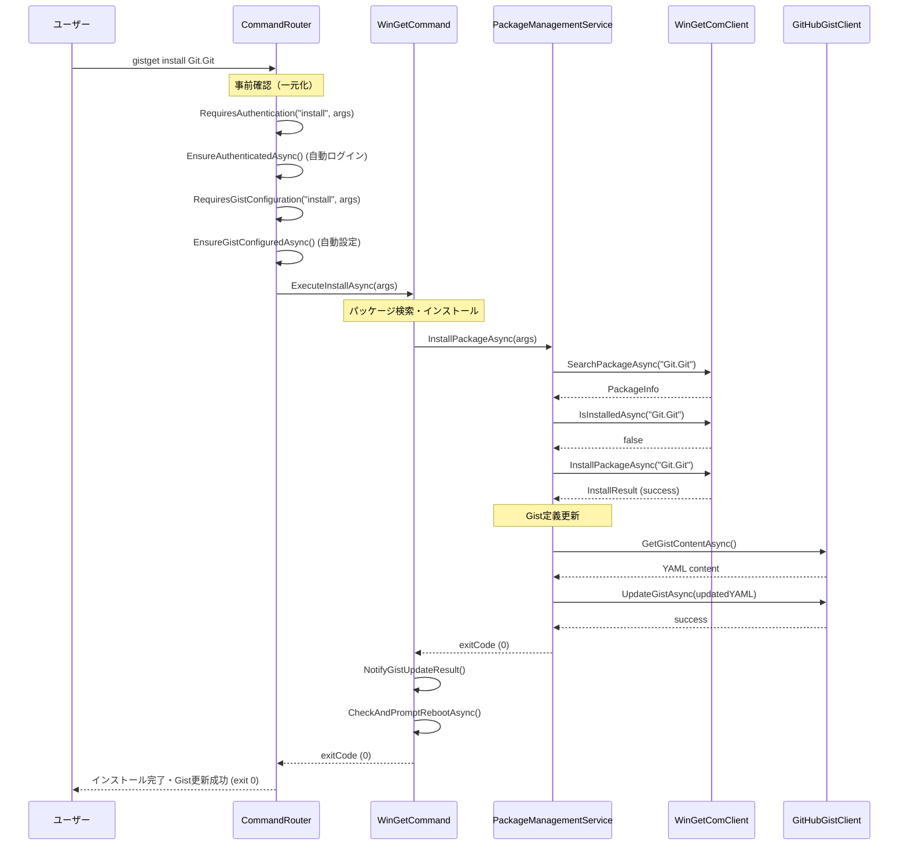

# installコマンド仕様書

## 概要
WinGetパッケージをインストールしてGist定義を自動更新するコマンドです。ローカル環境への変更と同時にGist上のパッケージ定義を自動的に同期します。

## 基本動作方針

### コアコンセプト
- **パッケージインストール + Gist更新**: WinGet COM APIでインストール後、Gist定義に自動追加
- **冪等性**: 既にインストール済みのパッケージは再インストールしない
- **自動同期**: インストール成功後、Gist定義を自動的に更新
- **エラー継続性**: 一部パッケージの失敗でも、他のパッケージの処理を継続
- **認証自動化**: 未認証時は自動的にログインフローを実行

### 動作フロー

1. **事前確認（CommandRouterで完了済み）**
   - GitHub認証の確認と自動ログイン（CommandRouterで実施）
   - Gist設定の確認と自動設定フロー（CommandRouterで実施）
   - 管理者権限の確認

2. **パッケージ存在確認**
   - WinGet検索でパッケージIDの有効性を確認
   - 複数候補がある場合はユーザーに選択肢を提示

3. **インストール状態の確認**
   - WinGetComClientで現在のインストール状態を取得
   - 既にインストール済みの場合は警告表示してスキップ

4. **パッケージインストール**
   - WinGet COM APIを使用してパッケージをインストール
   - インストール進捗の表示

5. **Gist定義更新**
   - 現在のGist定義を取得
   - 新しいパッケージ定義を追加
   - YAML形式でGistを更新

6. **結果レポート**
   - インストール結果とGist更新結果を表示
   - エラー発生時の詳細情報を提供

## 詳細仕様

### コマンドライン引数
```bash
gistget install <package-id> [options]
gistget add <package-id> [options]     # エイリアス
```

**必須引数**:
- `package-id`: インストールするパッケージのID（例: Git.Git, Microsoft.VisualStudioCode）

**オプション**:
- `--version <version>`: 特定バージョンを指定してインストール
- `--scope <user|machine>`: インストールスコープの指定（デフォルト: machine）
- `--architecture <x64|x86|arm64>`: アーキテクチャの指定
- `--silent`: サイレントインストール（確認プロンプトなし）
- `--force`: 既にインストール済みでも強制的に再インストール
- `--no-gist`: Gist更新をスキップ（ローカルのみの操作）

### パッケージ定義の追加

#### YAML形式での追加
```yaml
Git.Git:
Microsoft.VisualStudioCode:
  version: 1.85.0  # バージョン指定時のみ
Microsoft.PowerToys:
  scope: user  # カスタムパラメータ指定時
```

#### バージョン管理
- `--version`指定時: YAML定義にversionフィールドを追加
- 未指定時: 最新バージョンをインストール、YAML定義にはversionフィールドなし
- 既存定義の更新: 同じPackage IDが存在する場合は設定を更新

### エラーハンドリング

#### 認証・設定エラー
- **GitHub未認証**: CommandRouterで自動的に`login`コマンドを実行
- **Gist未設定**: CommandRouterで自動的に`gist set`コマンドを実行
- **権限不足**: 管理者権限での実行を促すメッセージを表示

#### パッケージエラー
- **パッケージ未発見**: 類似パッケージの提案とsearchコマンドの案内
- **複数候補**: ユーザーに選択肢を提示して絞り込み
- **インストール失敗**: 詳細なエラーメッセージとログファイルの場所を提示
- **ネットワークエラー**: リトライの提案と接続確認の案内

#### Gist更新エラー
- **Gist読み取りエラー**: Gist設定の再確認を促すメッセージ
- **Gist更新失敗**: ローカルインストールは成功したが同期失敗の旨を明示
- **YAML解析エラー**: Gist内容の問題点を指摘

#### 終了コード
- `0`: 正常終了（インストールとGist更新が成功）
- `1`: 部分的成功（インストール成功、Gist更新失敗）
- `2`: インストール失敗
- `3`: 認証・設定エラー

## シーケンス図



## 実装クラス

### WinGetCommand (Presentation層)
```csharp
public class WinGetCommand
{
    public async Task<int> ExecuteInstallAsync(string[] args)
    {
        // UI制御：引数解析、進捗表示、結果表示
        // Business層への委譲：PackageManagementService.InstallPackageAsync()
        // 認証・Gist設定はCommandRouterで事前に完了済み
    }
}
```

### PackageManagementService (Business層)
```csharp
public class PackageManagementService : IPackageManagementService
{
    // installコマンド専用メソッド
    public async Task<int> InstallPackageAsync(string[] args)
    {
        // 1. パッケージ検索・確認
        // 2. インストール実行
        // 3. Gist定義更新
        // 4. 結果レポート
        // 認証・Gist設定はCommandRouterで事前に完了済み
    }
    
    // インストール後のGist更新
    public async Task AfterInstallAsync(string packageId)
    {
        // Gist定義にパッケージを追加（辞書形式）
        // パッケージIDをキー、設定をValueとしてYAML保存
    }
}
```

### InstallOptions (Business層モデル)
```csharp
public class InstallOptions
{
    public string Version { get; set; }
    public string Scope { get; set; } = "machine";
    public string Architecture { get; set; }
    public bool Silent { get; set; }
    public bool Force { get; set; }
    public bool NoGist { get; set; }
}
```

### InstallResult (Business層モデル)
```csharp
public class InstallResult
{
    public string PackageId { get; set; }
    public bool InstallSuccess { get; set; }
    public bool GistUpdateSuccess { get; set; }
    public string ErrorMessage { get; set; }
    public int ExitCode { get; set; }
}
```

## 依存関係

### 必要なサービス
- `IPackageManagementService`: パッケージ管理とGist同期の統合
- `IWinGetClient`: WinGetパッケージ操作
- `ILogger<T>`: ログ出力
- 認証・Gist設定はCommandRouterで事前管理

### 設定要件
- GitHub認証トークン (DPAPI暗号化済み) - CommandRouterで事前確認
- Gist設定 (GistId, FileName) - CommandRouterで事前確認
- 管理者権限（WinGetインストール用）

## テスト戦略

### 単体テスト (Business層)
- パッケージ検索ロジックのテスト
- インストール成功/失敗パターンのテスト
- Gist更新ロジックのテスト
- エラーハンドリングのテスト

### 統合テスト (Infrastructure層)
- 実際のWinGetパッケージでのインストールテスト
- テスト用Gistを使用した更新テスト
- 認証フローとの組み合わせテスト

### E2Eテスト
- コマンドライン引数から最終結果まで
- 実際の使用シナリオでの動作確認
- エラーケースでの適切な終了コード確認

## 実装注意点

### パフォーマンス
- 大量パッケージ同時インストール時の処理時間
- WinGet COM API呼び出しの最適化
- Gist更新の適切なバッチ処理

### 安全性
- 管理者権限での実行時の注意喚起
- インストール前の確認プロンプト
- Gist更新失敗時のロールバック検討

### 拡張性
- カスタムパラメータ対応
- 将来的なパッケージソース追加対応
- インストール後フックの実装余地

### PowerShell版との互換性
- PowerShell版: `Install-GistGetPackage`との動作一致
- 同じYAML形式での定義保存
- エラーメッセージとログ形式の統一

## 重要：他コマンドとの連携

### 関連コマンドとの役割分担
```bash
gistget install jq          # インストール → Gistに追加
gistget uninstall jq        # アンインストール → Gistから削除
gistget sync                # Gist定義 → ローカル環境に同期（一方向）
```

**installコマンドはローカル環境とGist定義の双方向同期の起点となり、個別パッケージの管理において中心的な役割を果たします。**

この仕様に基づき、PowerShellモジュール版と同等の機能を持つ.NET版installコマンドを実装します。