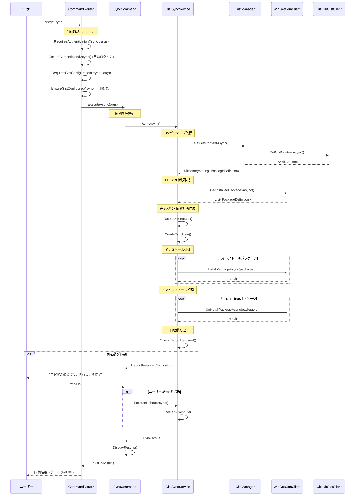

# syncコマンド仕様書

## 概要
Gistに定義されたパッケージリストとローカル環境を同期するコマンドです。PowerShellモジュール版のSync-GistGetPackageコマンドの.NET版実装にあたります。

## 基本動作方針

### コアコンセプト
- **Gist → ローカルの一方向同期**: Gistに定義されたパッケージをローカル環境に適用
- **冪等性**: 既にインストール済みのパッケージは再インストールしない
- **Uninstallフラグ対応**: 明示的なアンインストール指定をサポート
- **Gist不変性**: syncコマンドはGistの内容を変更しない
- **レイヤー分離**: 3層アーキテクチャに基づく実装

### 動作フロー

1. **事前確認（CommandRouterで完了済み）**
   - GitHub認証の確認と自動ログイン（CommandRouterで実施）
   - Gist設定の確認と自動設定フロー（CommandRouterで実施）

2. **パッケージ定義の取得**
   - GistManagerを使用してGistからパッケージ定義辞書を取得
   - YAML形式のパッケージ定義を解析（Dictionary<string, PackageDefinition>）

3. **現在の状態の取得**
   - WinGetComClientを使用してインストール済みパッケージを取得
   - ローカル環境の現在状態を把握

4. **差分検出**
   - Gist定義とローカル状態の比較
   - インストール対象とアンインストール対象の特定

5. **同期実行**
   - インストール処理の実行
   - アンインストール処理の実行（Uninstallフラグがtrueのもの）

6. **再起動処理**
   - 再起動が必要なパッケージの確認
   - ユーザーへの確認プロンプト表示
   - 確認後の自動再起動実行

7. **結果レポート**
   - 実行結果の表示
   - エラー発生時の適切な報告

## 詳細仕様

### コマンドライン引数
```bash
gistget sync [options]
```

**オプション（将来拡張予定）**:
- `--dry-run`: 実際のインストール/アンインストールを実行せず、対象パッケージのみ表示
- `--force`: 確認プロンプトをスキップして実行
- `--no-restart`: 再起動が必要でも再起動しない（手動再起動に委ねる）

### パッケージ定義の処理

#### uninstallフラグの動作
PackageDefinitionのuninstallプロパティに基づく処理：

| uninstallフラグ | インストール状態 | 動作 |
|------------------|------------------|------|
| `true` | インストール済み | `Uninstall-Package`実行 |
| `true` | 未インストール | メッセージ表示のみ（何もしない） |
| `false`, null, 未指定 | インストール済み | メッセージ表示のみ（何もしない） |
| `false`, null, 未指定 | 未インストール | `Install-Package`実行 |

#### バージョン管理
- versionプロパティが指定されている場合は特定バージョンをインストール
- 未指定の場合は最新バージョンをインストール
- 既に同じバージョンがインストール済みの場合はスキップ

### エラーハンドリング

#### 設定エラー
- **Gist未設定**: CommandRouterで自動的に`gist set`コマンドを実行
- **認証エラー**: CommandRouterで自動的に`login`コマンドを実行

#### 実行時エラー
- **個別パッケージエラー**: エラーログ出力後、次のパッケージの処理を継続
- **ネットワークエラー**: 適切なエラーメッセージと再試行の提案
- **権限エラー**: 管理者権限での実行を促すメッセージ
- **再起動エラー**: 再起動実行失敗時の適切なエラー表示

#### 終了コード
- `0`: 正常終了（すべてのパッケージが成功）
- `1`: エラー終了（1つ以上のパッケージでエラー発生）

## シーケンス図



## 実装クラス

### SyncCommand (Presentation層)
```csharp
public class SyncCommand
{
    public async Task<int> ExecuteAsync(string[] args)
    {
        // UI制御：引数解析、進捗表示、結果表示
        // Business層への委譲：GistSyncService.SyncAsync()
        // 認証・Gist設定はCommandRouterで事前に完了済み
    }
}
```

### GistSyncService (Business層)
```csharp
public class GistSyncService : IGistSyncService
{
    // syncコマンドのメイン処理（Gist更新なし）
    public async Task<int> SyncAsync()
    {
        // 1. Gistからパッケージ定義取得
        // 2. ローカル状態取得  
        // 3. 差分検出
        // 4. インストール/アンインストール実行
        // 5. 再起動処理
        // 6. 結果レポート
        // 認証・Gist設定はCommandRouterで事前に完了済み
        // ※Gist更新は行わない
    }
    
    // install/uninstallコマンド専用（syncでは使用しない）
    public void AfterInstall(string packageId) { /* syncでは何もしない */ }
    public void AfterUninstall(string packageId) { /* syncでは何もしない */ }
    
    private SyncPlan DetectDifferences(Dictionary<string, PackageDefinition> gistPackages, List<PackageDefinition> installedPackages)
    {
        // Gist定義（辞書形式）とローカル状態の差分検出ロジック
    }
    
    private bool CheckRebootRequired(List<string> installedPackages)
    {
        // インストールしたパッケージで再起動が必要かチェック
    }
    
    private async Task ExecuteRebootAsync()
    {
        // システム再起動の実行
        // PowerShell版: Restart-Computer -Force
    }
}
```

### SyncPlan (Business層モデル)
```csharp
public class SyncPlan
{
    public List<PackageDefinition> ToInstall { get; set; }
    public List<PackageDefinition> ToUninstall { get; set; }
    public List<PackageDefinition> AlreadyInstalled { get; set; }
    public List<PackageDefinition> NotFound { get; set; }
}
```

### SyncResult (Business層モデル)
```csharp
public class SyncResult
{
    public List<string> InstalledPackages { get; set; }
    public List<string> UninstalledPackages { get; set; }
    public List<string> FailedPackages { get; set; }
    public bool RebootRequired { get; set; }
    public int ExitCode { get; set; }
}
```

## 依存関係

### 必要なサービス
- `IGistSyncService`: 同期処理の統合
- `IGistManager`: Gist操作
- `IWinGetClient`: WinGetパッケージ操作
- `ILogger<T>`: ログ出力
- 認証・Gist設定はCommandRouterで事前管理

### 設定要件
- GitHub認証トークン (DPAPI暗号化済み) - CommandRouterで事前確認
- Gist設定 (GistId, FileName) - CommandRouterで事前確認

## テスト戦略

### 単体テスト (Business層)
- 差分検出ロジックのテスト
- 同期計画作成のテスト
- エラーハンドリングのテスト

### 統合テスト (Infrastructure層)
- 実際のWinGetパッケージでの同期テスト
- テスト用Gistを使用した統合テスト

### E2Eテスト
- コマンドライン引数から最終結果まで
- 実際の使用シナリオでの動作確認

## 実装注意点

### パフォーマンス
- 大量パッケージでの処理時間を考慮
- 進捗表示でユーザー体験向上

### 安全性
- ドライランモードでの事前確認
- エラー時の適切なロールバック検討
- 再起動前の重要データ保存確認

### 拡張性
- 将来的なバッチ処理対応
- カスタム設定ファイル対応の余地

### 再起動処理の実装

#### 再起動判定ロジック
- WinGet COM APIまたはwinget.exeの実行結果から再起動要求を検出
- インストールしたパッケージリストと既知の再起動要求パッケージの照合
- Windows APIを使用したシステム再起動状態の確認

#### ユーザー確認プロンプト
```
同期が完了しました。
再起動が必要なパッケージがインストールされました：
- Microsoft.VisualStudio.2022.Professional
- Docker.DockerDesktop

今すぐ再起動しますか？ (Y/N): 
```

#### PowerShell版との互換性
- PowerShell版: `Restart-Computer -Force`
- .NET版: `System.Diagnostics.Process.Start("shutdown", "/r /t 0")`

## 重要：各コマンドの役割分担

### パッケージ管理コマンド（Gist更新あり）
```bash
gistget install jq          # インストール → Gistに追加
gistget uninstall jq        # アンインストール → Gistから削除
```

### 同期コマンド（Gist更新なし）
```bash
gistget sync                # Gist定義 → ローカル環境に適用（一方向）
```

**syncコマンドは複数環境での安全な同期を目的とするため、Gistを変更せず読み取り専用で動作します。再起動が必要なパッケージがある場合は、ユーザー確認の上でシステム再起動を実行します。**

この仕様に基づき、PowerShellモジュール版と同等の機能を持つ.NET版syncコマンドを実装します。