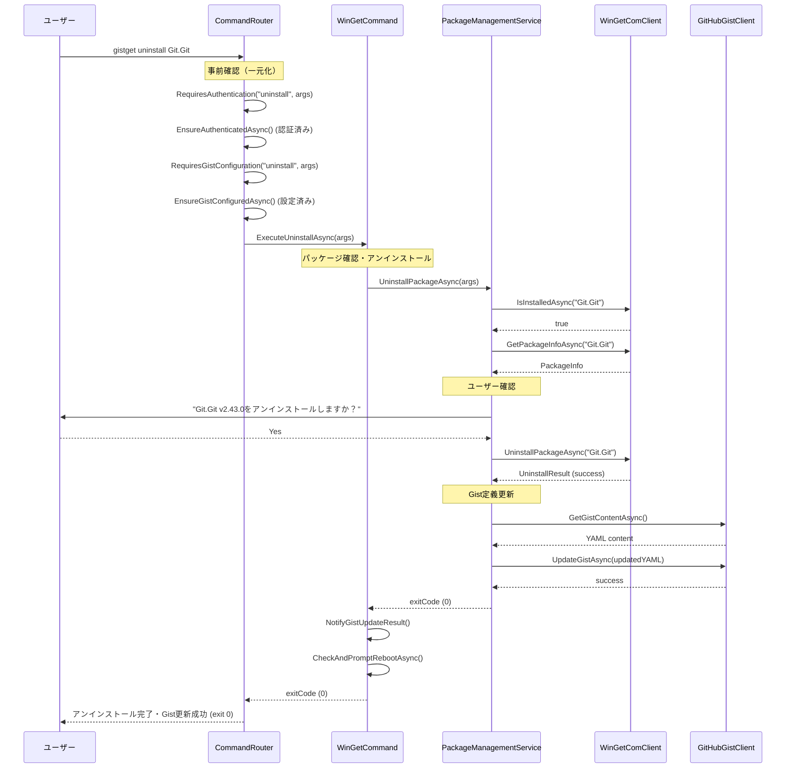

# uninstallコマンド仕様書

## 概要
WinGetパッケージをアンインストールしてGist定義から自動削除するコマンドです。ローカル環境からの削除と同時にGist上のパッケージ定義からも自動的に除去します。

## 基本動作方針

### コアコンセプト
- **パッケージアンインストール + Gist更新**: WinGet COM APIでアンインストール後、Gist定義から自動削除
- **安全性優先**: アンインストール前の確認プロンプト（--silentオプション以外）
- **自動同期**: アンインストール成功後、Gist定義を自動的に更新
- **エラー継続性**: 一部パッケージの失敗でも、他のパッケージの処理を継続
- **認証自動化**: 未認証時は自動的にログインフローを実行

### 動作フロー

1. **事前確認（CommandRouterで完了済み）**
   - GitHub認証の確認と自動ログイン（CommandRouterで実施）
   - Gist設定の確認と自動設定フロー（CommandRouterで実施）
   - 管理者権限の確認

2. **パッケージ存在確認**
   - WinGetComClientで現在のインストール状態を確認
   - 未インストールの場合は警告表示してスキップ

3. **アンインストール確認**
   - パッケージ情報の表示（名前、バージョン、依存関係など）
   - ユーザーへの確認プロンプト（--silentオプション以外）

4. **パッケージアンインストール**
   - WinGet COM APIを使用してパッケージをアンインストール
   - アンインストール進捗の表示

5. **Gist定義更新**
   - 現在のGist定義を取得
   - 対象パッケージ定義を削除
   - YAML形式でGistを更新

6. **結果レポート**
   - アンインストール結果とGist更新結果を表示
   - エラー発生時の詳細情報を提供

## 詳細仕様

### コマンドライン引数
```bash
gistget uninstall <package-id> [options]
gistget remove <package-id> [options]     # エイリアス
gistget rm <package-id> [options]         # エイリアス
```

**必須引数**:
- `package-id`: アンインストールするパッケージのID（例: Git.Git, Microsoft.VisualStudioCode）

**オプション**:
- `--version <version>`: 特定バージョンのみアンインストール
- `--silent`: サイレントアンインストール（確認プロンプトなし）
- `--force`: 依存関係を無視して強制アンインストール
- `--purge`: 設定ファイルやユーザーデータも削除
- `--no-gist`: Gist更新をスキップ（ローカルのみの操作）

### パッケージ定義の削除

#### YAML形式からの削除
```yaml
# 削除前
Git.Git:
Microsoft.VisualStudioCode:
  version: 1.85.0
Microsoft.PowerToys:

# Git.Git削除後
Microsoft.VisualStudioCode:
  version: 1.85.0
Microsoft.PowerToys:
```

#### 削除の判定基準
- **完全一致**: Package IDが完全に一致するエントリ（キー）を削除
- **バージョン指定時**: 同じIDかつ同じversionのエントリのみ削除
- **辞書キーの削除**: YAMLの辞書構造からパッケージIDキーを完全に削除

### エラーハンドリング

#### 認証・設定エラー
- **GitHub未認証**: CommandRouterで自動的に`login`コマンドを実行
- **Gist未設定**: CommandRouterで自動的に`gist set`コマンドを実行
- **権限不足**: 管理者権限での実行を促すメッセージを表示

#### パッケージエラー
- **パッケージ未インストール**: 現在の状態を表示して終了
- **アンインストール失敗**: 詳細なエラーメッセージとログファイルの場所を提示
- **依存関係エラー**: 依存するパッケージがある場合の警告と--forceオプションの案内
- **ネットワークエラー**: リトライの提案と接続確認の案内

#### Gist更新エラー
- **パッケージ未発見**: Gist内に該当パッケージが見つからない場合の警告
- **Gist読み取りエラー**: Gist設定の再確認を促すメッセージ
- **Gist更新失敗**: ローカルアンインストールは成功したが同期失敗の旨を明示
- **YAML解析エラー**: Gist内容の問題点を指摘

#### 終了コード
- `0`: 正常終了（アンインストールとGist更新が成功）
- `1`: 部分的成功（アンインストール成功、Gist更新失敗）
- `2`: アンインストール失敗
- `3`: 認証・設定エラー
- `4`: ユーザーキャンセル

## シーケンス図



## 実装クラス

### WinGetCommand (Presentation層)
```csharp
public class WinGetCommand
{
    public async Task<int> ExecuteUninstallAsync(string[] args)
    {
        // UI制御：引数解析、進捗表示、結果表示
        // Business層への委譲：PackageManagementService.UninstallPackageAsync()
        // 認証・Gist設定はCommandRouterで事前に完了済み
    }
}
```

### PackageManagementService (Business層)
```csharp
public class PackageManagementService : IPackageManagementService
{
    // uninstallコマンド専用メソッド
    public async Task<int> UninstallPackageAsync(string[] args)
    {
        // 1. パッケージ存在確認
        // 2. ユーザー確認プロンプト
        // 3. アンインストール実行
        // 4. Gist定義更新
        // 認証・Gist設定はCommandRouterで事前に完了済み
    }
    
    // アンインストール後のGist更新
    public async Task AfterUninstallAsync(string packageId)
    {
        // Gist定義からパッケージキーを削除（辞書形式）
        // YAML辞書構造から指定キーを削除
    }
}
```

### UninstallOptions (Business層モデル)
```csharp
public class UninstallOptions
{
    public string Version { get; set; }
    public bool Silent { get; set; }
    public bool Force { get; set; }
    public bool Purge { get; set; }
    public bool NoGist { get; set; }
}
```

### UninstallResult (Business層モデル)
```csharp
public class UninstallResult
{
    public string PackageId { get; set; }
    public bool UninstallSuccess { get; set; }
    public bool GistUpdateSuccess { get; set; }
    public string ErrorMessage { get; set; }
    public bool UserCancelled { get; set; }
    public int ExitCode { get; set; }
}
```

## 依存関係

### 必要なサービス
- `IPackageManagementService`: パッケージ管理とGist同期の統合
- `IWinGetClient`: WinGetパッケージ操作
- `ILogger<T>`: ログ出力
- 認証・Gist設定はCommandRouterで事前管理

### 設定要件
- GitHub認証トークン (DPAPI暗号化済み) - CommandRouterで事前確認
- Gist設定 (GistId, FileName) - CommandRouterで事前確認
- 管理者権限（WinGetアンインストール用）

## テスト戦略

### 単体テスト (Business層)
- パッケージ存在確認ロジックのテスト
- アンインストール成功/失敗パターンのテスト
- Gist削除ロジックのテスト
- ユーザー確認フローのテスト
- エラーハンドリングのテスト

### 統合テスト (Infrastructure層)
- 実際のWinGetパッケージでのアンインストールテスト
- テスト用Gistを使用した削除テスト
- 認証フローとの組み合わせテスト

### E2Eテスト
- コマンドライン引数から最終結果まで
- 実際の使用シナリオでの動作確認
- ユーザーキャンセル時の適切な動作確認
- エラーケースでの適切な終了コード確認

## 実装注意点

### 安全性
- アンインストール前の確認プロンプトの実装
- 依存関係チェックとユーザーへの警告
- 重要なシステムパッケージのアンインストール防止
- Gist更新失敗時のロールバック検討

### パフォーマンス
- 大量パッケージ同時アンインストール時の処理時間
- WinGet COM API呼び出しの最適化
- Gist更新の適切なバッチ処理

### ユーザビリティ
- 分かりやすい確認プロンプト
- アンインストール対象の詳細情報表示
- 進捗表示とキャンセル機能
- エラー時の具体的な解決策提示

### 拡張性
- カスタムアンインストールパラメータ対応
- 将来的なロールバック機能の実装余地
- アンインストール後フックの実装余地

### PowerShell版との互換性
- PowerShell版: `Uninstall-GistGetPackage`との動作一致
- 同じYAML形式での定義削除
- エラーメッセージとログ形式の統一

## 重要：他コマンドとの連携

### 関連コマンドとの役割分担
```bash
gistget install jq          # インストール → Gistに追加
gistget uninstall jq        # アンインストール → Gistから削除
gistget sync                # Gist定義 → ローカル環境に同期（一方向）
```

### 特殊ケースの処理
```bash
# Gist定義にはあるがローカルに未インストールの場合
gistget uninstall somepackage  # Gist定義からのみ削除

# ローカルにはあるがGist定義にない場合
gistget uninstall somepackage  # ローカルからのみ削除
```

**uninstallコマンドはローカル環境とGist定義の双方向同期において、パッケージ削除の一貫性を保つ重要な役割を果たします。**

この仕様に基づき、PowerShellモジュール版と同等の機能を持つ.NET版uninstallコマンドを実装します。