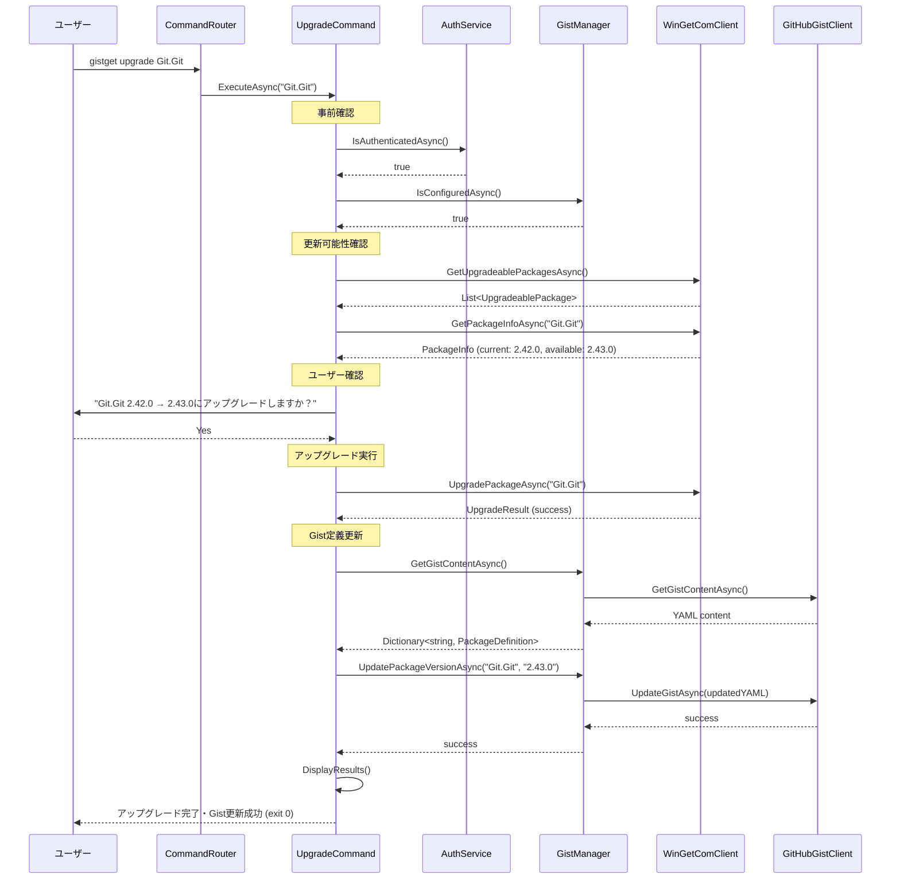

# upgradeコマンド仕様書

## 概要
WinGetパッケージをアップグレードしてGist定義を自動更新するコマンドです。ローカル環境でのパッケージ更新と同時にGist上のパッケージ定義も最新状態に同期します。

## 基本動作方針

### コアコンセプト
- **パッケージアップグレード + Gist更新**: WinGet COM APIでアップグレード後、Gist定義を自動更新
- **安全性優先**: アップグレード前の確認プロンプト（--silentオプション以外）
- **自動同期**: アップグレード成功後、Gist定義のバージョン情報を自動更新
- **選択的更新**: 特定パッケージまたは全パッケージの更新に対応
- **認証自動化**: 未認証時は自動的にログインフローを実行

### 動作フロー

1. **事前確認**
   - GitHub認証の確認（未認証時は自動ログイン）
   - Gist設定の確認（未設定時は自動設定フロー）
   - 管理者権限の確認

2. **アップグレード対象の特定**
   - 特定パッケージ指定時: 該当パッケージの更新可能性を確認
   - 全パッケージ更新時: インストール済みパッケージから更新可能なものを抽出

3. **アップグレード確認**
   - 現在バージョンと更新後バージョンの表示
   - ユーザーへの確認プロンプト（--silentオプション以外）

4. **パッケージアップグレード**
   - WinGet COM APIを使用してパッケージをアップグレード
   - アップグレード進捗の表示

5. **Gist定義更新**
   - 現在のGist定義を取得
   - 対象パッケージのバージョン情報を更新
   - YAML形式でGistを更新

6. **結果レポート**
   - アップグレード結果とGist更新結果を表示
   - エラー発生時の詳細情報を提供

## 詳細仕様

### コマンドライン引数
```bash
gistget upgrade [package-id] [options]
gistget update [package-id] [options]     # エイリアス
```

**引数**:
- `package-id`: アップグレードするパッケージのID（省略時は全パッケージ）

**オプション**:
- `--all`: 全パッケージを明示的にアップグレード
- `--include-unknown`: Gist定義にないパッケージも含めてアップグレード
- `--silent`: サイレントアップグレード（確認プロンプトなし）
- `--force`: 強制的にアップグレード（依存関係無視）
- `--no-gist`: Gist更新をスキップ（ローカルのみの操作）
- `--dry-run`: 実際のアップグレードを実行せず、対象パッケージのみ表示

### パッケージ定義の更新

#### YAML形式での更新
```yaml
# アップグレード前
Git.Git:
  version: 2.42.0
Microsoft.VisualStudioCode:
Microsoft.PowerToys:
  version: 0.75.0

# Git.Git 2.43.0にアップグレード後
Git.Git:
  version: 2.43.0  # 更新
Microsoft.VisualStudioCode:
Microsoft.PowerToys:
  version: 0.75.0
```

#### バージョン管理
- **既存定義あり**: versionフィールドを最新バージョンに更新
- **新規追加**: アップグレード時に新たにversionフィールドを追加
- **バージョン固定解除**: 特定バージョンから最新追従に変更する場合はversionフィールドを削除

### エラーハンドリング

#### 認証・設定エラー
- **GitHub未認証**: 自動的に`login`コマンドを実行
- **Gist未設定**: 自動的に`gist set`コマンドを実行
- **権限不足**: 管理者権限での実行を促すメッセージを表示

#### パッケージエラー
- **パッケージ未インストール**: 該当パッケージがインストールされていない旨を表示
- **更新不要**: 既に最新バージョンの場合はスキップして次のパッケージへ
- **アップグレード失敗**: 詳細なエラーメッセージとログファイルの場所を提示
- **依存関係エラー**: 依存するパッケージとの競合警告と--forceオプションの案内
- **ネットワークエラー**: リトライの提案と接続確認の案内

#### Gist更新エラー
- **パッケージ未発見**: Gist内に該当パッケージが見つからない場合の追加処理
- **Gist読み取りエラー**: Gist設定の再確認を促すメッセージ
- **Gist更新失敗**: ローカルアップグレードは成功したが同期失敗の旨を明示
- **YAML解析エラー**: Gist内容の問題点を指摘

#### 終了コード
- `0`: 正常終了（アップグレードとGist更新が成功）
- `1`: 部分的成功（一部アップグレード成功、一部失敗またはGist更新失敗）
- `2`: アップグレード失敗
- `3`: 認証・設定エラー
- `4`: ユーザーキャンセル

## シーケンス図



## 実装クラス

### UpgradeCommand (Presentation層)
```csharp
public class UpgradeCommand
{
    public async Task<int> ExecuteAsync(string packageId, UpgradeOptions options)
    {
        // UI制御：引数解析、確認プロンプト、進捗表示、結果表示
        // Business層への委譲：GistSyncService.UpgradeAndSyncAsync()
    }
    
    private async Task<bool> ConfirmUpgradeAsync(List<UpgradeablePackage> packages, bool silent)
    {
        // アップグレード確認プロンプトの表示
        // バージョン情報と変更点の表示
    }
}
```

### GistSyncService (Business層)
```csharp
public class GistSyncService : IGistSyncService
{
    // upgradeコマンド専用メソッド
    public async Task<int> UpgradeAndSyncAsync(string packageId, UpgradeOptions options)
    {
        // 1. アップグレード対象パッケージの特定
        // 2. アップグレード実行
        // 3. Gist定義更新
        // 4. 結果レポート
    }
    
    // アップグレード後のGist更新
    public async Task AfterUpgradeAsync(string packageId, string newVersion)
    {
        // Gist定義のパッケージバージョンを更新（辞書形式）
        // パッケージIDキーのversionフィールドを更新
    }
    
    private async Task<List<UpgradeablePackage>> GetUpgradeablePackagesAsync(string packageId = null)
    {
        // 更新可能なパッケージの抽出
        // Gist定義との照合
    }
}
```

### UpgradeOptions (Business層モデル)
```csharp
public class UpgradeOptions
{
    public bool All { get; set; }
    public bool IncludeUnknown { get; set; }
    public bool Silent { get; set; }
    public bool Force { get; set; }
    public bool NoGist { get; set; }
    public bool DryRun { get; set; }
}
```

### UpgradeablePackage (Business層モデル)
```csharp
public class UpgradeablePackage
{
    public string PackageId { get; set; }
    public string CurrentVersion { get; set; }
    public string AvailableVersion { get; set; }
    public bool IsInGist { get; set; }
    public string Source { get; set; }
}
```

### UpgradeResult (Business層モデル)
```csharp
public class UpgradeResult
{
    public List<string> SuccessfulUpgrades { get; set; }
    public List<string> FailedUpgrades { get; set; }
    public List<string> SkippedPackages { get; set; }
    public bool GistUpdateSuccess { get; set; }
    public string ErrorMessage { get; set; }
    public int ExitCode { get; set; }
}
```

## 依存関係

### 必要なサービス
- `IAuthService`: GitHub認証管理
- `IGistManager`: Gist操作
- `IWinGetClient`: WinGetパッケージ操作
- `ILogger<T>`: ログ出力

### 設定要件
- GitHub認証トークン (DPAPI暗号化済み)
- Gist設定 (GistId, FileName)
- 管理者権限（WinGetアップグレード用）

## テスト戦略

### 単体テスト (Business層)
- アップグレード対象パッケージ抽出ロジックのテスト
- アップグレード成功/失敗パターンのテスト
- Gistバージョン更新ロジックのテスト
- 全パッケージ更新処理のテスト
- エラーハンドリングのテスト

### 統合テスト (Infrastructure層)
- 実際のWinGetパッケージでのアップグレードテスト
- テスト用Gistを使用したバージョン更新テスト
- 認証フローとの組み合わせテスト

### E2Eテスト
- コマンドライン引数から最終結果まで
- 実際の使用シナリオでの動作確認
- 全パッケージ更新のパフォーマンステスト
- ユーザーキャンセル時の適切な動作確認

## 実装注意点

### パフォーマンス
- 大量パッケージの同時アップグレード処理
- WinGet COM API呼び出しの最適化
- 並列処理とユーザー体験のバランス
- Gist更新の適切なバッチ処理

### 安全性
- アップグレード前の確認プロンプト
- 依存関係チェックとユーザーへの警告
- システム重要パッケージの慎重な扱い
- ロールバック計画の検討

### ユーザビリティ
- 分かりやすいアップグレード確認プロンプト
- アップグレード内容の詳細情報表示
- 進捗表示とキャンセル機能
- 大量パッケージ時の選択的アップグレード

### 拡張性
- カスタムアップグレードパラメータ対応
- 将来的なロールバック機能の実装余地
- アップグレード後フックの実装余地
- バージョン管理戦略の柔軟性

### PowerShell版との互換性
- PowerShell版: `Update-GistGetPackage`との動作一致
- 同じYAML形式でのバージョン管理
- エラーメッセージとログ形式の統一

## 重要：他コマンドとの連携

### 関連コマンドとの役割分担
```bash
gistget install jq          # 新規インストール → Gistに追加
gistget upgrade jq          # アップグレード → Gistバージョン更新
gistget upgrade --all       # 全パッケージアップグレード → Gist一括更新
gistget sync                # Gist定義 → ローカル環境に同期（一方向）
```

### 特殊ケースの処理
```bash
# Gist定義にないパッケージのアップグレード
gistget upgrade somepackage --include-unknown  # Gist定義に追加

# ドライランモードでの事前確認
gistget upgrade --all --dry-run  # 更新対象のリストのみ表示
```

**upgradeコマンドはローカル環境とGist定義の両方を最新状態に保つ重要な役割を果たし、定期的なシステムメンテナンスの中核となります。**

この仕様に基づき、PowerShellモジュール版と同等の機能を持つ.NET版upgradeコマンドを実装します。