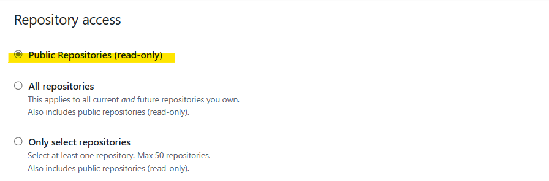
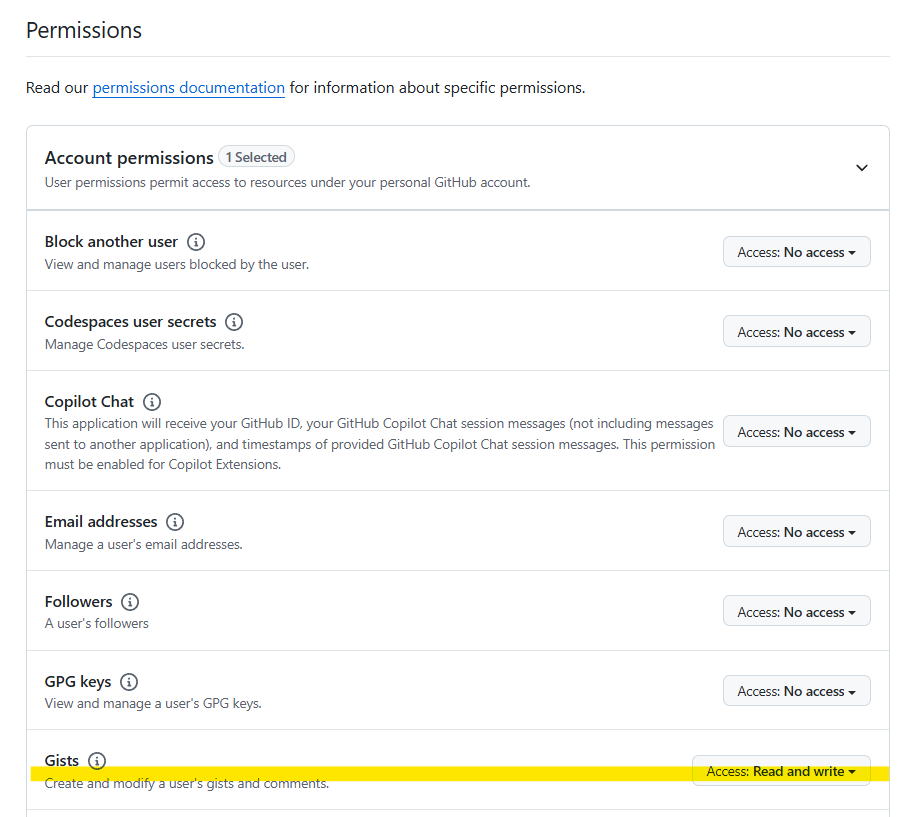

# Set-GitHubToken

Gitの更新を行う場合、認証トークンを設定する必要があります。

トークンは下記のリンクから発行します。

- [https://github.com/settings/personal-access-tokens/new](https://github.com/settings/personal-access-tokens/new)

トークンには、最低限の権限を割り当ててください。

ここではGistGetを利用するための最低限の権限を割り当てますが、PowerShellForGitHubを別の用途でも利用するようであれば、必要な権限を割り当ててください。

リポジトリーアクセスは、もっとも低い権限である、Publicリポジトリーの読み取り権限を付与します。



Account permissionsは、GitのRead and writeを割り当てます。



必要な権限を割り当てたらトークンを発行し、つぎのように呼び出して設定します。

```pwsh
Set-GitHubToken -Token "<Your Access Token>"
```
